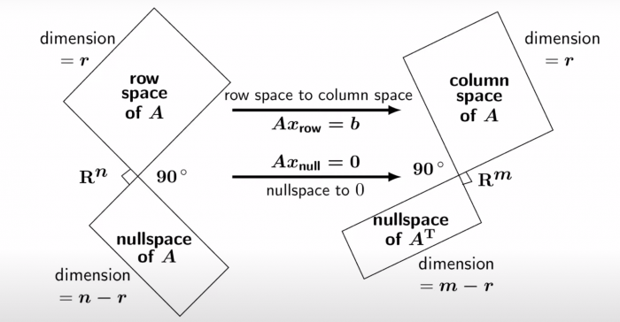
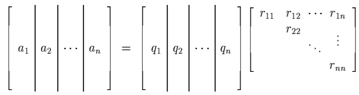
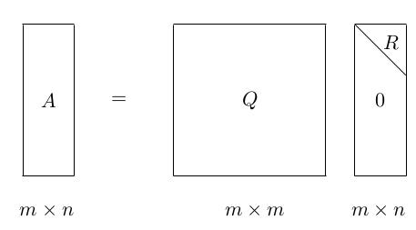
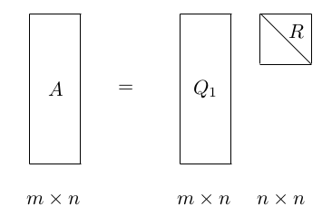

# 0x003 Matrix

- [1. Foundation](#1-foundation)
    - [1.1. Subspace](#11-subspace)
    - [1.2. Rank](#12-rank)
    - [1.3. Trace and Determinant](#13-trace-and-determinant)
    - [1.4. Derivatives](#14-derivatives)
    - [1.5. Submatrices](#15-submatrices)
    - [1.6. Norm](#16-norm)
- [2. Triangular Matrix](#2-triangular-matrix)
    - [2.1. Linear System](#21-linear-system)
    - [2.2. Row Reduction](#22-row-reduction)
- [3. Diagonal matrix](#3-diagonal-matrix)
    - [3.1. Eigenvalue and Eigenvector](#31-eigenvalue-and-eigenvector)
    - [3.2. Similarity](#32-similarity)
- [4. Unitary, Normal Matrix](#4-unitary-normal-matrix)
    - [4.1. QR Decomposition](#41-qr-decomposition)
    - [4.2. Unitary Similarity](#42-unitary-similarity)
    - [4.3. Normal Matrices](#43-normal-matrices)
    - [4.4. Unitary Equivalence](#44-unitary-equivalence)
    - [4.5. Projection](#45-projection)
- [5. Hermitian, Symmetric Matrix](#5-hermitian-symmetric-matrix)
    - [5.1. Congruences and Diagonalizations](#51-congruences-and-diagonalizations)
- [6. Positive Semidefinite, Positive Definite Matrix](#6-positive-semidefinite-positive-definite-matrix)
    - [6.1. Characterizations and Properties](#61-characterizations-and-properties)
- [7. Tensor Analysis](#7-tensor-analysis)
    - [7.1. Decomposition](#71-decomposition)
- [8. Reference](#8-reference)

This section only treats matrix and finite dimension vector, general treatment of operators and infinite dimension vectors is covered in the 0x011 linear algebra.

## 1. Foundation
### 1.1. Subspace
**Definition (fundamental subspace)** There are four fundamental subspaces in linear algebra

- $N(A)$: null space of A
- $C(A)$: column space of A
- $N(A^T)$: null space of $A^T$
- $C(A^T)$: row space of $A$

The Big Picture of Linear Algebra Gilbert Strang

**Lemma (dimension of fundamental subspaces)**
- The dimension of $C(A)$ is the number of pivot (also equals $rank(A)$)
- The dimension of $N(A)$ is the number of free variables.

Therefore, we have the fundamental theorem of linear algebra as follows:

$$\dim(C(A)) + \dim(N(A)) = n$$

And similarly, 

$$\dim(N(A^T)) + \dim(C(A^T)) = m$$

**Lemma (orthogonal fundamental subspaces)** Null space $N(A)$ is orthogonal to row space $C(A^T)$, therefore

$$N(A) \perp C(A^T)$$

And similarly,
$$N(A^T) \perp C(A)$$

Proof: Intuitively, for any vector $x$ such that $Ax=0$, $x$ is orthogonal to every row in $A$, therefore any linear combination from row space is also orthogonal to $x$. In other words, $Ax = 0$ implies for all $y$, $(y^T A)x = 0$, therefore, $y^TA$ and $x$ are orthogonal.

### 1.2. Rank

**Definition (rank)** rank is the dimension size of the column space

$$rank(A) = \dim C(A)$$

**Lemma (inequalities of rank)** For any $A,B,C$ with the same shape,

$$|rank(A) - rank(B)| \leq rank(A+B) \leq rank(A) + rank(B)$$

If $A,C$ is nonsingular, then 

$$rank(AB) = rank(B) = rank(BC)$$

### 1.3. Trace and Determinant

**Lemma (cyclic permutation properties)**  Trace has a cyclic permutation property useful to compute derivatives

$$tr(\mathbf{ABC}) = tr(\mathbf{CAB}) = tr(\mathbf{BCA})$$

**Lemma (inequalities determinant)** The following inequality is known as the Hadamard's inequality

$$|detA| \leq \Pi_{j} ||a_j||_2$$

### 1.4. Derivatives
Annoyingly, there are two types of vector, matrix layouts, the **numerator layout** (consistent with the Jacobian) and the **denominator layout** (consistent with the Hessian). They are transpose of each other. Note that the standard chain rule is consistent with the numerator layout, it also changes its order in denominator layout.

A easy rule to distinguish these two is to check its shape. Suppose $x \in \mathbb{R}^{a \times b}, y \in \mathbb{R}^{c \times d}$, the most general tensor shape is as follows

The numerator layout has the shape
$$\frac{\partial x}{\partial y} \in \mathbb{R}^{((a,b), (c,d))}$$

The denominator layout has the shape
$$\frac{\partial x}{\partial y} \in \mathbb{R}^{((c,d), (a,b))}$$

when $a,b,c,d$ is 0, it might be dimension reduced to simplify notation. For example, when $x,y$ is a column vector (i.e, $b,d = 0$), when denominator layout is simplified to $(c,a)$ instead of $(c,1,a,1)$

In the ML community, it looks the latter are more commonly used, so this section is follows the denominator layout.

$$\big( \frac{\partial \mathbf{a}}{\partial x} \big) = (\frac{\partial a_1}{\partial x}, ...,  \frac{\partial a_n}{\partial x}) \in \mathbb{R}^{1 \times n}$$

$$\big( \frac{\partial x}{\partial \mathbf{a}} \big)_i = \begin{bmatrix} \frac{\partial x}{\partial a_i} \\ \frac{\partial x}{\partial a_i} \\ ... \\ \frac{\partial x}{\partial a_i} \\ \end{bmatrix} \in \mathbb{R}^{n \times 1}$$

Be careful this are all tranposed in the Jacobian matrix.

$$\big( \frac{\partial \mathbf{a}}{\partial \mathbf{b}} \big)_{i,j} = \frac{\partial a_i}{\partial b_j}$$

Under this layout, some important conclusions are 

$$\frac{\partial (\mathbf{x^T a}) } {\partial x} =  \frac{\partial (\mathbf{a^T x}) } {\partial x} = \mathbf{a}$$

$$\frac{\partial \bf{u}^T A \bf{v}}{\partial \bf{x}} = \frac{\partial \bf{u}}{\partial \bf{x}} A \mathbf{v} + \frac{\partial \bf{v}}{\partial \bf{x}} A^T \mathbf{u}$$

$$\frac{\partial (\mathbf{a^T A a})}{\partial \mathbf{a}} = \mathbf{(A+A^T)a}$$

$$\frac{\partial A\mathbf{x}}{\partial \mathbf{x}} = A^T$$

$$\frac{\partial \mathbf{x}^T A}{\partial \mathbf{x}} = A$$

$tr(BA)$ can be seen as the inner product of two matrix $\langle B, A \rangle$, the following one is easy to see by noticing its similarity with $\langle x, a \rangle$

$$\frac{\partial}{\partial \mathbf{A}} tr(\mathbf{BA}) = \mathbf{B^T}$$

**Determinant's derivative** 
Proof can be obtained by expanding det with cofactor. [Here](https://www.kamperh.com/notes/kamper_matrixcalculus13.pdf) is a pdf containing its proof

$$\frac{\partial \det(A)}{\partial A} = |A| (A^{-1})^T$$

$$\frac{\partial \log \det(A)}{\partial A} = A^{-T}$$

### 1.5. Submatrices
A simple rule inverse of triangular submatrix is as follows

$$\begin{pmatrix} A_{11} & A_{12} \\ 0 & A_{22} \\ \end{pmatrix}^{-1} = \begin{pmatrix}A^{-1}_{11} & -A_{11}^{-1}A_{12}A^{-1}_{22} \\ 0 & A^{-1}_{22} \\ \end{pmatrix}$$

A more general inverse rule is to use schulr's complement. it is used, for example, to compute conditional probability and marginalized probability in multivariable normal distribution.

**Definition (schur's complement)** Schur's complement of the block matric

$$\begin{pmatrix} A & B \\ C&D \\ \end{pmatrix}$$

is defined to be 

$$M = (A - BD^{-1}C)^{-1}$$

**Theorem (partitioned inverse formula)** The inverse of the original matrix 

$$\begin{pmatrix} M & -MBD^{-1} \\ -D^{-1}CM & D^{-1} + D^{-1}CMBD^{-1} \\ \end{pmatrix}$$

Derivation of this formula is to apply Gaussian elimination, details can be found in this [lecture note](https://www.cis.upenn.edu/~jean/schur-comp.pdf) or MLAPP 4.3.4.1

This can be applied to give the matrix inversion, it might reduce the complexity
**Corollary (Sherman-Morrison-Woodbury)** 

$$(A - BD^{-1}C)^{-1} = A^{-1} + A^{-1}B(D-CA^{-1}B)^{-1}CA^{-1}$$

If the shape of matrix $A$ is $N \times N$, matrix $D$ is $D \times D$, then the LHS has $O(N^3)$ and RHS has $O(D^3)$, this is helpful when $N >> D$

### 1.6. Norm
Norms arise naturally in the study of power series of matrices and in the analysis of numerical computations

For example, it is sufficient to say the following formula is valid when any matrix norm of $A$ is less than 1

$$(I-A)^{-1} = I+A+A^2+A^3...$$

**Definition (spectral norm)** 
$$||A||_2 = \max \frac{||Ax||}{||x||} = \sigma_1$$

**Definition (Frobenius norm)** Frobenius norm is to think of matrix as a long vector and to take vector norm.

$$||A||_{F} = \sqrt{\sigma^2_1 + ... + \sigma^2_r}$$

Proof $||A||_F = \sum_{i,j} (a_{i,j})^2 = tr(A^T A) = \sum_i \lambda_i = \sum_i \sigma_i^2$

**Definition (nuclear norm)**
$$||A||_{N} = \sigma_1 + \sigma_2 + ... + \sigma_r$$

## 2. Triangular Matrix

### 2.1. Linear System

This subsection is about solving linear equation

$$Ax = b$$

where we reduce $A$ into echelon form through a series of row operations.

Note that if $b=0$, this system is called *homogeneous*

**Definition (consistency)** A linear (or nonlinear system of equations) is called *consistent* if it has at least 1 solution (it might have infinitely many solutions)

**Definition (overdetermined system)** A system of equations is called overdetermined if it has more equations than unknowns. It can be either consistent or inconsistent (though usually inconsistent)

!!! example "consistent case of overdetermined systems"

    The following overdetermined equation is a consistent example.

    $$x + y = 1 \\
    2x + 2y = 2 \\
    x + 2y = 2 $$

**Definition (exact determined system)** A system of equations is called *exact-determined* if the number of unknowns is equal to the number of equations. It also can be consistent or inconsistent.

**Definition (underdetermined system)** A system of equations is called underdetermined if it has more unknowns than equations. Again, it can be consistent or inconsistent (though usually consistent)

!!! example "inconsistent case of underdetermined systems"

    The following underdetermined equation is an inconsistent example

    $$ x + y + z = 1 \\
    2x + 2y + 2z = 3 $$

**Criterion (consistency)** The following three are equivalent iff criterion of consistency.

- $b$ is in the column space of $A$.
- $A$'s rank is equal to the rank of augmented matrix $[A,b]$.
- the right most column of the augmented matrix is not a pivot column (e.g: echelon form of the augmented matrix has no row of the form $[0, ..., 0, b]$ with $b$ nonzero)

Note the 3rd statement basically says if there is such a row, then appending $b$ will result in 1 more rank.

**Algorithm (size of solution set)** To decide how many solutions we have, we should

- first, apply the previous consistency condition to check whether it is feasible
- if feasible, then check the null space of the matrix (or its rank), the dimension of solutions set is the dimension of null space.

### 2.2. Row Reduction

**Definition (row equivalence)** Two matrices $A,B$ of the same shape are said to be row equivalent if they share the the same row space or null space

$$N(A) = N(B)$$

Row equivalence can be established by applying a sequence of elementary row operations.

**Definition (elementary row operation)** The followings are elementary row operations

- swap: swap tow rows
- scale: scale 1 row by nonzero constant
- pivot: add a multiple of 1 row to another row

!!! example "matrix form of row operation"

    Each of the elementary row operation is corresponding to a invertible matrix form.

    swap example: swap row 1 and row 2

    $$E_{swap} = \begin{pmatrix} 0 & 1 & 0 \\ 1 & 0 & 0 \\ 0 & 0 & 1 \\ \end{pmatrix}$$

    scale example: scale row 3 by 5 times

    $$E_{scale} = \begin{pmatrix} 1 & 0 & 0 \\ 0 & 1 & 0 \\ 0 & 0 & 5 \\ \end{pmatrix}$$

    pivot example: add 4*row 1 to row 3

    $$E_{pivot} = \begin{pmatrix} 1 & 0 & 0 \\ 0 & 1 & 0 \\ -4 & 0 & 1 \\ \end{pmatrix}$$

**Lemma (properties of row equivalent matrix)** It is easy to show that

- A matrix is invertible if it is row equivalent to identity matrix
- rank is perserved (because null space is same)

Note that eigenvalues, vectors are not preserved.

The most "canonical" form of row equivalent matrix is the echelon form and reduced echelon form

**Definition (echelon form, reduced echelon form)** A matrix is in echelon form if it satisfies the following properties

- All nonzero rows are above any rows of all zeros
- each leading entry of a row is in a column to the right of the leading entry of the row above it
- all entries in a column below a leading entry are zeros

Intuitively, this means the nonzero leading entry has a steplike pattern in the matrix.

Note that each matrix may be row reduced into more than one echelon forms.

**Definition (reduced echelon form)** In addition to the echelon conditions, it also has to satisfy:

- the leading entry in each nonzero row is 1
- each leading 1 is the only nonzero entry in its column

Note that each matrix can be row reduced into 1 form of echelon matrix, so this is the canonical form with respect to row equivalence.

**Collorary (algebra of triangular matrix)** Triangular matrix is preserved under many operations. For example,
- sum of upper triangular is upper triangular
- product of upper triangular is upper triangular
- inverse (if exists) of upper triangular is upper triangular

**Decomposition (LU decomposition)**

!!! note "application of LU decomposition"

    LU decomposition is useful to solve $Ax = b$, expecially for a fixed A and a sequence of different $b$, by decomposing $A = LU$, we can solve $L(Ux) = b$ by solving the following two equation efficiently

    $$Ly = b \\ Ux = y$$

## 3. Diagonal matrix

### 3.1. Eigenvalue and Eigenvector

**Definition (spectrum)** The spectrum of $A \in M_n$ is the set of all $\lambda \in C$ that are eigenvalues of $A$; denoted by $\sigma(A)$

A diagonal matrix can be represented in the following form

$$AX = X \Lambda$$

where $\Lambda$ is a diagonal matrix $diag(\lambda_1, ..., \lambda_n)$, $X$ is a matrix whose columns are eigenvectors $x_i$

Because columns of $X$ are linear independent and $X$ spans the whole space, $X$ is invertible, and we obtain the following decomposition.

**Decomposition (eigen-decomposition, diagonalization)** 

An diagonalizable matrix $A$ can be factorized into the following form

$$ A = X \Lambda X^{-1}$$

This decomposition can be interpreted clearly by considering component. 

If $v=\sum_i  c_i x_i$, Multiplying $X^{-1}$ is to extract the coefficient component under the basis of $X$

$$X^{-1} v = (c_1, ..., c_n)$$

Multiplying $A$ is to extend linearly each eigenvector by eigenvalue.

$$AX^{-1} v = (c_1 \lambda_1, ..., c_n \lambda_n)$$

Then using the original basis to represent the vector by multiplying $X$

$$XAX^{-1} v = (c_1 \lambda_1 x_1, ..., c_n \lambda_n x_n)$

With this decomposition, we can compute $A^k$ efficiently by 

$$A^k = X \Lambda^k X^{-1}$$

In particular, if $\lambda < 1$, it can be dropped when $k$ is large enough.

### 3.2. Similarity
This section is to study of similarity of $A \in M_n$ via a general nonsingular matrix $S$: the transformation $A \to S^{-1} A S$

Similar matrices are just different basis presentations of the same linear transformation, similar matrices have the same set of eigenvalues (spectrum).

Diagonalizable matrices have independent eigenvectors, but not necessarily orthogonal.

**Definition (similarity)** $A, B \in M_n$. We say that $B$ is similar to $A$ if there exists a nonsingular $S \in M_n$ such that

$$B = S^{-1} A S$$

Similarity is an equivalence relation on $M_n$, sometimes we write $A ~ B$ to express similarity.

**Corollary (Invariant under similarity)** There are several properties preserved by the similarity relation. For example, the eigenvalues of $A, B$ (spectrum) are preserved, the characteristic polynomial is preserved, rank is also preserved. 

However, note that the same set of eigenvalues does not imply similarity

**Definition (diagonalizable)** If $A \in M_n$ is similar to a diagonal matrix, then $A$ is said to be diagonalizable

$$A = PDP^{-1}$$

Note that $P,D$ are not unique and $D$ might not be diagonal matrix of eigenvalue and $P$ might not be eigenvectors.

Note that diagonalizable matrix does not require orthonormal basis.

**Criterion (eigenspace)** A $n \times n$ matrix is diagonalizable if and only if eigenspace spans the whole space (eigenspace dim is $n$)

!!! example "defective matrix is not diagonalizable"

    A defective matrix is a matrix does not have a basis of eigenvector (therefore not diagonalizable). A example is a shear matrix

    $$\begin{pmatrix} 1 & 1 \\ 0 & 1 \end{pmatrix}$$

**Criterion (distinct eigenvalue)** A useful sufficient condition is to check the unique eigenvalue, if there are $n$ distinct eigenvalue, then the matrix is diagonalizable (because eigenvalue of each eigenvector are independent and thus spans the whole space)

Note the converse is not true.

!!! example "converse case"

    Consider the identity matrix $I_2$, it is obviously diagonalizable.

    $$\begin{pmatrix} 1 & 0 \\ 0 & 1 \end{pmatrix}$$
    
    It has only 1 eigenvalue (1), but the eigenspace has 2 dimension, therefore diagonalizable.

**Lemma (sum of rank-1 matrices)** A diagonalizable $A \in M_n$ can be decomposed into sum of $n$ rank-1 matrices 

$$A = \sum_i \lambda_i x_i y_i^T$$

where $x_i$ is the (right) eigenvector, $y_n$ is the left eigenvectors of $A$ (i.e.: $y^T A = \lambda y^T$)

## 4. Unitary, Normal Matrix
analogous to a number $r$ where $|r|=1$

**Definition (unitary matrix, orthogonal matrix)** A matrix $U \in M_n$ is unitary if $U U^* = I$. A matrix $U \in M_n(R)$ is real orthogonal if $U^T U = I$

The set of unitary matices in $M-n$ forms a group $U(n)$ which is a subgroup of $GL(n)$.

### 4.1. QR Decomposition
**Decomposition (QR decomposition)** Decomposition of a matrix into a orthogonal matrix and a triangular matrix
$$A = QR$$

where $Q$ is the orthogonal matrix and $R$ is the upper triangular matrix.

It can be illustrated as follows:

Note that it is an enhanced version of CR decomposition with Gram-Schmit

A reduced thin version of QR is also available

### 4.2. Unitary Similarity
Unitary similarity is a special case of similarity

**Definition (unitary similarity)** $A$ is unitarily similar to $B$ if there exists a unitary matrix $U$ such that 

$$A = UBU^*$$

We say that $A$ is unitarily diagonalizable if it is unitarily similar to a diagonal matrix

### 4.3. Normal Matrices
**Definition (normal matrix)** A matrix $A \in M_n$ is called normal if $A$ commutes with its conjugate transpose

$$A A^{*} = A^{*} A$$

Example: A diagonalizable matrix might not be a normal matrix 

$$M = \begin{pmatrix} 
1 & 1 \\
0 & 2 \\
\end{pmatrix}$$

**Theorem (statements of normal matrix)** Let $A= [ a_{ij} ] \in M_n$ have eigenvalues $\lambda_1, ..., \lambda_n$. The following statements are equivalent

$A$ is normal
A is unitarily diagonalizable
$\sum_{i,j=1}^n |a_{ij}|^2 = \sum_i^n |\lambda_i|^2$
$A$ has $n$ orthonormal eigenvectors.
Unitary Equivalence and Singular Value Decomposition
Definition (equivalence) Two matrices are said to be equivalent iff there exist invertible matrices $P,Q$ such that

$$A = PBQ$$

### 4.4. Unitary Equivalence

**Definition (unitary equivalence)** For $A \in M_{n,m}$, the transformation $A \to UAV$ in which $U \in M_n,V \in M_m$ are both unitary, is called unitary equivalence

**Decomposition (Singular Value Decomposition)** Let $A \in M_{n,m}$ matrix with rank r, there exists a matrix $\Sigma \in M_{n,m}$ where the diagonal entries are $\sigma_1 \geq \sigma_2 ... \geq \sigma_r \geq 0$, and orthogonal matrix $U \in M_{n,n}$, $V \in M_{m,m}$ such that

$$A = U\Sigma V^T$$

 (orthogonal) x (diagonal) x (orthogonal)

The reduced form of SVD using rank $r$ can be written as 

$$A = U_{n \times r} \Sigma_{r \times r} V_{m \times r}^T $$

This decomposition can also be written in the rank 1 sum form 

$$A = \sum_{i=1}^r u_i v_i^T$$

$u_i, v_i$ are left and right eigenvectors, they are connected with $A$ by

$$A v_i = \sigma_i u_i$$

In the matrix form, it is

$$AV = \Sigma U$$

**Corollary (range and null from SVD)** The range and null space can be easily identified with the SVD decomposition

$$\mathrm{range}(A) = \{ u_1, ..., u_r \}$$
$$\mathrm{null}(A) = \{ v_{r+1}, ..., v_{n} \}$$

This is actually the most accurate approach to find orthonormal basis for range and null space.

**Theorem (Eckart-Young)** The first k rank 1 sum is the best rank $k$ approximation of $A$, suppose that $B$ has rank k, then

$$|| A - A_k || \leq ||A-B||$$

**Note (singular value VS eigenvalue)**
Note that singular value does not match eigenvalue in general, actually the first singular value is the upper bound.

$$\sigma_1 \geq \lambda$$

However, in some cases, they could be identical, for example.

If $S=Q\Lambda Q^T$ is symmetric positive definite matrix, then $U=V=Q$ and $\Sigma=\Lambda$

If $S$ is symmetric but has negative eigenvalue, then the corresponding singular value is its reverse, and one set of the corresponding singular vector is its reverse.

**Decomposition (Polar Decomposition)** polar decomposition is analogous to $re^{i\theta}$, where an arbitrary matrix $A$ can be decomposed into an orthogonal matrix $Q$ and symmetric positive semidefinite matrix $S$

$$A = U \Sigma V^T = (UV^T)(V^T \Sigma V) =  QS$$

### 4.5. Projection
Let's first consider projecting vector $b$ into another vector $a$. Supposed the projected vector is $xa$ where $x$ is a scalar, then it is clear $b - xa \perp a$, therefore

$$(b-xa)^T a = 0$$

Solving this formula, we know

$$x = \frac{b^Ta}{a^Ta}$$

Therefore, the projected vector is

$$xa = \frac{b^Ta}{a^Ta}a$$

or equivalanetly

$$xa = \frac{aa^T}{a^Ta}b$$

where $\frac{aa^T}{a^Ta}$ is a rank 1 matrix acting on $b$

These formulas can be simplified using unit vectors. Notice if we normalized $a$ into $q=a/||a||$, then the projected vector is simply 

$$(b^Tq)q$$

which computes the length $b^Tq$ first and multiplies it to $q$. The projected vector can also be written equivalently as

$$(q^Tq)b$$

where $q^Tq$ is a rank 1 matrix, which acts on $b$.

Instead of projecting a vector $b$ into a vector spans by a single vector $a$, we can generalize this idea into projecting $b$ into the column space spanning by a matrix $A$.

First we would define what matrix is qualified as the projection matrix

**Definition (Projection)** A square matrix is called a projector if it satisfies
$$P^2 = P$$

The projection is said to be *idempotent* because any higher power than 1 does not change results (another example is closure)

**Definition (complementary projection)** If $P$ is a projection, then $I-P$ is called the complementary projection. It is also a projection because 
$$(I-P)^2 = I-P$$

The projection and complementary projection can be connected by range and null, where
$$\mathrm{range}(P) = \mathrm{null}(I-P)$$
$$\mathrm{null}(P) = \mathrm{range}(I-P)$$

The projection is equivalent to split the space into two disjoint subspace $S_1, S_2$, where $S_1$ is corresponding to the range, and $S_2$ is corresponding to the null space. Note in this case, $S_1, S_2$ are not required to be orthogonal. When they are not orthogonal, it is called the *oblique projection*.

When they are orthogonal, we have the orthogonal projection. A matrix is an orthogonal projection if

**Theorem (orthogonal projection)** A projector $P$ is orthogonal if it is hermitian
$$P = P^*$$

**Theorem (projection with orthonormal basis)**
when projecting to the column space of an orthonormal basis matrix $Q$, $P$ can be written as
$$P = QQ^*$$

In the column-wise representations,
$$Pv = \sum_{i=1}^n (q_i q_i^*)v$$

Notice the similarity with the previous discussion of $(qq^T)b$, instead of taking a single rank 1 matrix, this is taking a sum of rank 1 matrix.

The more general projection with arbitrary basis is as follows.
**Theorem (projection with any basis)** Let $A$ be an m,n matrix, for any vector $v$, suppose the projected vector is $y$, then $y-v$ should be orthogonal to range A, therefore $A^*(y-v)=0$, because $y \in \mathrm{range}(A)$, then $y=Ax$ for a $x$, $A^*(Ax - v)$ becomes
$$A^T Ax = A^Tv$$

When it is consistent (A is full rank), $x$ can be solved by
$$x = (A^* A)^{-1} A^* v$$
and the projection $P$
$$P = A(A^* A)^{-1}A^*$$

We can easily verify that this $P$ satisfies the projection properties (e.g: $P^2=P$)

Again notice the similarity with the previous discussion where projection into a dim 1 vector space is

$$\frac{aa^T}{a^Ta}$$

## 5. Hermitian, Symmetric Matrix
analogous to a real number

**Definition (hermitian conjugate, adjoint)** The hermitian conjugate or adjoint of an $m \times n$ matrix $A$, written $A^*$, is the $n \times m$ matrix whose $i,j$ entry is the complex conjugate of the $j, i$ entry of $A$

$$A = \begin{bmatrix} a_{11}, a_{12} \\ a_{21}, a_{22} \\ a_{31}, a_{32} \end{bmatrix} \implies A^* = \begin{bmatrix} \bar{a}_{11}, \bar{a}_{21}, \bar{a}_{31} \\ \bar{a}_{12}, \bar{a}_{22}, \bar{a}_{32} \end{bmatrix}$$

**Definition (hermitian)** A matrix is called hermitian iff

$$A = A^*$$

A hermitian matrix has to be, by definition, square.

**Definition (symmetric)** If a real matrix is hermitian, it is says to be symmetric.

$$A = A^T$$

**Decomposition (eigen-decomposition)** The eigen-decomposition of a symmetric matrix is as follows:

$$A = Q\Lambda Q^T$$

In an equivalent form, it can be represented by a rank 1 symmetric matrix sum

$$A = \sum_i \lambda_i q_i q_i^T$$

Eigenvector of symmetric matrix are orthogonal. Suppose $Sx = \lambda x, Sy = \alpha y$, then$y^T S x = \lambda y^T x$, $x^T S y = \alpha x^T y$ and $y^T S x = x^T S y$. therefore $\lambda - \alpha x^T y = 0$ and $x^T y = 0$ when $\lambda \neq \alpha$

### 5.1. Congruences and Diagonalizations
**Definition (\*congruence, T-congruence)** Let $A,B \in M_n$, if there exists a nonsingular matrix $S$ such that 

$$B=SAS^*$$

Then $B$ is said to be *congruent or conjunctive to $A$. If

$$B=SAS^T$$

Then $B$ is said to be T-congruent to $A$

Note that both types of congruence are equivalence relations.

**Theorem (Sylvester's law of inertia)** Congruent matrices have the same number of positive, negative, zero eigenvalues

## 6. Positive Semidefinite, Positive Definite Matrix
analogous to a non-negative, positive number. It is corresponding to the positive operator in linear algebra.

**Definition (positive definite, positive semidefinite)** A Hermitian matrix $A \in M_n$ is positive definite if for all nonzero $x \in C^n$

$$x^* A x > 0$$

It is positive semidefinite if for all nonzero $x \in C^n$

$$x^* A x \geq 0$$

### 6.1. Characterizations and Properties
Property All entries on diagonal of Hermitian positive semidefinite matrix are positive.

**Theorem (eigenvalue criterion)** A Hermitian matrix is positive semidefinite iff all of is eigenvalues are nonnegative, it is positive definite iff all of its eigenvalues are positive.

**Theorem (Sylvester's criterion)** Let $A \in M_n$ be **Hermitian**

- If every principal minor of $A$ is nonnegative, then $A$ is positive semidefinite
- If every leading principal minor of $A$ is positive, then $A$ is positive definite.

**Decomposition (Cholesky decomposition)** Cholesky decomposition is the decomposition of the following form where $L$ is a lower triangular matrix with real and positive diagonal entries

$$A = L L^*$$

Note that this is to find the square root

## 7. Tensor Analysis

### 7.1. Decomposition
Tensor is much more difficult to decompose

**Decomposition (CP Decomposition)** Approximate a given tensor $T$ by a sum of rank one tensors $A,B,C$

$$T \approx \sum_{i=1}^R a_i \circ b_i \circ c_i$$

This is a NP-hard problem, but can be computed in a reasonably efficient way by alternatively improve $A,B,C$

**Decomposition (Tucker Decomposition)** 
$$T \approx \sum_{p=1}^{P} \sum_{q=1}^{Q} \sum_{r=1}^{R} g_{pqr} a_p \circ b_q \circ c_r$$

where $a,b,c$ are three sets of orthonormal columns.

## 8. Reference
- [1] Horn, Roger A., and Charles R. Johnson. Matrix analysis. Cambridge university press, 2012.
- [2] Golub, G. H. (1996). CF vanLoan, Matrix Computations. The Johns Hopkins.
- [3] Petersen, K. B., and M. S. Pedersen. "The Matrix Cookbook, vol. 7." Technical University of Denmark 15 (2008).
- [4] Strang, Gilbert. Linear algebra and learning from data. Wellesley-Cambridge Press, 2019.
- [5] Dan Margalit, Joseph Rabinoff. Interactive Linear Algebra
- [6] Murphy, Kevin P. Machine learning: a probabilistic perspective. MIT press, 2012.