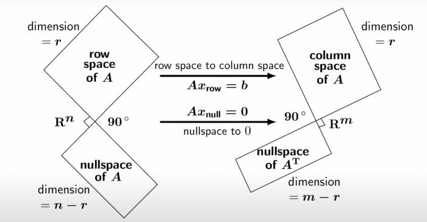
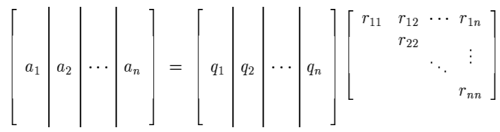
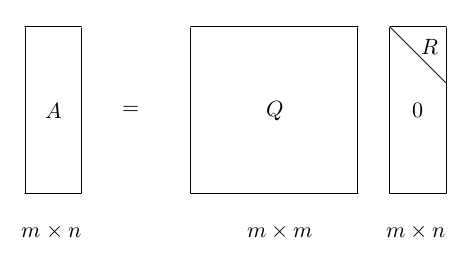
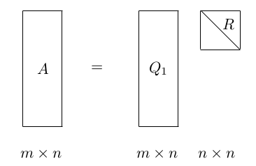

# 0x023 Matrix Algebra

- [1. Foundation](#1-foundation)
    - [1.1. Subspace](#11-subspace)
    - [1.2. Rank](#12-rank)
    - [1.3. Determinant](#13-determinant)
    - [1.4. Derivatives](#14-derivatives)
        - [1.4.1. Denominator Layout](#141-denominator-layout)
        - [1.4.2. Determinant](#142-determinant)
    - [1.5. Submatrices](#15-submatrices)
    - [1.6. Norm](#16-norm)
- [2. Triangular Matrix](#2-triangular-matrix)
- [3. Eigenvalue and Eigenvector](#3-eigenvalue-and-eigenvector)
    - [3.1. Similarity](#31-similarity)
- [4. Unitary, Normal Matrix](#4-unitary-normal-matrix)
    - [4.1. QR Decomposition](#41-qr-decomposition)
    - [4.2. Unitary Similarity](#42-unitary-similarity)
    - [4.3. Normal Matrices](#43-normal-matrices)
    - [4.4. Unitary Equivalence](#44-unitary-equivalence)
    - [4.5. Projection (vector decomposition)](#45-projection-vector-decomposition)
- [5. Hermitian, Symmetric Matrix](#5-hermitian-symmetric-matrix)
    - [5.1. Congruences and Diagonalizations](#51-congruences-and-diagonalizations)
- [6. Positive Semidefinite, Positive Definite Matrix](#6-positive-semidefinite-positive-definite-matrix)
    - [6.1. Characterizations and Properties](#61-characterizations-and-properties)
- [7. Tensor Analysis](#7-tensor-analysis)
    - [7.1. Decomposition](#71-decomposition)
- [8. Reference](#8-reference)

## 1. Foundation
### 1.1. Subspace
**Definition (fundamental subspace)** There are four fundamental subspaces in linear algebra

- $N(A)$: null space of A
- $C(A)$: column space of A
- $N(A^T)$: null space of $A^T$
- $C(A^T)$: row space of $A$

The Big Picture of Linear Algebra Gilbert Strang

**Lemma**
- $N(A) \perp C(A^T)$
- $N(A) + C(A) = n$
- $N(A^T) \perp C(A)$
- $N(A^T) + C(A^T) = m$
The important thing here is that null space $N(A)$ is orthogonal to row space $C(A^T)$, because for any vector $x$ such that $Ax=0$, $x$ is orthogonal to every row in $A$, therefore any linear combination from row space is also orthogonal to $x$. In other words, $Ax = 0$ implies for all $y$, $(y^T A)x = 0$, therefore, $y^TA$ and $x$ are orthogonal.

### 1.2. Rank

**Definition (rank)** rank is the dimension size of the column space

$$rank(A) = \dim range(A)$$

**Lemma (properties of rank)**
$rank(A^T) = rank(A)$
$|rank(A) - rank(B)| \leq rank(A+B) \leq rank(A) + rank(B)$
If $A,C$ is nonsingular, then $rank(AB) = rank(B) = rank(BC)$
Trace
Trace has a cyclic permutation property useful to compute derivatives

$$tr(\mathbf{ABC}) = tr(\mathbf{CAB}) = tr(\mathbf{BCA})$$

### 1.3. Determinant

**Lemma (properties of determinant)**
- (Hadamard's inequality) $|detA| \leq \Pi_{j} ||a_j||_2$

### 1.4. Derivatives
Annoyingly, there are two types of vector, matrix layouts, the numerator layout (consistent with the Jacobian) and the denominator layout. In the ML community, it looks the latter are more commonly used, so this section is follows the denominator layout.

#### 1.4.1. Denominator Layout

$$\big( \frac{\partial \mathbf{a}}{\partial x} \big) = (\frac{\partial a_1}{\partial x}, ...,  \frac{\partial a_n}{\partial x}) \in \R^{1 \times n}$$

$$\big( \frac{\partial x}{\partial \mathbf{a}} \big)_i = \begin{bmatrix} \frac{\partial x}{\partial a_i} \\ \frac{\partial x}{\partial a_i} \\ ... \\ \frac{\partial x}{\partial a_i} \\ \end{bmatrix} \in \R^{n \times 1}$$

Be careful this are all tranposed in the Jacobian matrix.

$$\big( \frac{\partial \mathbf{a}}{\partial \mathbf{b}} \big)_{i,j} = \frac{\partial a_i}{\partial b_j}$$

Under this layout, some important conclusions are 

$$\frac{\partial (\mathbf{x^T a}) } {\partial x} =  \frac{\partial (\mathbf{a^T x}) } {\partial x} = \mathbf{a}$$

$$\frac{\partial \bf{u}^T A \bf{v}}{\partial \bf{x}} = \frac{\partial \bf{u}}{\partial \bf{x}} A \mathbf{v} + \frac{\partial \bf{v}}{\partial \bf{x}} A^T \mathbf{u}$$

$$\frac{\partial (\mathbf{a^T A a})}{\partial \mathbf{a}} = \mathbf{(A+A^T)a}$$

$$\frac{\partial A\mathbf{x}}{\partial \mathbf{x}} = A^T$$

$$\frac{\partial \mathbf{x}^T A}{\partial \mathbf{x}} = A$$

$$\frac{\partial}{\partial \mathbf{A}} tr(\mathbf{BA}) = \mathbf{B^T}$$

#### 1.4.2. Determinant
Proof can be obtained by expanding det with cofactor. [A PDF containing easy to understand proof](https://www.kamperh.com/notes/kamper_matrixcalculus13.pdf)
$$\frac{\partial \det(A)}{\partial A} = |A| (A^{-1})^T$$

$$\frac{\partial \log \det(A)}{\partial A} = A^{-T}$$

### 1.5. Submatrices

The following is used to compute conditional probability and marginalized probability in multivariable normal distribution

**Definition (schur's complement)** Schur's complement of the block matric

$$\begin{pmatrix} A & B \\ C&D \\ \end{pmatrix}$$

is defined to be 

$$M = (A - BD^{-1}C)^{-1}$$

**Theorem (partitioned inverse formula)** The inverse of the original matrix 

$$\begin{pmatrix} M & -MBD^{-1} \\ -D^{-1}CM & D^{-1} + D^{-1}CMBD^{-1} \\ \end{pmatrix}$$

Derivation of this formula is to apply Gaussian elimination, details can be found in this [lecture note](https://www.cis.upenn.edu/~jean/schur-comp.pdf) or MLAPP 4.3.4.1

This can be applied to give the matrix inversion, it might reduce the complexity
**Corollary (Sherman-Morrison-Woodbury)** 

$$(A - BD^{-1}C)^{-1} = A^{-1} + A^{-1}B(D-CA^{-1}B)^{-1}CA^{-1}$$

If the shape of matrix $A$ is $N \times N$, matrix $D$ is $D \times D$, then the LHS has $O(N^3)$ and RHS has $O(D^3)$, this is helpful when $N >> D$

### 1.6. Norm
Norms arise naturally in the study of power series of matrices and in the analysis of numerical computations

For example, it is sufficient to say the following formula is valid when any matrix norm of $A$ is less than 1

$$(I-A)^{-1} = I+A+A^2+A^3...$$

**Definition (spectral norm)** 
$$||A||_2 = \max \frac{||Ax||}{||x||} = \sigma_1$$

**Definition (Frobenius norm)** Frobenius norm is to think of matrix as a long vector and to take vector norm.

$$||A||_{F} = \sqrt{\sigma^2_1 + ... + \sigma^2_r}$$

Proof $||A||_F = \sum_{i,j} (a_{i,j})^2 = tr(A^T A) = \sum_i \lambda_i = \sum_i \sigma_i^2$

**Definition (nuclear norm)**
$$||A||_{N} = \sigma_1 + \sigma_2 + ... + \sigma_r$$

## 2. Triangular Matrix

**Collorary (algebra of triangular matrix)** Triangular matrix is preserved under many operations. For example,
- sum of upper triangular is upper triangular
- product of upper triangular is upper triangular
- inverse (if exists) of upper triangular is upper triangular

**Decomposition (LU decomposition)**
Diagonal matrix
This section is to study of similarity of $A \in M_n$ via a general nonsingular matrix $S$: the transformation $A \to S^{-1} A S$

Diagonalizable matrices have independent eigenvectors, but not necessarily orthogonal.

## 3. Eigenvalue and Eigenvector
**Definition (spectrum)** The spectrum of $A \in M_n$ is the set of all $\lambda \in C$ that are eigenvalues of $A$; denoted by $\sigma(A)$

A diagonal matrix can be represented in the following form

$$AX = X \Lambda$$

where $\Lambda$ is a diagonal matrix $diag(\lambda_1, ..., \lambda_n)$, $X$ is a matrix whose columns are eigenvectors $x_i$

Because columns of $X$ are linear independent and $X$ spans the whole space, $X$ is invertible, and we obtain the following decomposition.

**Decomposition (eigen-decomposition)** An diagonalizable matrix $A$ can be factorized into the following form

$$ A = X \Lambda X^{-1}$$

This decomposition can be interpreted clearly by considering component. 

If $v=\sum_i  c_i x_i$, Multiplying $X^{-1}$ is to extract the coefficient component under the basis of $X$

$$X^{-1} v = (c_1, ..., c_n)$$

Multiplying $A$ is to extend linearly each eigenvector by eigenvalue.

$$AX^{-1} v = (c_1 \lambda_1, ..., c_n \lambda_n)$$

Then using the original basis to represent the vector by multiplying $X$

$$XAX^{-1} v = (c_1 \lambda_1 x_1, ..., c_n \lambda_n x_n)$

With this decomposition, we can compute $A^k$ efficiently by 

$$A^k = X \Lambda^k X^{-1}$$

In particular, if $\lambda < 1$, it can be dropped when $k$ is large enough.

### 3.1. Similarity
Similar matrices are just different basis presentations of the same linear transformation, similar matrices have the same set of eigenvalues (spectrum).

**Definition (similarity)** $A, B \in M_n$. We say that $B$ is similar to $A$ if there exists a nonsingular $S \in M_n$ such that

$$B = S^{-1} A S$$

Similarity is an equivalence relation on $M_n$, sometimes we write $A ~ B$ to express similarity.

**Corollary (Invariant under similarity)** There are several properties preserved by the similarity relation. For example, the eigenvalues of $A, B$ (spectrum) are preserved, the characteristic polynomial is preserved, rank is also preserved. 

However, note that the same set of eigenvalues does not imply similarity

**Definition (diagonalizable)** If $A \in M_n$ is similar to a diagonal matrix, then $A$ is said to be diagonalizable

The purpose of eigendecomposition is to find a similar diagonal matrix. 

Note that diagonalizable matrix does not require orthonormal basis.

**Lemma (sum of rank-1 matrices)** A diagonalizable $A \in M_n$ can be decomposed into sum of $n$ rank-1 matrices 

$$A = \sum_i \lambda_i x_i y_i^T$$

where $x_i$ is the (right) eigenvector, $y_n$ is the left eigenvectors of $A$ (i.e.: $y^T A = \lambda y^T$)

## 4. Unitary, Normal Matrix
analogous to a number $r$ where $|r|=1$

**Definition (unitary matrix, orthogonal matrix)** A matrix $U \in M_n$ is unitary if $U U^* = I$. A matrix $U \in M_n(R)$ is real orthogonal if $U^T U = I$

The set of unitary matices in $M-n$ forms a group $U(n)$ which is a subgroup of $GL(n)$.

### 4.1. QR Decomposition
**Decomposition (QR decomposition)** Decomposition of a matrix into a orthogonal matrix and a triangular matrix
$$A = QR$$

where $Q$ is the orthogonal matrix and $R$ is the upper triangular matrix.

It can be illustrated as follows:

Note that it is an enhanced version of CR decomposition with Gram-Schmit

A reduced thin version of QR is also available

### 4.2. Unitary Similarity
Unitary similarity is a special case of similarity

**Definition (unitary similarity)** $A$ is unitarily similar to $B$ if there exists a unitary matrix $U$ such that 

$$A = UBU^*$$

We say that $A$ is unitarily diagonalizable if it is unitarily similar to a diagonal matrix

### 4.3. Normal Matrices
**Definition (normal matrix)** A matrix $A \in M_n$ is called normal if $A$ commutes with its conjugate transpose

$$A A^{*} = A^{*} A$$

Example: A diagonalizable matrix might not be a normal matrix 

$$M = \begin{pmatrix} 
1 & 1 \\
0 & 2 \\
\end{pmatrix}$$

**Theorem (statements of normal matrix)** Let $A= [ a_{ij} ] \in M_n$ have eigenvalues $\lambda_1, ..., \lambda_n$. The following statements are equivalent

$A$ is normal
A is unitarily diagonalizable
$\sum_{i,j=1}^n |a_{ij}|^2 = \sum_i^n |\lambda_i|^2$
$A$ has $n$ orthonormal eigenvectors.
Unitary Equivalence and Singular Value Decomposition
Definition (equivalence) Two matrices are said to be equivalent iff there exist invertible matrices $P,Q$ such that

$$A = PBQ$$

### 4.4. Unitary Equivalence

**Definition (unitary equivalence)** For $A \in M_{n,m}$, the transformation $A \to UAV$ in which $U \in M_n,V \in M_m$ are both unitary, is called unitary equivalence

**Decomposition (Singular Value Decomposition)** Let $A \in M_{n,m}$ matrix with rank r, there exists a matrix $\Sigma \in M_{n,m}$ where the diagonal entries are $\sigma_1 \geq \sigma_2 ... \geq \sigma_r \geq 0$, and orthogonal matrix $U \in M_{n,n}$, $V \in M_{m,m}$ such that

$$A = U\Sigma V^T$$

 (orthogonal) x (diagonal) x (orthogonal)

The reduced form of SVD using rank $r$ can be written as 

$$A = U_{n \times r} \Sigma_{r \times r} V_{m \times r}^T $$

This decomposition can also be written in the rank 1 sum form 

$$A = \sum_{i=1}^r u_i v_i^T$$

$u_i, v_i$ are left and right eigenvectors, they are connected with $A$ by

$$A v_i = \sigma_i u_i$$

In the matrix form, it is

$$AV = \Sigma U$$

**Corollary (range and null from SVD)** The range and null space can be easily identified with the SVD decomposition

$$\mathrm{range}(A) = \{ u_1, ..., u_r \}$$
$$\mathrm{null}(A) = \{ v_{r+1}, ..., v_{n} \}$$

This is actually the most accurate approach to find orthonormal basis for range and null space.

**Theorem (Eckart-Young)** The first k rank 1 sum is the best rank $k$ approximation of $A$, suppose that $B$ has rank k, then

$$|| A - A_k || \leq ||A-B||$$

**Note (singular value VS eigenvalue)**
Note that singular value does not match eigenvalue in general, actually the first singular value is the upper bound.

$$\sigma_1 \geq \lambda$$

However, in some cases, they could be identical, for example.

If $S=Q\Lambda Q^T$ is symmetric positive definite matrix, then $U=V=Q$ and $\Sigma=\Lambda$

If $S$ is symmetric but has negative eigenvalue, then the corresponding singular value is its reverse, and one set of the corresponding singular vector is its reverse.

**Decomposition (Polar Decomposition)** polar decomposition is analogous to $re^{i\theta}$, where an arbitrary matrix $A$ can be decomposed into an orthogonal matrix $Q$ and symmetric positive semidefinite matrix $S$

$$A = U \Sigma V^T = (UV^T)(V^T \Sigma V) =  QS$$

### 4.5. Projection (vector decomposition)
**Definition (Projection)** A square matrix is called a projector if it satisfies
$$P^2 = P$$

The projection is said to be *idempotent* because any higher power than 1 does not change results (another example is closure)

**Definition (complementary projection)** If $P$ is a projection, then $I-P$ is called the complementary projection. It is also a projection because 
$$(I-P)^2 = I-P$$

The projection and complementary projection can be connected by range and null, where
$$\mathrm{range}(P) = \mathrm{null}(I-P)$$
$$\mathrm{null}(P) = \mathrm{range}(I-P)$$

The projection is equivalent to split the space into two disjoint subspace $S_1, S_2$, where $S_1$ is corresponding to the range, and $S_2$ is corresponding to the null space. Note in this case, $S_1, S_2$ are not required to be orthogonal. When they are not orthogonal, it is called the *oblique projection*.

When they are orthogonal, we have the orthogonal projection. A matrix is an orthogonal projection if

**Theorem (orthogonal projection)** A projector $P$ is orthogonal if it is hermitian
$$P = P^*$$

**Theorem (projection with orthonormal basis)**
when projecting to the column space of an orthonormal basis matrix $Q$, $P$ can be written as
$$P = QQ^*$$

In the column-wise representations,
$$Pv = \sum_{i=1}^n (q_i q_i^*)v$$

The more general projection with arbitrary basis is as follows.
**Theorem (projection with any basis)** Let $A$ be an m,n matrix, for any vector $v$, suppose the projected vector is $y$, then $y-v$ should be orthogonal to range A, therefore $A^*(y-v)=0$, because $y \in \mathrm{range}(A)$, then $y=Ax$ for a $x$, $A^*(Ax - v)$ becomes
$$A^T Ax = A^Tv$$

When it is consistent (A is full rank), $x$ can be solved by
$$x = (A^* A)^{-1} A^* v$$
and the projection $P$
$$P = A(A^* A)^{-1}A^*$$

## 5. Hermitian, Symmetric Matrix
analogous to a real number

**Decomposition (eigen-decomposition)** The eigen-decomposition of a symmetric matrix is as follows:

$$A = Q\Lambda Q^T$$

In an equivalent form, it can be represented by a rank 1 symmetric matrix sum

$$A = \sum_i \lambda_i q_i q_i^T$$

Eigenvector of symmetric matrix are orthogonal. Suppose $Sx = \lambda x, Sy = \alpha y$, then$y^T S x = \lambda y^T x$, $x^T S y = \alpha x^T y$ and $y^T S x = x^T S y$. therefore $\lambda - \alpha x^T y = 0$ and $x^T y = 0$ when $\lambda \neq \alpha$

### 5.1. Congruences and Diagonalizations
**Definition (\*congruence, T-congruence)** Let $A,B \in M_n$, if there exists a nonsingular matrix $S$ such that 

$$B=SAS^*$$

Then $B$ is said to be *congruent or conjunctive to $A$. If

$$B=SAS^T$$

Then $B$ is said to be T-congruent to $A$

Note that both types of congruence are equivalence relations.

**Theorem (Sylvester's law of inertia)** Congruent matrices have the same number of positive, negative, zero eigenvalues

## 6. Positive Semidefinite, Positive Definite Matrix
analogous to a non-negative, positive number. It is corresponding to the positive operator in linear algebra.

**Definition (positive definite, positive semidefinite)** A Hermitian matrix $A \in M_n$ is positive definite if for all nonzero $x \in C^n$

$$x^* A x > 0$$

It is positive semidefinite if for all nonzero $x \in C^n$

$$x^* A x \geq 0$$

### 6.1. Characterizations and Properties
Property All entries on diagonal of Hermitian positive semidefinite matrix are positive.

**Theorem (eigenvalue criterion)** A Hermitian matrix is positive semidefinite iff all of is eigenvalues are nonnegative, it is positive definite iff all of its eigenvalues are positive.

**Theorem (Sylvester's criterion)** Let $A \in M_n$ be **Hermitian**

- If every principal minor of $A$ is nonnegative, then $A$ is positive semidefinite
- If every leading principal minor of $A$ is positive, then $A$ is positive definite.

**Decomposition (Cholesky decomposition)** Cholesky decomposition is the decomposition of the following form where $L$ is a lower triangular matrix with real and positive diagonal entries

$$A = L L^*$$

Note that this is to find the square root

## 7. Tensor Analysis

### 7.1. Decomposition
Tensor is much more difficult to decompose

**Decomposition (CP Decomposition)** Approximate a given tensor $T$ by a sum of rank one tensors $A,B,C$

$$T \approx \sum_{i=1}^R a_i \circ b_i \circ c_i$$

This is a NP-hard problem, but can be computed in a reasonably efficient way by alternatively improve $A,B,C$

**Decomposition (Tucker Decomposition)** 
$$T \approx \sum_{p=1}^{P} \sum_{q=1}^{Q} \sum_{r=1}^{R} g_{pqr} a_p \circ b_q \circ c_r$$

where $a,b,c$ are three sets of orthonormal columns.

## 8. Reference
- [1] Horn, Roger A., and Charles R. Johnson. Matrix analysis. Cambridge university press, 2012.
- [2] Golub, G. H. (1996). CF vanLoan, Matrix Computations. The Johns Hopkins.
- [3] Petersen, K. B., and M. S. Pedersen. "The Matrix Cookbook, vol. 7." Technical University of Denmark 15 (2008).
- [4] Strang, Gilbert. Linear algebra and learning from data. Wellesley-Cambridge Press, 2019.
- [5] Dan Margalit, Joseph Rabinoff. Interactive Linear Algebra
- [6] Murphy, Kevin P. Machine learning: a probabilistic perspective. MIT press, 2012.