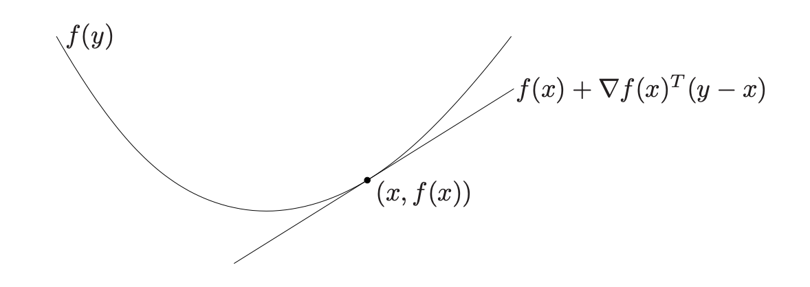

# 0x043 Optimization

- [1. Foundation](#1-foundation)
    - [1.1. Unconstrained Optimization](#11-unconstrained-optimization)
    - [1.2. Equality Constrained Optimization](#12-equality-constrained-optimization)
    - [1.3. Inequality Constrained Optimization](#13-inequality-constrained-optimization)
- [2. Convex Sets](#2-convex-sets)
    - [2.1. Affine Set](#21-affine-set)
    - [2.2. Convex Set](#22-convex-set)
        - [2.2.1. Operations that preserve convexity](#221-operations-that-preserve-convexity)
    - [2.3. Cone Set](#23-cone-set)
    - [2.4. Generalized Inequalities](#24-generalized-inequalities)
    - [2.5. Seperating and Supporting Hyperplanes](#25-seperating-and-supporting-hyperplanes)
    - [2.6. Dual Cones and Generalized Inequalities](#26-dual-cones-and-generalized-inequalities)
- [3. Convex Functions](#3-convex-functions)
    - [3.1. Basic Properties and Examples](#31-basic-properties-and-examples)
    - [3.2. Closedness and Semicontinuity](#32-closedness-and-semicontinuity)
    - [3.3. Operations that preserve convexity](#33-operations-that-preserve-convexity)
    - [3.4. The conjugate function](#34-the-conjugate-function)
    - [3.5. Quasiconvex functions](#35-quasiconvex-functions)
- [4. Duality](#4-duality)
    - [4.1. Lagrange Dual Problem](#41-lagrange-dual-problem)
- [5. Reference](#5-reference)

## 1. Foundation
**Definition (optimization problems)** The most general optimization problems is formulated as follows:

$$ \text{minimize } f_0(x) \\
\text{     subject to } f_i(x) \leq 0, h_j(x) = 0$$

where $f_0$ is the objective function, the inequality $f_i(x) \leq 0$ is inequality constraints, the equation $h_i(x)$ is called the equalit constraints. 

**Definition (optimal value, optimal point)** The *optimal value* $p^*$ is defined as

$$p^* = \inf \{ f_0(x) | f_i(x) \leq 0, h_j(x) = 0 \}$$

We say $x^*$ is an *optimal point* if $x^*$ is feasible and

$$f_0(x^*) = p^*$$

The set of optimal points is the *optimal set*, denoted

$$X_{opt} = \{ x| f_i(x) \leq 0, h_j(x)=0, f_0(x) = p^* \}$$

If there exists an optimal point for the porblem, the problem is said to be *solvable*.

**Definition (local minimum)** Let $f: D \subset \mathbb{R}^n \to \mathbb{R}$. We say $f$ has a *local minimum* of $f(a)$ at point $a$ in D if there exists an open ball with radius $\epsilon$ such that

$$\forall(x \in B_{\epsilon}(a) \cap D)f(x) \geq f(a)$$

To find the global extrema, divide the domain into subdomain and gather their critical points to find the actual global extrema. The existence of global extrema can be guaranteed by the continuous function and compact domain as mentioned in the previous section.

### 1.1. Unconstrained Optimization
First derivate test can be used to find all interior critical points for local extremum.

**Theorem (First derivative test, Fermat)** Let $f$ be a differentiable function from $D \subset \mathbb{R}^n \to \mathbb{R}$, suppose $f$ has a local extremum $f(a)$ at the interior point $a$, then the first partial derivatives of $f$ are zero at $A$

$$\nabla f(a) = 0$$

To decide the actual extremum within the candidates, the second derivative test is required.

**Theorem (Second derivative test)** Let $f \in C^{3}$  in an open set of $\mathbb{R}^n$ containing $a$. If $\nabla f(a)=0$ and Hessian is positive definite at $a$, then $f$ has a local minimum at $a$.

### 1.2. Equality Constrained Optimization

In the equality constraint optimization, 

$$\text{minimize}_\theta f(\theta)\text{  subject to } g(\theta) = 0$$

We can use the Lagrange Multiplier to find critical points.

**Theorem (Lagrange Multiplier)** Any constrained critical point of the function $f$ on the domain $D=\{ g = 0 \}$ must be a point $a$ satifying either of

- $f$ is not differentiable at $a \in D$
- $\nabla g(a) = 0$
- $\nabla f(a) = \lambda \nabla g(a)$

The second condition is called the degeneracy condition, and the last condition is the Lagrange condition.

### 1.3. Inequality Constrained Optimization

In the inequality constraint optimization,

$$\text{minimize}_\theta f(\theta)\text{  subject to } g(\theta) \leq 0$$

There are two types of solutions:
- The constraint could be *slack* or *loose*, meaning there is no force is needed to keep $\theta$ from violating the constraint, in this case $\nabla f=0$ like any unconstrained problems, regardless of what $\nabla g$ is

- The constraint could be *binding* or *tight*, meaning $g(\theta) = 0$, in this case the constraint can exert nonzero force on $\theta$, and we need to find a force cancel out the objective gradient 

**Theorem (complementary slackness)** 

$$\nabla f(\theta) = \alpha \nabla g(\theta)$$

$$\alpha \geq 0, g(\theta) \leq 0$$

$$\alpha (\theta) = 0$$

The 3rd condition is called the complementary slackness encoding the possible cases.

## 2. Convex Sets
### 2.1. Affine Set
**Definition (affine set)** A set $C \subseteq R^n$ is affine if for any $x_1, x_2 \in C$, then $\theta x_1 + (1-\theta)x_2 \in C$ where $\theta \in R$

note: Affine set is a subspace plus an offset

**Definition (affine hull)** The affine hull of $C$ is the affine combination of all points in $C$. The affine dimension of $C$ is the dimension of its affine hull, which is the dimension of the underlying subspace

!!! example "solution set of linear equations"

    The solution set of a system of linear equations is an affine set

    $$\{ x | Ax=b \}$$

!!! example "hyperplane"

    A hyperplane is also a solution set of linear equation, therefore affine set

    $$\{ x | a^Tx =b \}$$

### 2.2. Convex Set

**Definition (convex set)** A set $C$ is convex if for any $x1,x2 \in C$, and any $0 \leq \theta \leq 1 $, then 

$$\theta x_1 + (1-\theta)x_2 \in C$$

**Definition (convex hull)** The convex hull of $C$ is the convex combination of all points in $C$

!!! example "halfspace"

    A halfspace is a convex set

    $$\{ x | a^T x \leq b\}$$

!!! example "ball and ellipsoid"

    A norm ball is a convex set

    $$\{ x | ||x-x_c|| \leq r \}$$

    A lreated family are ellipsoids, they are also convex

    $$\{ x | (x-x_c)^TP^{-1}(x-x_c) \leq 1 \}$$

!!! example "polyhedra and simplex"

    A polyhedron is defined as the solution set of a finite number of halfspaces and hyperplanes, therefore convex

    $$\{ x | Ax \preceq b, Cx=d \}$$

    Simplexes are an important family of polyhedra, it is defined with $k+1$ affinely independent points $v_0, ..., v_k$ (i.e. : $v_1-v_0, v_2-v_0, ...$ are independent), the simplex is given by their convex hull

    $$\{ \theta_0 v_0 + ... + \theta_k v_k | \theta \succeq 0, 1^T \theta = 1 \}$$

#### 2.2.1. Operations that preserve convexity
**Proposition (Intersection preserves convexity)** The intersection of any number of convex sets is a convex set

For example, polyhedron is the intersection of halfspaces and hyperplanes

!!! example "positive semidefinite cone"

    positive semidefinite cone can be expressed 

    $$\bigcap_{z \neq 0} \{ X \in S^n | z^T X z \geq 0 \} $$

    which is the intersection of infinite number of halfspaces $ \{ X \in S^n | z^T X z \geq 0 \}$, and so is convex

**Proposition (convex set and halfspaces)** a closed convex set $S$ is the intersection of all halfspaces that contain it

$$ S = \bigcap \{ H | H, S \subseteq H \} $$

**Proposition (Affine function preserves convexity)**  $y = Ax + b$ and its reverse preserves convexity, which means suppose $S \subset R^n$ is convex and $f: R^n \to R^m$ is an affine function, then the image and reverse image

$$f(S) = \{ f(x) | x \in S \}$$

$$f^{-1}(S) = \{ x | f(x) \in S \}$$

are both convex

!!! example "limear matrix inequality"

    Solution set of linear matrix inequality (LMI)

    $$A(x) = x_1 A_1 + ... + x_n A_n \preceq B$$

    is convex because it is the inverse image of the positive semidefinite cone under the affine function $f(x) = B - A(x)$

**Definition (perspective function)** The perspective function $P: R^{n+1} \to R^n$ with the domain $R^{n} \times R_{++}$ is 

$$P(z, t)=\frac{z}{t}$$

**Proposition (perspective function preserves convexity)** If $C \subset \text{dom}(P)$ is convex, then its image is convex

$$P(C) = \{ P(x) | x \in C \}$$

If $C \subset R^n$ is convex, then the inverse image is also convex

$$P^{-1}(C) = \{ (x, t) \in R^{n+1} | x/t \in C, t > 0 \}$$

**Definition (linear-fractional function)** The linear fractional function is the composition of perspective function with an affine function

$$f(x) = \frac{Ax + b}{c^Tx + d}$$
where $\text{dom }f = \{x | c^T x + d > 0 \}$

Affine function and linear function can be thought as the special cases of linear-fraction by setting $c=0$

**Proposition (Linear-fractional and perspective function preserve convexity)** The perspective functions, linear-fractional functions preserve convexity

### 2.3. Cone Set
**Definition (cone)** A set is cone if for every $x \in C, \theta \geq 0$ then $\theta x \in C$. A set is called convex cone if it is convex and cone

!!! example "norm cones"

    The norm cone is convex cone

    $$\{ (x,t) | ||x|| \leq t \}$$

**Definition (conic hull)** The conic hull of $C$ is the conic combination of all points in $C$

**Definition (proper cone)** A cone $K \subset R^n$ is called a proper cone if it satisfies the following:

-  convex
-  closed
-  solid (has noempty interiors)
-  pointed (contains no line)

!!! example "positive semidefinite cone"

    The set of symmetric positive semidefinite matrices is a proper cone

    $$S^n_{+} = \{ X | X = X^T, X \succeq 0 \}$$

### 2.4. Generalized Inequalities
**Definition (generalized inequality)** A generalized inequality defined with respect to a proper cone $K$ is a partial order

$$x \preceq_{K} y \iff y-x \in K$$

$$x \prec_{K} y \iff y-x \in K^{\circ}$$

The following two generalized inequalities are commonly used

!!! example "nonnegative orthant and componentwise inequality"

    The nonnegative orthant $K=R^n_{+}$ is a proper cone. The associated generalized inequality $\preceq_K$ is the componentwise inequality $(\forall{i})x_i \leq y_i$ 

!!! example "positive semidefinite cone and matrix inequality"

    The positive semidefinite cone is a proper cone. The associated inequality $\preceq_K$ means

    $$X \preceq_K Y \implies Y-X \in S^n_{+}$$

**Definition (minimum, maximum)** $x \in S$ is the minimum element of $S$ with respect to $\preceq_{K}$ if for all $y \in S$, $x \preceq_{K} y$

**Definition (minimal, maximal)** $x \in S$ is the minimal element of $S$ with respect to $\preceq_{K}$ if $y \preceq_{K} x $, then $y = x$

### 2.5. Seperating and Supporting Hyperplanes
**Theorem (separating hyperplane theorem)** Let $A,B$ be two disjoint convex set in $R^n$, there exists a nonzero vector $v$ 

and scalar $c$, such that for all $x \in A, y \in B$,

$$\langle x, v \rangle \geq c, \langle y, v \rangle \leq c$$

The converse, however, is not necessarily true: the existence of a separating hyperplane implies $A,B$ are disjoint.

We need additional constraints to make it true, for example, any two convex sets $A,B$, at least one of which is open, are disjoint iff there exists a separating hyperplane.

**Theorem (supporting hyperplane theorem)** For a non-empty convex set $C$ and its boundary point $x_0$, there exists a supporting hyperplane to $C$ at $x_0$

### 2.6. Dual Cones and Generalized Inequalities
**Definition (dual cone)** The following set $K^{*}$ is called the dual cone with respect to cone $K$

$$K^{*} = \{ y |(\forall{ x \in  K}) x^T y \geq 0 \}$$

Note that the dual cone of a subspace is the orthogonal complement of the subspace

**Properties (dual generalized inequalities)**
$x \preceq_K y \iff (\forall \lambda \preceq_{K^{*}} 0) \lambda^T x \leq \lambda^T y$
$x \prec_K y \iff (\forall \lambda \prec_{K^{*}} 0) \lambda^T x \leq \lambda^T y$
Criterion (dual characterization of minimum) $x$ is the minimum element of $S$ with respect to $K$ iff for every $\lambda \prec_{K^*} 0$, $x$ is the unique minimizer of $\lambda^T z$ over $z \in S$

**Criterion (dual characterization of minimal)** $x$ is the minimal element of $S$ with respect to $K$ iff $x$ minimizes a $\lambda^T x$ for a particular $\lambda \prec_{K^{*}} 0$

## 3. Convex Functions
### 3.1. Basic Properties and Examples
**Definition (Convex function)** A function $f: R^n \to R$ is convex if its domain is a convex set and for all $x, y \in dom(f), \theta \in [0, 1]$ we have

$$f(\theta x + (1-\theta) y) \leq \theta f(x) + (1-\theta)f(y)$$

Note that, convexity of the domain is a prerequisite for convexity of a function. When we call a function convex, we imply that its domain is convex

A function is strictly convex if strict inequality holds whenever $x \neq y \land \theta \in (0, 1) $

Similarly, a function $f$ is (strictly) **concave** iff $-f$ is (strictly) convex

!!! example "affine function"
    An affine function is a convex function whose form is

    $$f(x)=ax+b$$

!!! example "norm"
    A norm $|| \cdot ||$ is also an convex function become accoring to the triangle inequality, we have

    $$||\alpha x + (1-\alpha) y|| \leq \alpha ||x|| (1-\alpha) ||y||$$

!!! example "max function"

    The max function is convex on $R^n$
    $$f(x)= max \{ x_1, ..., x_n \}$$

!!! example "log-sum-exp"

    The log-sum-exp is convex on $R^n$

    $$f(x) = \log \sum_i e^{x_i}$$

!!! example "log-determinant"

    The log-det function is concave on $S^n_{++}$

    $$f(x) = \log\det X$$

**Corollary (convex $\land$ concave = affine)** all affine (and also linear) functions are both convex and concave, and vice versa

Under the assumption of differentiability, we have two equivalent statements of convexity.

**Criterion (1st order condition)** Suppose $f$ is differentiable. Then $f$ is convex iff $dom(f)$ is convex and $\forall x, y \in dom(f)$

$$f(y) \geq f(x) + f(x) + \nabla f(x)^T (y-x)$$

It states that the first taylor approximation is a global underestimator for convex function. Conversely , if the first Taylor approximation is aways a global underestimator, then the function is convex.

**Criterion (2nd order condition)** Suppose $f$ is twice differentiable, then $f$ is convex iff $dom(f)$ is convex and its Hessian is positive semidefinite $\forall x \in dom(f)$

$$ \nabla^2 f(x) \succeq 0$$

For a function on $\mathbb{R}$, this reduces to the simple condition $f''(x) \geq 0$

!!! example "quadratic function"

    Consider the quadratic function $f: \mathbb{R} \to \mathbb{R}$ given by

    $$f(x) = (1/2)x^TPx + q^Tx + r$$

    with $P \in S^n$. $f(x)$ is convex iff $P \succeq 0$

**Definition (sublevel set, superlevel set)** The $\alpha$-sublevel set of $f: R^n \to R$ is defined as

$$C_\alpha = \{ x \in dom(f) | f(x) \leq \alpha  \}$$

**Corollary (sublevel set and convex)** Sublevel sets of a convex function are convex. Note that the converse is not true: a function can have all its sublevel sets convex, but not be a convex function. (e.g: $f(x) = e^{-x}$)

**Definition (epigraph)** The epigraph of a function $f: R^n \to R$ is defined as

$$\text{epi } f = \{ (x,t) | x \in dom(f), f(x) \leq t \}$$

$dom(f)$ can be seen as a projection of $epi(f)$.

**Theorem (epigraph and convexity)** A function is convex iff its epigraph is a convex set

Many results for convex functions can be proved geometrically by using epigraphs and apply results for convex sets.

''' info "convex set and indicator function"
    A convex set $X$ can also be mapped to a indicator function $\delta(x|X)$. 
    A set if convex iff its indicator function is convex

    $$\delta(x|X) = \begin{cases}0 & \text{ if }x \in X \\ \infty & \text{ otherwise} \end{cases}$$

### 3.2. Closedness and Semicontinuity
**Definition (closed function)** A function $f$ is a *closed* function if its epigraph is a closed set.

**Definition (semicontinuous)** A function $f$ is called lower semicontinuous at $x \in \mathcal{X}$ if

$$f(x) \leq \liminf_{k \to \infty} f(x_k) $$

for every sequence ${x_k} \subset \mathcal{X}$ with $x_k \to x$. We say that $f$ is lower semicontinuous at each point $x$ in its domain $\mathcal{X}$. Upper semicontinuous is defined that $-f$ is lower semicontinuous.

### 3.3. Operations that preserve convexity
**Proposition (nonnegative weighted sum)** Nonnegative weight sum of convex function is convex function

$$f = w_1 f_1 + ... + w_n f_m$$

**Proposition (affine mapping)** Affine mapping preserves convexity

$$g(x) = f(Ax + b)$$

!!! example "least square problem is convex"
    that least square problem is a convex problem because norm is convex and its inside is an affine function.

    $$|| Ax - b ||^2_2$$

**Proposition (pointwise maximum) If $f_1, f_2$ are convex function then their pointwise maximum is also convex

$$f(x) = \max \{ f_1(x), f_2(x) \}$$

Extending this to infinite set of convex, we have the supremum
**Proposition (supremum)** If for each $y$, $f(x,y)$ is convex in $x$, then its supreme over $y$ is also convex

$$g(x) = \sup_{y} f(x,y)$$

**Proposition (scalar composition)** Suppose $f(x) = h(g(x)))$ where $h: R \to R$ and $g: R^n \to R$, then the composition rules is

- $f$ is convex if $h$ is convex, extended $h$ is nondecreasing and $g$ is convex
- $f$ is convex if $h$ is convex, extened $h$ is nonincreasing and $g$ is concave

**Proposition (vector composition)** Suppose $f(x) = h(g_1(x), ..., g_k(x))$ where $h: R^k \to R, g_i: R^n \to R$. $f$ is convex if $h$ is convex and nondecreasing in each argument, $g$ is convex

**Proposition (infimum)** If $f$ is convex in $(x,y) $ and $C$ is a convex nonempty set, then the function $g$ is convex  if some $g(x) > -\infty$

$$g(x) = \inf_{y \in C} f(x,y) $$

Notice the difference between previous sup and inf: the inf requires $y$ to be minimized over a convex set where sup does not require anything.

!!! example "distance to a set"

    The distance of a point $x$ to a set $S$ is defined as

    $$dist(x, S) = \inf_{y \in S} ||x - y||$$

    This function is convex

**Proposition (perspective of a function)** If $f: R^n \to R$, then the perspective function of $f$ is the function $g: R^{n+1} \to R$ defined by

$$g(x, t) = t(fx/t)$$

with domain

$$\{ (x,t) | x/t \in dom(f), t  > 0 \}$$

!!! example "euclid norm squared"

    The perspective function on $f(x)=x^Tx$ is convex

    $$g(x, t) = x^Tx/t$$

### 3.4. The conjugate function
**Definition (conjugate function)** Let $f: R^n \to R$. The function $f*: R^n \to R$, defined as

$$f^*(y) = \sup_{x \in \text{dom} f }  (y^T x - f(x))$$

The domain of conjugate function consists of $y \in R^n$ for which the sup is bounded.

Conjugate function $f*$ is a convex function because it is taking sup over a affine function of $y$. This is true regardless of $f$'s convexity.

!!! example "conjugate of convex quadratic function"

    The conjugate of $f(x) = \frac{1}{2}x^TQx$ with $Q$ positive definite, then

    $$f^*(y) = \frac{1}{2}y^*Q^{-1}y$$

!!! example "conjugate of indicator function"

    The conjugate of indicator function f a set $S$, i.e $I(x) = 0$ with $dom(I)=S$ is the support function of $S$

    $$I^*(y) = \sup_{x \in S} y^Tx$$

!!! example "conjugate of log-sum-exp"

    The conjugate of log-sum-exp $f(x) = \log (\sum_i e^{x_i})$ is the negative entropy function

    $$f^*(y) = \sum_i y_i \log(y_i)$$

    with the domain restricted to the probability simplex.

**Corollary (Fenchel's inequality)** from the conjugate definition, it is obvious that

$$(\forall(x, y)) f(x) + f^*(y) \geq x^Ty$$

**Lemma (conjugate's conjugate)** If $f$ is convex and closed, then

$$f^{**} = f$$

### 3.5. Quasiconvex functions
**Definition (quasiconvex)** A function $R^n \to R$ is called *quasiconvex* if its domain and all sublevel sets

$$S_\alpha = \{ x \in dom(f) | f(x) \leq \alpha \}$$

for all $\alpha \in R$ are convex. A function is quasiconcave if $-f$ is quasiconvex. It is quasilinear if it is both quasiconvex and quasiconcave

!!! example "log is quasilinear"

    $\log x$ on $R_{++}$ is both quasiconvex and quasiconcave therefore quasilinear.

!!! example "quasiconvex functions on R"

    A continous function $R \to R$ is quasiconvex in following cases

    - $f$ is nondecreasing
    - $f$ is nonincreasing
    - $f$ is nonincreasing until a point and nondecreasing after that

**Criterion (Jensen's inequality for quasiconvex function)** A function $f$ is quasiconvex iff domain is convex and for all $x,y$ and $\theta \in [0, 1]$

$$f(\theta x + (1-\theta) y) \leq \max \{ f(x), f(y) \}$$

**Criterion (first order condition)** Suppose $f: R^n \to R$ is differentiable. Then $f$ is quasiconvex iff domain is convex and for all $x,y \in dom(f)$

$$f(y) \leq f(x) \implies \nabla f(x)^T (y-x) \leq 0$$

**Criterion (second order condition)** Suppose $f$ is twice differentiable. If $f$ is quasiconvex, then for all $x \in dom(f), y \in R^n$

$$y^T \nabla f(x) = 0 \implies y^T \nabla^2 f(x) y \geq 0$$

## 4. Duality
### 4.1. Lagrange Dual Problem
**Definition (Lagrangian)** The Lagrangian $L: R^n \times R^m \times R^p \to R$ associated with the standard form optimization problem is

$$L(x, \lambda, \nu) = f_0(x) + \sum_{i=1}^m \lambda_i f_i(x) + \sum_{i=1}^{p} \nu_i h_i(x)$$

$\lambda$ is called the Lagrange multiplier and $\nu$ is called dual variables. Domain $\mathcal{D} = \mathrm{dom} f_i \cap \mathrm{dom} h_i$

**Definition (dual function)** The Lagrange dual function is the minimum value over $x$

$$g(\lambda, \nu) = \inf_{x \in \mathcal{D}} L(x, \lambda, \nu)$$

Dual function over $(\lambda, \nu)$ is concave even the original problem is not convex. 

One of the motivations of Lagrangian is to gives the lower bound on the optimal value of the original problem.

$$g(\lambda, \nu) \leq p*$$

This is because for any feasible point $x$, we have $f_i(x) \leq 0, h_i(x)=0$, for any $\lambda \geq 0$

$$\sum_i \lambda_i f_i(x) + \sum_i \nu_i h_i(x) \leq 0$$

Then we know

$$L(x, \lambda, \nu) = f_0(x) + \sum_i \lambda_i f_i(x) + \sum_i \nu_i h_i(x) \leq f_0(x)$$

Taking $\inf_x$ yields the conclusion of the lower bound.

**Definition (dual problem)** The Lagrange dual problem associated with the primal problem is a convex optimization problem even the primal problem is not

$$\text{maximize } g(\lambda, \nu) $$

$$\text{subject to } \lambda \succeq 0 $$

Dual feasible means there exists a pair $(\lambda, \nu)$ such that $\lambda \succeq 0, g(\lambda, \nu) > -\infty$. We refer to $(\lambda^*, \nu^*)$ as dual optimal if they are optimal for the dual problem

The dual problem is always a convex optimization problem even the primal problem is not convex

**Proposition (weak duality)** The optimal value of the dual problem, denoted $d^*$ is by definition, the best lower bound on the optimal value of the primal problem $p^*$, therefore

$$d^* \leq p^*$$

This property is called the weak duality

**Proposition (strong duality and Slater's condition)** The strong duality holds when the optimal duality gap is zero

$$d^* = p^*$$

The strong duality does not always hold, one of condition to make it hold is the Slater's condition such that there exists a strictly feasible point

$$f_i(x) < 0$$

**Definition (proof, certificate)** If we can find a dual feasible $(\lambda, \nu)$, we establish a lower bound on the optimal value of the primal problem: $p^* \geq g(\lambda, \nu)$. Then the point provides proof or certificate that  $p^* \geq g(\lambda, \nu)$

**Criterion (Karush-Kuhn-Tucker, KKT)** Let $x^*, (\lambda^*, \nu^*)$ be any primal and dual optimal points with zero duality gap. Then

$$ f_i(x^*) \leq 0 $$

$$h_i(x^*) = 0$$

$$\lambda^* \geq 0$$

$$\lambda^* f_i(x^*) = 0$$

$$ \nabla f_0 (x^*) + \sum_{i=1}^m \lambda^* \nabla f_i(x^*) + \sum_{i=1}^p \nu_i^* \nabla h_i (x^*) = 0 $$

If a convex optimization problem with differentiable objective and constraint functions satisfies Slater's condition, then the KKT conditions provide necessary and sufficient conditions for optimality

## 5. Reference
[1] Boyd, Stephen, and Lieven Vandenberghe. Convex optimization. Cambridge university press, 2004.

[2] Bertsekas, Dimitri P. Convex optimization theory. Belmont: Athena Scientific, 2009.