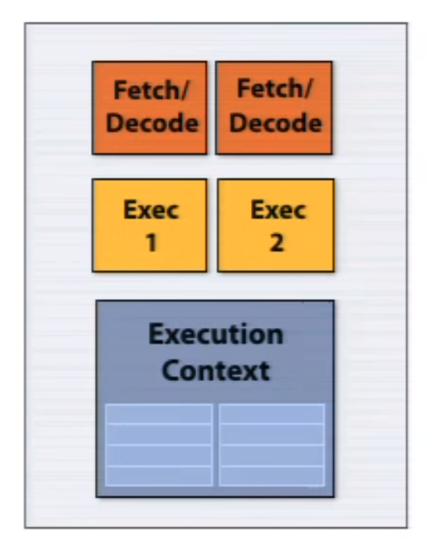
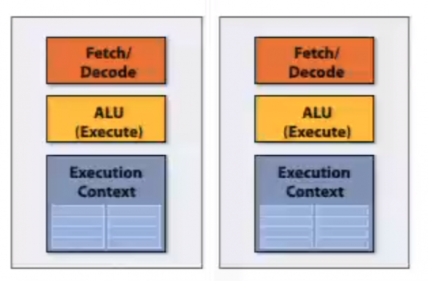

# 0x221 Microarchitecture

- [1. Arithmetic](#1-arithmetic)
    - [1.1. Integer](#11-integer)
    - [1.2. Real Numbers](#12-real-numbers)
        - [1.2.1. Fixed-point Representation](#121-fixed-point-representation)
        - [1.2.2. Float Representation](#122-float-representation)
- [2. Processor](#2-processor)
    - [2.1. Notable CPU](#21-notable-cpu)
    - [2.2. Flynn's taxonomy](#22-flynns-taxonomy)
        - [2.2.1. SISD](#221-sisd)
        - [2.2.2. SIMD](#222-simd)
        - [2.2.3. MISD](#223-misd)
        - [2.2.4. MIMD](#224-mimd)
    - [2.3. Pipeline](#23-pipeline)
    - [2.4. Execution](#24-execution)
        - [2.4.1. Branch Prediction](#241-branch-prediction)
- [3. Processor](#3-processor)
    - [3.1. Microcode](#31-microcode)
- [4. Memory](#4-memory)
    - [4.1. Cache](#41-cache)
        - [4.1.1. Hierarchy](#411-hierarchy)
        - [4.1.2. Placement Policy](#412-placement-policy)
        - [4.1.3. Management](#413-management)
    - [4.2. Memory Controller](#42-memory-controller)
        - [4.2.1. MMU](#421-mmu)
        - [4.2.2. TLB](#422-tlb)
- [5. Storage](#5-storage)
- [6. Reference](#6-reference)

## 1. Arithmetic

### 1.1. Integer

### 1.2. Real Numbers
Note that historically, floating point is not the only representation for real numbers, there were fixed point representations where the gaps are all of the same size

#### 1.2.1. Fixed-point Representation

#### 1.2.2. Float Representation
The IEEE 754 standard defines the representation of floating point as follows

$$(-1)^S (1+Fraction) \times 2^{(Exponent - Bias)}$$

The part of $1+Fraction$ is also called *significand*, the fraction is also known as *mantissa*

There are several special cases
- when fraction and exponent are both 0, the represented number is 0 (it is special because it does not require +1)
- when exponent are all 1 and fraction is 0, it is infinity
- when exponent are all 1 and fraction are nonzero, it is NaN

In single-precision
- S is 1 bit
- Exponent is 8 bit and Bias is $127_{Ten}$
- Fraction is 24 bit (6 decimal digits of precision)
- range is around $[2.0 \times 10^{-38}, 2.0 \times 10^{38}]$


```go
var f float32 = 16777216  // 1<<24
fmt.Println(f == f+1)  // true
```

In double-precision
- S is 1 bit
- Fraction is 11 bit and Bias is $1023_{Ten}$
- Fraction is 52 bit (15 decimal digits of precision)
- range is around $[2.0 \times 10^{-308}, 2.0 \times 10^{308}]$

To find the detailed numbers on each machine, you can consult <float.h> from standard C header.

## 2. Processor

### 2.1. Notable CPU

*   4 bit: intel 4004 (first intel chip, 1970, 2k transistor)
*   8 bit: intel 8008 (1972, 3k transistors)
*   16 bit: intel 8086 (1976), PDP-11 (minicomputer DEC 1970)
*   32 bit: intel 80386 (1985), VAX-11 (DEC 1977)
*   64 bit

### 2.2. Flynn's taxonomy

#### 2.2.1. SISD

**pipelines**

**superscalar processor** The superscalar architecture implements parallelism within one core executing independent part of instruction from the same instruction stream. This was one of the main strategies in the pre-multi core era, but requires a lot transistors for cache, branch predictor, out-of-order logics. P5 Pentium was the first x86 superscalar processor.

The following example shows a single-core architecture which can execute two independent instructions simultaneously from a single instruction stream.



#### 2.2.2. SIMD

**vector processor**

**instruction stream coherence**: same instruction sequence applied to all elements, which is necessary for efficient SIMD execution, but not necessary for multicore parallelization

**SSE instructions**: 128 bit (4 wide float)

**AVX instructions**: 256 bits (8 wide float)

#### 2.2.3. MISD

#### 2.2.4. MIMD

**hyper-threading**: super-scalar with multiple execution contexts in a single core

**multi-core**: thread-level parallelism. simultaneously execute a completely different instruction stream on each core



### 2.3. Pipeline

### 2.4. Execution

#### 2.4.1. Branch Prediction

security: meltdown and spectre

## 3. Processor

**Single-cycle implementation**: an instruction is executed in one clock cycle, the slowest instruction decide cycle time

**Multi-cycle implementation**: instruction processing broken into multiple cycles/stages.

### 3.1. Microcode

## 4. Memory

### 4.1. Cache

Cache is usually implemented with SRAM

#### 4.1.1. Hierarchy

*   **L1**: reference 1ns, usually in core
*   **L2**: reference 4ns, usually out core
*   **L3**: usually shared by multiple cores

#### 4.1.2. Placement Policy

*   **full associative cache**: each memory can be placed anywhere
*   **directed mapped cache**: each memory can be placed at one place
*   **LRU**: Least Recently Used

#### 4.1.3. Management

*   **Write-through**: write data to cache and RAM at the same time
*   **Write-back**: delay writing data to RAM

### 4.2. Memory Controller

#### 4.2.1. MMU

the unit to translate virtual address into physical address

#### 4.2.2. TLB

*   the cache that saves the recent address mapping
*   it is a cache of page tables
*   only store the final translation even it is a multiple-level memory
*   change cr3 in x86 can clear TLB automatically

## 5. Storage

## 6. Reference

[1] Patterson, David A., and John L. Hennessy. _Computer Organization and Design ARM Edition: The Hardware Software Interface_. Morgan kaufmann, 2016.

[2] Hennessy, John L., and David A. Patterson. _Computer architecture: a quantitative approach_. Elsevier, 2011.

[3] CMU 15-418/15-618: Parallel Computer Architecture and Programming

[4] CMU 18-447 Introduction to Computer Architecture