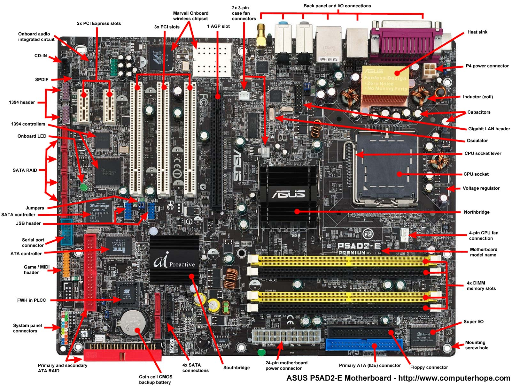
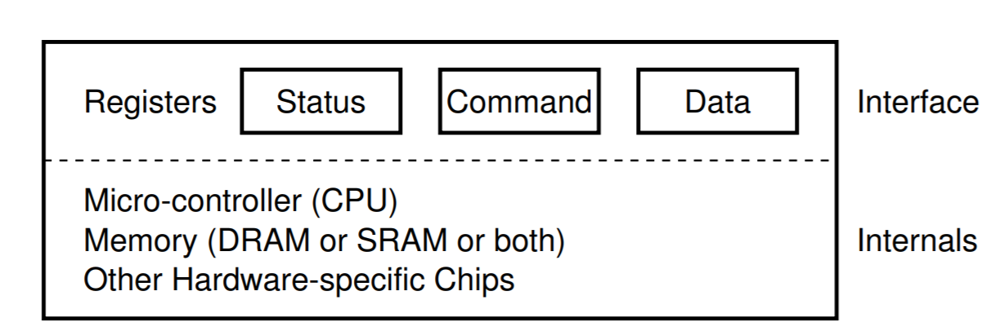
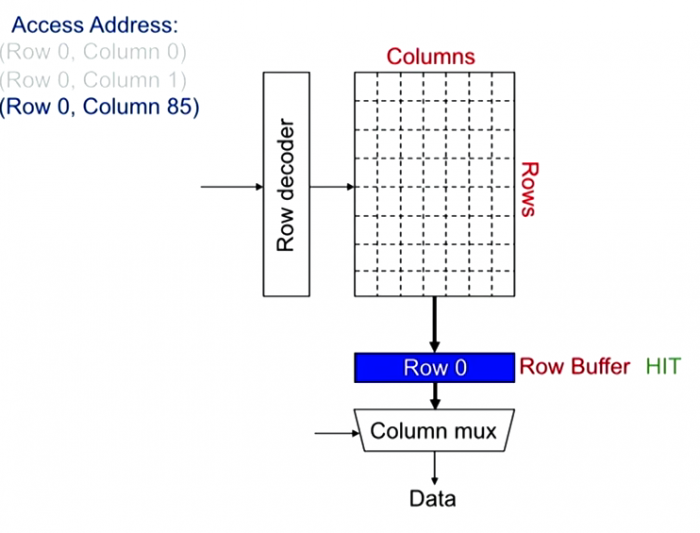

# 0x222 Computer Organization

This page summarizes every peripheral and hardware interface/component connected to the motherboard except CPU. CPU related contents will go to the Processor page.

## Overview
The traditional overview of the Hub architecture looks like this

**Component (Northbridge)** a traditional chip, now replaced by PCH (platform controller hub) in intel's chip. It connects CPU and high-speed modules (DDR RAM and graphic card)
Intel Management Engine: firmware is based on MINIX 3

**Component (Southbridge)** a traditional IO chip, now replaced by PCH (platform controller hub) in intel's chip, it connects northbridge with slow-speed modules
To connect northbridge and southbridge, we can use DMI (direct media interface) which is Intel's proprietary link.

### Bus
A bus is a shared communication link, which uses one set of wires to connect multiple subsystems. The advantages are versatility and low cost, the disadvantage is that it might create the communication bottleneck (e.g: through put)

#### Process-Memory Bus
usually short, high speed bus

#### IO Bus
lengthy, can have many types of devices connected to them, and can have a wide range in the data bandwidth.

**PCI**: faster, usually used for graphics and some other higher-performance IO
**peripheral bus**: slower bus (e.g: SCSI, SATA, USB) connecting slow devices (e.g: keyboard, disks, mice)
Device Interface
The canonical device interface looks like this, it has three registers
- status: read to see the current status of device
- command : tell the device to perform task
- data: pass/get data to/from device

### Data Transfer Protocols
There are mainly three types of protocols to transfer data between CPU, memory and IO devices.

**Programmed IO (pooling)** : CPU constantly monitor (polling) the status register of device, when free, write the command into the command register, and data into data register, waste of CPU when waiting long time.

**Interrupt based IO**: issue the request and put the process to sleep, when device finish it, raise a hardware interrupt to wake out the process

**DMA (direct memory access)**: A specific device that can orchestrate transfers between devices and main memory without much CPU usage.

### Communication Methods
Microprocessors usually use two methods to connect external devices:

**Port-mapped IO**: use the separate address space with dedicated instruction (e.g: x86 in/out) 
**Memory-mapped IO**: use the same address space as main memory by map registering and ports. Access is done by normal load/store instructions. Common in RISC CPUs. Not to be confused with the memory-mapped file.

## Memory

### Architecture
#### Shared Address Space Model
Any processor can load and store from any address (shared address space)

#### UMA
symmetric multi-processor
common one
all memory access are post to the same bus

#### NUMA
each core has its local memory (but was also accessible form other cores)

### SRAM
implemented with flipflop, used for cache

### DRAM
implemented with capacitor, used for main memory

DRAM Bank Operation looks like following diagram. In the first step, row decoder selects one row, and send it to Row Buffer. Then column mux selects data. If the row buffer has already the correct row, then now need to fetch row. Typical Row size is 8KB, and request size is 64B.

DRAM Scheduling Policies
row hit first: prioritize apps with high row buffer locality > apps with random access
oldest first: prioritize memory-intensive applications

DRAM Latency
reference: 100 ns
1mb sequential read: 0.25 ms

## Storage Devices
### Interface
ATA
SCSI
SCSI command, bus, id
CPU->Host Bus Adaptor -> Target
Host Bus Adaptor translate PCI bus into SCSI bus

### Flash Memory
NAND flash memory and NOR flash memory

A good video on the structure of SSD

Structure of SSD
The smallest element is the cell, depending on how many bits each cell can store (by different level), there are SLC (1 bit), MLC (2 bit), TLC (3bit) and QLC (4 bit) the SLC has the highest performance but the worst cost.

Connecting those cell vertically gives a string (or vnand), consisting of around 100 cells.

Connecting those cell horizontally gives a page, consisting of around 10k~100k cells, this is the minimum element for IO, usually 4KB.

Page are organized into blocks by the order of 32~256 pages. 

SSD Latency
4k random access: 0.15 ms
1mb sequential access: 1 ms
SSD Bandwidth
SATA: 500M/sec
PCI Express: > 1G/sec

### Magenetic Disk
Component
This image has an empty alt attribute; its file name is hdd-700x499.png
Reference: database system concepts
Latency Time:

IO can be checked with dd command in linux

disk seek: 10 ms
1mb sequencial read: 20 ms
RAID
RAID 0: striping
Tape Storage
Bus
AGP
PCI Express
bandwidth is determined by generation and length (adapted to lowest one).  Here is a simple video tutorial.

Generation
double bandwidth in each generation
- generation 1: 250GB/s
- generation 2: 500GB/s
- generation 3: 1GB/s
  
  
double bandwidth in each generation
Length
1x, 2x, 4x, 8x, 16x
4x can fit into 8x but only half speed

USB

## Display
### VGA
### DVI

## FPGA
FPGA provides faster hardware prototype and optimized hardware acceleration. Looks like modern FPGA is integrated with processors.  But they are expensive, the price of Intel Stratix 10 looks like over 20k dollars.

### Microarchitectures
System-on-Chip Products
Altera (Intel): Arria 10 (used for NLU on bing) -> Stratix 10
Xilinx: Zynq Ultrascale+
LUT
Look-Up Tables (LUT) is intended to implement arbitrary combinational logic. 

 implemented by MUX and SRAM.  SRAM stores the configuration memory.  The input is used to select the stored memory via MUX.
Can simulate any truth table (e.g. : AND NOR ... ) 
Typically 6-LUTs
Switches
Switches can be configured to connect LUTs. It is something like bus

### Synthesize
Language: Verilog or VHDL
FGPA routing is a NP-hard problem (a disadvantage of FPGA)
Reference:
altera FPGA white paper
What is a LUT 
A HN thread comparing FPGA with GPU
Lecture on FPGA
Operating Systems Three Easy Pieces

