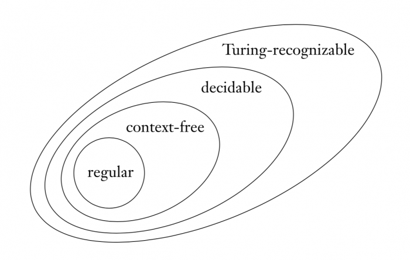

# 0x300 Computation

- [1. Regular Languages (Type 3)](#1-regular-languages-type-3)
    - [1.1. Finite Automaton](#11-finite-automaton)
        - [1.1.1. Deterministic Finite Automaton](#111-deterministic-finite-automaton)
        - [1.1.2. Nondeterministic Finite Automaton](#112-nondeterministic-finite-automaton)
        - [1.1.3. Finite State Transducer](#113-finite-state-transducer)
    - [1.2. Regular Expression](#12-regular-expression)
    - [1.3. Regular Grammar](#13-regular-grammar)
- [2. Context Free Languages (Type 2)](#2-context-free-languages-type-2)
    - [2.1. Context Free Grammar](#21-context-free-grammar)
        - [2.2. Chomsky Normal Form (CNF)](#22-chomsky-normal-form-cnf)
    - [2.3. Pushdown Automaton](#23-pushdown-automaton)
- [3. Context-Sensitive Languages (Type 1)](#3-context-sensitive-languages-type-1)
- [4. Recursive Languages](#4-recursive-languages)
    - [4.1. Turing Machine](#41-turing-machine)
    - [4.2. Recursive Function](#42-recursive-function)
    - [4.3. Lambda Calculus](#43-lambda-calculus)
- [5. Recursively Enumerable Language (Type 0)](#5-recursively-enumerable-language-type-0)
    - [Recognition](#recognition)
- [6. Reference](#6-reference)

This note is arranged based on the Chomsky hierarchy from Type 3 to Type 0.

Note that all models here have access to some memory (limited or not), these are all models of sequential logic. An even model low-level model is the combinational logic, which is the pure function of the input and it has no access to any memory

**Definition (alphabet)** Alphabet are defined as a finite set of symbols. e.g: $\Sigma = \{ 0, 1 \}, \Sigma = \{ A,B, ..., Z \}$

**Definition (string)** A string is a finite sequence of symbols from some alphabet. e.g: $0101010$ from $\Sigma = \{ 0, 1 \}$

**Definition (language)** A language is a set of string chosen from some $\Sigma^*$

**Definition (grammar)** A formal grammar is a set of rules for rewriting strings, along with a "start symbol" from which rewriting starts.

Note that a grammar is simply a set of rules defining the syntax of a specific language. It does not describe the semantics of the language (i.e: meaning of the strings.)

**Definition (recognition)** We say that a model $M$ recognizes language $A$ if

$$A = \{ w | M \text{ accepts } w \}$$

**Definition (model of computation)** a model of computation is a model which describes how a set of outputs are computed given a set of inputs 

In my personal understanding, it is just the f part of a general $y=f(x)$

Personally, I think model of computation (or formal language) is IDL of abstract machines.

There are mainly three models of computation: regular languages, CFG and Turing Machine.

The difference of three models can be characterized by their memory usage

- regular language: limited memory
- CFG: unlimited stack-like memory (restricted)
- Turing Machine: unlimited random access memory (unrestricted)

## 1. Regular Languages (Type 3)

**Definition (regular language)** A language is called a regular language is some FA recognizes it

**Lemma (closed operations)** The regular languages are closed under following operations
- (union) If $A_1, A_2$ are regular languages, then $A_1 \cup A_2$ is regular
- (intersection) If $A_1, A_2$ are regular languages, then $A_1 \cap A_2$ is regular
- (concatenation) If $A_1, A_2$ are regular languages, then $A_1 \circ A_2$ is regular

The proof is easy by using NFA formulation.

One technique for proving nonregularity is to use the pumping lemma.
**Criterion (pumping lemma)** If $A$ is a regular language, then there is a number $p$ (pumping length), where, if $s$ is any string in $A$ of length at least $p$, then $s$ maybe divided into 3 pieces, $s=xyz$, satisfying the following conditions

- $(\forall i \geq 0) xy^iz \in A$
- $|y| > 0$
- $|xy| \leq p$

!!! example "nonregular language"

    The following language $A$ is nonregular because it requires infinite number of memory. The nonregularity can be proved by using pumping lemma

    $$A = \{ 0^n 1^n | n \geq 0 \}$$

Regular languages can be expressed by three different formulation: finite automaton, nondeterministic finite automaton and regular expression. They are all equivalent.

### 1.1. Finite Automaton
The automaton computes a function that maps string into the set ${0,1}$ (i.e. acceptance or not)

#### 1.1.1. Deterministic Finite Automaton
**Definition (finite automaton)** A finite automaton is a 5-tuple $(Q, \Sigma, \delta, q_0, F) $

- $Q$ is a finite set called the states
- $\Sigma$ is a finite set called alphabet
- $\delta: Q \times \Sigma \rightarrow Q$ is the transition function
- $q_0 \in Q$ is the start state
- $F \subseteq Q $ is the set of accept states
  
Interface:
- input: a string of alphabet
- output: Accept or Reject  (I prefer to understanding the output as a 1/0 bit)
  
If $A$ is the set of all strings that FA $M$ accepts, then $A$ is the language of machine $M$, which means $L(M)=A$

#### 1.1.2. Nondeterministic Finite Automaton
**Definition (nondeterministic finite automaton)** A nondeterministic finite automaton (NFA) is a 5-tuple $(Q, \Sigma, \delta, q_0, F)$

- $Q$ is a finite set of states
- $\Sigma$ is a finite alphabet
- $\delta: Q \times \Sigma_{\epsilon} \to \mathcal{P}(Q)$ is the transition function
- $q_0 \in Q$ is the start start
- $F \subseteq Q$ is the set of accept states

**Theorem (equivalence between DFA and NFA)** The two machines are equivalent (they are recognizing the same language)

Proof outline: Every DFA is a special case of NFA, so DFA -> NFA is obvious. To prove the other direction (NFA -> DFA), we can construct a NFA from DFA by consider the power set of states and assign deterministic transition based on NFA transitions.

Thus NFA gives an alternative way of characterizing the regular language.

**Corollary (NFA and regular language)** A language is regular iff some NFA recognizes it.

#### 1.1.3. Finite State Transducer
FST accept pairs of strings

**Definition (finite state transducer)** A finite state transducer is a tuple of

- $Q$ is a finite set of states
- $\Sigma$ is a finite set of input alphabet
- $\Gamma$ is a finite set of output alphabet
- $I \subset Q$ is the set of initial states
- $F \subset Q$ is the final states
- $\epsilon \subseteq Q \times (\Sigma \cup \{ \lambda \}) \times (\Gamma \cup \{ \lambda \} ) \times Q$ is the transition relation
  
**Definition (regular relations)** A generalization (tuple) of regular languages.

- the empty set and all $(x, y)$ where $x \in \Sigma, y \in \Gamma$
- $R_1 \circ R_2$ where $R_1, R_2$ are regular relation
- $R_1 \cup R_2$ where $R_1, R_2$ are regular relation
- $R^* = \cup_{i=0}^{\infty} R_i$
  

### 1.2. Regular Expression
According to Wikipedia, the inventor of regular expression is Stephen Cole Kleene (the guy behind Kleene's star), interestingly, he is a student of Alonzo Church.

We can use the regular operations to build up expressions describing languages, which are called regular expressions. e.g.: $(0 \cup 1)0^*$

We can define regular expression inductively as follows:
**Definition (regular expression)** $R$ is said to be a regular expression if $R$ is

- $a$ for some $a$ in the alphabet $\Sigma$
- $\epsilon$
- $\emptyset$
- $(R_1 \cap R_2)$
- $(R_1 \circ R_2)$
- $(R_1^*)$

Note that the value of a regular expression is a language.

Regular expression is useful, for example, to implement lexical analysis rule in compiler.

### 1.3. Regular Grammar
**Definition (regular grammar)** A regular grammar is a formal grammar with the following forms

- $A \to a$
- $A \to aB$
- $A \to \epsilon$

Every regular grammar describes a regular language

## 2. Context Free Languages (Type 2)
Context Free languages is a more expressive language collection than regular languages. It can be used for natural language parsing and compiler.

**Definition (context free language)** Any language that can be generated by some context-free grammar is called a context-free language. We write $L(G)$ for the language of grammar $G$

Note that the name of context-free is because subtree node is not affected by its surrounding context (On the other hand, context-sensitive languages are affected by contexts $\alpha, \beta$ as in the following section)

The models of CFL is a computation model with un-limited memory but with limited manner of using memory.

### 2.1. Context Free Grammar
**Definition (context-free grammar)** A context free grammar is a 4-tuple $(V, \Sigma, R, S)$ where

- $V$ is a finite set of variables
- $\Sigma$ is a finite set, disjoint from $V$, called the terminals
- $R$ is a finite set of rules, with each rule being a variable and a string of variables and terminals
- $S \in V$ is the start variable

!!! example "nonregular language"

    Consider the following context free grammar $G$

    $$A \to 0A1; A \to \epsilon$$

    The language of this grammar is
    
    $$L(G) = \{ 0^n1^n | n geq 0 \}$$

    Recall that this language is not regular

!!! example "language of valid parenthesis"

    The following grammar

    $$S \to ( S ) | SS | \epsilon$$

    The language of this grammar is all strings of properly nested parenthesis

!!! example "language of arithmetic expressions"

    Consider grammar $G=(V, \Sigma, R, \text{<EXPR>})$ where $V=\{ \text{<EXPR>, <TERM>, <FACTOR>} \}$ and $\Sigma=\{ a, +, \times, (, )\}$

    The rules are

    $$\text{<EXPR>} \to \text{<EXPR>+<TERM> | <TERM>}$$
    $$\text{<TERM>} \to \text{<TERM>} \times \text{<FACTOR> | <FACTOR>}$$
    $$\text{<FACTOR>} \to \text{(<EXPR>) | a}$$

    This grammar, for example, can enerate $a+a\times a$ and $(a+a) \times a$ properly

**Lemma (convert DFA to CFG)** Every DFA can be converted into a CFG easily by following rules:

- make variable $R_i$ for each state $q_i$
- add the rule $R_i \to a R_j$ for every $\delta(q_i, a) = q_j$
- $R_i \to \epsilon$ if $q_i$ is an accept state

#### 2.2. Chomsky Normal Form (CNF)

If a grammar generates the same string in several different ways, we say that the string is derived *ambiguously* in that grammar.

**Definition (ambiguitiy)** A string $w$ is derived ambiguously in context-free grammar $G$ if it has two or more different leftmost derivations. Grammar $G$ is ambiguous if it generates some string ambiguously.

Note that **leftmost derivation** means that at every step the leftmost remaining variable is the one replaced.

!!! example "ambiguous arithmetic expression"

    The following arithmetic form is ambiguous

    $$\text{<EXPR> } \to \text{<EXPR>+<EXPR> | <EXPR> x <EXPR> | (<EXPR>)} | a$$

!!! example "ambiguous sentence"

    Naturla language also has ambiguity in syntactic analysis.

    *I once shot an elephant in my pajamas*

    Consider the possibilities whether I am in my pajamas or elephant is in my pajamas

**Definition (Chomsky Normal Form)** A context-free grammar is in Chomsky normal form if every rule is of the form

- $A \to BC$
- $A \to a$

where $a$ is any terminal, $A,B,C$ are any variables.

**Theorem (convert CFG to CNF)** Any context-free language is generated by a context-free grammar in Chomsky normal form.

How to transform a context free grammar to Chomsky Normal form? binarization.

### 2.3. Pushdown Automaton
The pushdown automata is similar to that of the nondeterministic finite automata but have an extra component called a stack.

Note there are deterministic and nondeterministic versions of pushdown automaton, they are NOT equivalent in power (nondeterministic is more powerful)

The nondeterministic one is equivalent in power to context-free grammars.

The formal definition of nondetermistic pushdown is

**Definition (pushdown automaton)** A pushdown automaton is a 6-tuple $(Q, \Sigma, \Gamma, \delta, q_0, F)$ where $Q, \Sigma, \Gamma, F$ are all finite sets and

- $Q$ is the set of states
- $\Sigma$ is the input alphabet
- $\Gamma$ is the stack alphabet
- $\delta: Q \times \Sigma_{\epsilon} \times \Gamma_{\epsilon} \to \mathcal{P}(Q \times \Gamma_{\epsilon})$ is the transition function ($\mathcal{P}$ means the power set)
- $q_0 \in Q$ is the start state
- $F \subset Q$ is the set of accept states

!!! example "example of nondeterministic pushdown automaton"

    Consider the language

    $$\{ a^ib^j c^k | i, j, k \geq 0 \text{ and } (i=j \text{ or } i=k) \}$$

    This language can be accepted by pushdown automaton. Intuively, it reads all $a$ and push them to the stack, then make a nondeterministic decision whether $i=j$ or $i=k$, then handle each case respectively.

**Theorem** A language is context free iff some pushdown automaton recognizes it

Basic idea of proof 
- context free $\to$ pushdown automaton: we can constrauct a pushdown automaton by first pushing the start symbol to the stack and then nondeterministicaly branching for each nonterminal rule, when the stack's top is a terminal, we match that against the input. If we match all nonterminals on the stack and the input perfectly, then it accepts the string.

## 3. Context-Sensitive Languages (Type 1)
Grammar
$$\alpha A \beta \to \alpha \gamma \beta$$

## 4. Recursive Languages
The recursive languages have three different formulations: Turing machine, recursive function and lambda calculus, which is proved by the Church-Turing thesis.

### 4.1. Turing Machine

Any string in the language will be accepted by the TM
Any other string will not be accepted (halting OR rejected)

**Definition (decidable)** A language is called decidable (or Recursive) if some Turing machine decides it

- Any string in the language will be accepted by the TM
- Any other string will not be rejected

A problem is said to be decidable if we can always construct a corresponding algorithm that can answer the problem correctly
  
**Definition (Universal Turing Machine)** Universal turing machine is a machine that can simulate any other Turing Machine.

### 4.2. Recursive Function

### 4.3. Lambda Calculus

## 5. Recursively Enumerable Language (Type 0)

### Recognition

**Definition (Decision problem)** whether TM can decide a language by answering yes or no without looping. The following are some famous undecidable problems.

!!! example "Entscheidungsproblem"
    The decision problem in first-order logic.

    This is recursively enumerable language but not recursive language, therefore undecidable. It is proven by Church-Turing Thesis

!!! example "Hilbert's 10th problem"

    the decision problem of Diophantine equations which have integer roots. Proven undecidable.

!!! example "Halting problem"

    the decision problem of deciding whether a TM will halt. Proven undecidable by Turing. (proof: by easy contradiction)

**Definition (recognizable)** A language is called recognizable (or Recursive Enumerable) if some Turing machine recognizes it.

The cardinality of all possible languages is continuum, and the cardinality of language recognizable by Turing Machine is countable. Therefore, there are languages that are not recognizable by TM.

!!! example "non-recursively enumerable language"

    The complement of the halting set is an example of non-recursively enumerable language

    $$\bar{HALT} = \{  (M,x) | M \text{ does not halt on input } x \}$$

## 6. Reference
[1] Sipser, Michael. "Introduction to the Theory of Computation." ACM Sigact News 27.1 (1996): 27-29.

[2] Chapter 10 of Aho, Alfred V., and Jeffrey D. Ullman. Foundations of computer science. Computer Science Press, Inc., 1992. pdf is released by the author [http://infolab.stanford.edu/~ullman/focs/ch10.pdf](http://infolab.stanford.edu/~ullman/focs/ch10.pdf)