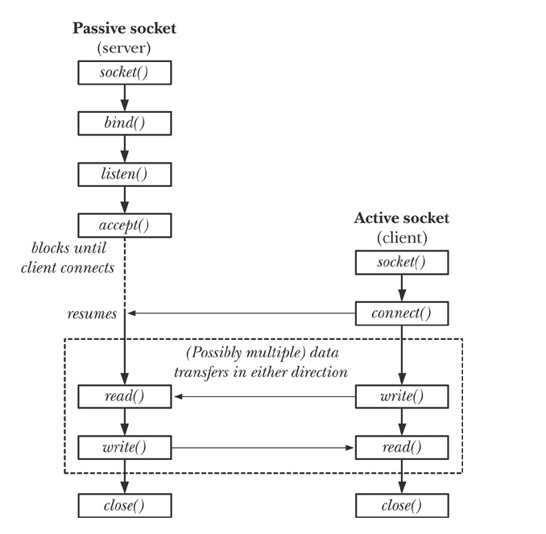
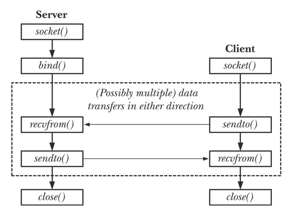

# 0x322-Linux Interface

- [1. System Call](#1-system-call)
    - [1.1. ABI](#11-abi)
    - [1.2. unistd.h](#12-unistdh)
        - [1.2.1. x86](#121-x86)
        - [1.2.2. amd64](#122-amd64)
- [2. Process](#2-process)
- [3. Threads](#3-threads)
    - [3.1. Thread Creation](#31-thread-creation)
    - [3.2. Thread Synchronizations](#32-thread-synchronizations)
        - [3.2.1. Mutex](#321-mutex)
        - [3.2.2. Condition Variables](#322-condition-variables)
    - [3.3. Green Thread](#33-green-thread)
- [4. File System](#4-file-system)
    - [4.1. File Attributes](#41-file-attributes)
    - [4.2. File IO](#42-file-io)
    - [4.3. IO Multiplexing](#43-io-multiplexing)
        - [4.3.1. select](#431-select)
        - [4.3.2. poll](#432-poll)
        - [4.3.3. epoll](#433-epoll)
    - [4.4. File Monitoring](#44-file-monitoring)
    - [4.5. Other IO](#45-other-io)
- [5. Command](#5-command)
- [6. Signals](#6-signals)
- [7. Memory](#7-memory)
    - [7.1. Shared Memory](#71-shared-memory)
    - [7.2. Memory Allocation](#72-memory-allocation)
- [8. Credentials](#8-credentials)
    - [8.1. Users / Groups](#81-users--groups)
- [9. IPC](#9-ipc)
    - [9.1. System V IPC](#91-system-v-ipc)
    - [9.2. POSIX IPC](#92-posix-ipc)
        - [9.2.1. Pipe](#921-pipe)
- [10. Socket](#10-socket)
    - [10.1. Stream Socket](#101-stream-socket)
    - [10.2. Datagram Socket](#102-datagram-socket)
    - [10.3. DNS](#103-dns)
- [11. Terminal](#11-terminal)
- [12. Reference](#12-reference)


man Section Number

       1   Executable programs or shell commands
       2   System calls (functions provided by the kernel)
       3   Library calls (functions within program libraries)
       4   Special files (usually found in /dev)
       5   File formats and conventions eg /etc/passwd
       6   Games
       7   Miscellaneous (including macro packages and conventions), e.g. man(7), groff(7)
       8   System administration commands (usually only for root)
       9   Kernel routines [Non standard]

## 1. System Call

### 1.1. ABI

### 1.2. unistd.h
system call index can be looked up in the `unistd.h` file. Note that different arch have different system call indexes e.g.:
- x86_64: arch/x86/entry/syscalls/syscall_64.tbl: read is 0
- x86: arch/x86/entry/syscalls/syscall_32.tbl: read is 3
- arm64: include/uapi/asm-generic/unistd.h: read is 63
- arm: arch/arm/tools/syscall.tbl, read is 3


#### 1.2.1. x86
The first 10 system calls are defined as follows

```c
#define __NR_restart_syscall 0
#define __NR_exit 1
#define __NR_fork 2
#define __NR_read 3
#define __NR_write 4
#define __NR_open 5
#define __NR_close 6
#define __NR_waitpid 7
#define __NR_creat 8
#define __NR_link 9
#define __NR_unlink 10
```

#### 1.2.2. amd64


## 2. Process
**API (fork (2), vfork (BSD))**
- return val is -1 for error (e.g: reach RLIMIT_NPROC), 0 for child process, other for parent process. The parent process usually gets CPU first after Linux 2.6.32.
- file descriptor are shared for child and parent after fork. (e.g: lseek in children can be visible from parent)
- child and parent are using different virtual page tables, but both points to the same physical pages.  The text segment is read-only, so no need to copy, but other pages of data, heap, stack are copy-on-write, which means when either child or parent try to modify those pages, then a new page is assigned.
- The parent process usually runs first by default after Linux 2.6.32, but can be controlled by proc/sys/kernel/sched_child_runs_first. The benefit of running child first is to reduce copy pages when immediately syscall exec. The benefit of running parent first is to reduce TLB and CPU swapping time.


**API (_exit (2), exit(3))**
- _exit is the system call, exit is its wrapper in libc
- exit performs several actions before _exit: exit handler, stdio stream buffer flush
  
**API (clone (2))**
- finer control over process creation

## 3. Threads
There are two main linux threading implementation for posix threads

- **LinuxThreads**: original implementation. Lots of derivations from SUSv3. Not longer provided after glibc 2.4
- **Native POSIX Threads Library (NPTL)**.   Modern implementation. Better performance and more compliance to SUSv3. Here is a good tutorial for pthread.
  
### 3.1. Thread Creation 
**API (pthread_create (3))**
- specify function and argument to start a new thread
  
**API (pthread_exit, pthread_join, pthread_detach (3))**
- pthread_detach: cannot be joined after detach
  
### 3.2. Thread Synchronizations
#### 3.2.1. Mutex
Currently, pthread mutex on Linux is mainly implemented with futex (fast userspace mutex). 

**API (pthread_mutex_lock, pthread_mutex_unlock (3))**
- mutex_lock will be blocking if mutex has already been acquired by others
- latency of lock/unlock costs 25 ns respectively
- static allocation: PTHREAD_MUTEX_INITIALIZER
- dynamic allocation: pthread_mutex_init
  
#### 3.2.2. Condition Variables

### 3.3. Green Thread
User-space level thread, supported by VM not kernel
- nonpreemptive thread (each thread return resource to OS by itself)
- less expensive than normal thread

## 4. File System
### 4.1. File Attributes
**API (stat, lstat, fstat (2))**
- **stat**:  return info about a file. require exec permission for all parent paths
- **lstat**: similar to stat, return info of a link itself if link specified
- **fstat**: info about a file descriptor

for example, ls uses this API to retrieve timestamps

```c
// defined in sys/stat.h
struct stat {
	mode_t			st_mode;
	ino_t			st_ino;
	dev_t			st_dev;
	dev_t			st_rdev;
	nlink_t			st_nlink;
	uid_t			st_uid;
	gid_t			st_gid;
	off_t			st_size;
	struct timespec	st_atim;
	struct timespec	st_mtim;
	struct timespec st_ctim;
	blksize_t		st_blksize;
	blkcnt_t		st_blocks;
};
```

!!! info "atime"

    Note that atime (st_aim) denotes the access time, it was critisized a lot because it issues a write instruction to disk during reading. A new default option `relatime` was introduced in 2009 and this atime is no longer strictly means access time anymore. Its configuration is available in `fstab`


### 4.2. File IO
According to POSIX, I/O is intended to be atomic to ordinary files and pipes and FIFOs

**API (open (2))**
- O_RDONLY, O_WRONLY, O_RDWR: file access mode
- O_CREAT: create the file if not existed
- O_DIRECT: bypass OS page cache
- O_EXCL: use together with O_CREAT to prevent race condition of creation. Only one process will succeed when creating, others will fail.
- O_APPEND: append write is atomic for most file systems (e.g: NFS, HDFS are not).


**API (pread/pwrite (2))**
- read and write at a specific offset without modifying current offset in fd.
- It is equivalent to atomically perform: lseek to the new offset, io, lseek to the original offset.
useful for multithread applications.


**API (readv/writev (2))**
scatter/gather IO
- readv read from fd into multiple buffers atomically
- writev write from multiple buffers into fd atomically

**API (fcntl (2))**
perform control operations on an open file descriptor

### 4.3. IO Multiplexing
#### 4.3.1. select

#### 4.3.2. poll

#### 4.3.3. epoll

### 4.4. File Monitoring
inotify API is added to replace dnotify from kernel 2.6.

- inotify_init: create an inotify instance
- inotify_add_watch: add items to the watch lists
read from the inotify file descriptor to retrieve inotify_event structs

### 4.5. Other IO
io_uring

## 5. Command
lsof: list open files

## 6. Signals
## 7. Memory
This section describes memory related API in user space

### 7.1. Shared Memory
**API (mmap, munmap (2))**
mmap can select whether memory is private (MAP_PRIVATE) or shared (MAP_SHARED)

- mmap can map file or map anonymous memory (an option for memory allocation).
- offset and addr should be page aligned in linux, length will be rounded up to a multiple of page size (BTW, page size can be retrieved by getpagesize(2))
  
**API (mprotect, madvise, mlock, msync (2))**
- mprotect: change protection (PROT_READ, PROT_WRITE, PROT_EXEC) of a region
- madvise: tell OS the expectedd read pattern to make good guess. (e.g: random or sequence)
- mlock: lock the region to prevent from being swapped out.
- msync: force memory to be written into file (sync or async)


### 7.2. Memory Allocation
**API (brk, sbrk (2))**
heap allocation system call, it change current program break.
- brk specify the new program break address. brk(0) returns current program break
- sbrk specify increments 


**API (malloc, free (3))**
memory allocation can be implemented with brk, sbrk or mmap.

free memory blocks are managed (as a linked list) in user space to reduce syscalls

malloc first search empty blocks in current memory lists. If found, return the block and mark as used. If not found, call brk or sbrk to allocate new memory. This is to prevent issuing system calls. free will return the block to managed memory lists (in user space) without calling brk or sbrk.
- **first fit strategy**: implementation used K&R amd malloc in embedded systems. find the first block whose size is enough. The problem is memory fragmentation.
- **best fit strategy**: glibc malloc implementation.

**API (calloc, realloc (3))**
- calloc: malloc with initialization
- realloc: can be used in vector, map implementations

**API (memalign, posix_memalign (3))**
allocate memory with a specific alignment.
useful for SSE, AVX...

**API (alloca (3))**
allocate memory on stack

## 8. Credentials
### 8.1. Users / Groups
**File (/etc/passwd)**
nonsensitive system password file

- login name: unique user name
encrypted password: DES hash of password, x if shadow password enabled
- User ID (UID): superuser (root) if value 0 
- Group ID (GID): group id of the first group
- Comment: text about the user
- home directory: HOME variable
- login shell: shell
  
**File (/etc/shadow)**
sensitive password file. password hash is saved here

**File (/etc/group)**
group info (note that part of the info is saved in /etc/passwd) . current login user's group can be checked with group (1)

- group name: unique group name
- encrypted password: group password, x if shadow password enabled
- group ID (GID): group id
- user list: users
  
## 9. IPC
The lowest level IPC on Windows is done by COM (component object model). On Linux, there are two families of IPC: System V IPC and POSIX IPC. POSIX IPC is a newer one and thread safe, but sometimes not supported in some OS.

### 9.1. System V IPC
### 9.2. POSIX IPC
#### 9.2.1. Pipe
Pipes are the oldest method of IPC (from Version 3 Unix). A pipe is an undirected byte stream (random access (e.g.: lseek) not allowed. However, pipe looks not supported in recent Zircon microkernel 

Writes of up to PIPE_BUF (4096 in Linux )bytes are guaranteed to be atomic. buf size can be modified with fcntl (up to about 1M in Linux). this would help reduce context switch

**API (int pipe(int filedes[2]) (2))**
filedes[0] is the read end, filedes[1] is the write end.  If all write fds are closed, then all read fds receives EOF

Normally pipe is followed with fork and the child process imherits copies of parent's fds. Usually one closes the read end, and the other closes the write end.

Bidirectional IPC can be implemented with two pipes

close unused pipep fd is important. 

If redundant write fds are not closed, then read fd cannot receive EOF correctly. 

If redundant read fds are not closed, then write fd cannot receive SIGPIPE signal

## 10. Socket
**API (socket (2))**

- system call to create a socket and return its file descriptor.
- There are three socket domains: AF_UNIX for socket on the same host, AF_INET for IPv4, AF_INET6 for IPv6.
- There are two types: SOCK_STREAM for connection-oriented communication (e.g: TCP), SOCK_DGRAM for connectionless communication (e.g.: UDP)
  
### 10.1. Stream Socket


**API (bind (2))**
bind socket to an address. addr is a generic structure to handle both pathname (for unix socket) and IP (for inet socket)

**API (listen (2))**
Listening for incoming connections, backlog is the limit of pending connections.

**API (accept (2))**
server side interface to accept a connection
can be configured as either blocking or nonblocking

**API (connect (2))**
client side interface
connecting to a peer socket

### 10.2. Datagram Socket

 
recvfrom
sendto

### 10.3. DNS
getaddrinfo (3): domain -> address
getnameinfo (3): address -> domain

## 11. Terminal

stty -a: show terminal line settings

## 12. Reference
[1] Kerrisk, Michael. The Linux programming interface: a Linux and UNIX system programming handbook. No Starch Press, 2010.

