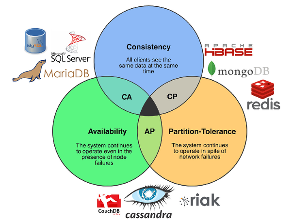
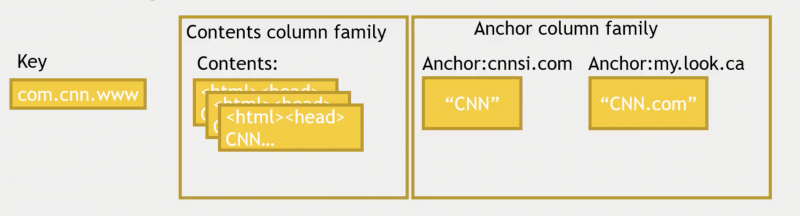

# 0x352 Distributed Applications

- [1. Overview](#1-overview)
    - [1.1. Concensus](#11-concensus)
    - [1.2. Paxos](#12-paxos)
- [2. Scheduler](#2-scheduler)
    - [2.1. slurm](#21-slurm)
- [3. Distributed File Systems](#3-distributed-file-systems)
    - [3.1. NFS](#31-nfs)
    - [3.2. AFS](#32-afs)
    - [3.3. HDFS](#33-hdfs)
    - [3.4. GFS](#34-gfs)
- [4. IPFS](#4-ipfs)
- [5. Distributed Database/Storage](#5-distributed-databasestorage)
    - [5.1. Foundation](#51-foundation)
        - [5.1.1. CAP Theorem](#511-cap-theorem)
    - [5.2. Kafka (Streaming)](#52-kafka-streaming)
    - [5.3. MySQL/PostgreSQL](#53-mysqlpostgresql)
    - [5.4. HBase (BigTable)](#54-hbase-bigtable)
        - [5.4.1. Interface:](#541-interface)
        - [5.4.2. Data Model](#542-data-model)
        - [5.4.3. Applications](#543-applications)
    - [5.5. Cassandra (Dynamo)](#55-cassandra-dynamo)
        - [5.5.1. Interface](#551-interface)
        - [5.5.2. Architecture](#552-architecture)
    - [5.6. mongoDB](#56-mongodb)
- [6. Distributed Cache](#6-distributed-cache)
- [7. Distributed Network](#7-distributed-network)
    - [7.1. CDN (Content Delivery Network)](#71-cdn-content-delivery-network)
    - [7.2. Load Balancing](#72-load-balancing)
- [8. Systems](#8-systems)
    - [8.1. Netflix](#81-netflix)
- [9. Cloud](#9-cloud)
    - [9.1. Google Cloud](#91-google-cloud)
        - [9.1.1. Bandwidth](#911-bandwidth)
    - [9.2. AWS](#92-aws)
    - [9.3. Azure](#93-azure)
- [10. Reference](#10-reference)

## 1. Overview
### 1.1. Concensus
### 1.2. Paxos
[Paxos Made Simple](http://lamport.azurewebsites.net/pubs/paxos-simple.pdf)

## 2. Scheduler
### 2.1. slurm
how to use slurm

scontrol
``` bash
scontrol update nodename=<nodename> state=resume
```

## 3. Distributed File Systems
### 3.1. NFS
**Filesystem (NFS (Network File System))** 
NFS is an open-protocol developed by Sun (only protocol, no implementation details). It was one of the first usage of distributed systems. It enables easy sharing of files across clients and enable centralized administration.

NFS's protocol is stateless (to achieve crash recovery), each call contains all the necessary information. The protocol usually contains the file handle to identify the file, the file handler can be thought as tuple of (file system identifier, file identifier), the second one can be inode.

To improve the performance, NFS caches the blocks in client memory, but it also introduces the cache consistency issue. To solve the issue, NFS

- flush-on-close: when closing file, its contents are forced into the server
- attribute-cache: check modification by using a local attribute-cache, timer is set to invalidate it.
  
### 3.2. AFS
cache strategy: files are cached in client local disk

### 3.3. HDFS
### 3.4. GFS
cache strategy: no cache in chunk server and client server

## 4. IPFS
## 5. Distributed Database/Storage

### 5.1. Foundation
#### 5.1.1. CAP Theorem



Reference: https://www.quora.com/What-Is-CAP-Theorem-1

### 5.2. Kafka (Streaming)
Kafka is a general publish/subscribe messaging system, it can publish message from different sources into multiple topics, and let subscriber receive those topics 

### 5.3. MySQL/PostgreSQL
Scaling Strategies
- denormalization: precompute join queries (to prevent multiple disk seek)
- caching: add memcache/redis above database (to prevent querying database)
- master/slave replication: master read/write, slaves read
- master/master replication: hard to achieve absolute consistency
- sharding: split database into different ranges

### 5.4. HBase (BigTable)
HBase (BigTable) is a sparse multi-dimension map

$$key(row, column, timestamp) \rightarrow value $$

#### 5.4.1. Interface: 
No query language, just CRUD API (very fast)
- HBase shell
- Java API (python, Scala wrapper)
- Spark
- builtin REST service

#### 5.4.2. Data Model
- fast access to a row with an unique key
- each row has a small number of column family
- a column family can have multiple columns (can be very large number, can be sparse)
- each cell can have multiple versions indexed by timestamps
- 
#### 5.4.3. Applications
The following table is a row example from Bigtable paper, the anchor column family is used to compute page ranks.


Reference: The Ultimate Hands-on Hadoop Chapter 6


### 5.5. Cassandra (Dynamo)
Cassandra (dynamo) has no master node
- High Availability, High Partition Tolerence
- Low Consistency (Eventual Consistency)
  

#### 5.5.1. Interface
- CQL (something like limited SQL)

#### 5.5.2. Architecture
- Replication: Consistent Hashing
- membership: Gossip-based protocol
  
### 5.6. mongoDB
Aggregation: aggregation pipline, mapreduce


## 6. Distributed Cache
## 7. Distributed Network
### 7.1. CDN (Content Delivery Network)
CDN is generally a concept of geographically-aware caching

### 7.2. Load Balancing
LB can serve 1M queries per second

DNS side Network Load Balancing (L3/L4)
HTTP Load Balancing (L7)
- gcloud implementation
- aws elb prewarming issue

## 8. Systems
This section collects some articles about some actual systems deployed globally.

### 8.1. Netflix
netflix CDN

## 9. Cloud
This section is some tips and my personal measurement of several cloud vendors

### 9.1. Google Cloud
ping latency (same zone us-centrala): 1 ms

#### 9.1.1. Bandwidth 
my measurements with iperf.

- same zone: 1.94 Gbits/sec
- same region: 1.93Gbits/sec
- us-europe: 236Mbits/sec
- us-asia: 143Mbits/sec

### 9.2. AWS
### 9.3. Azure

## 10. Reference
- system design primer
- AWS scaling lecture
- system design interview
- CMU lectures
- dropbox
- 1PB sort with mapreduce


