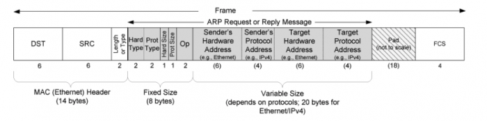

# 1. 0x360 Physical and Link

- [1. Physical Media](#1-physical-media)
    - [1.1. Guided Media](#11-guided-media)
        - [1.1.1. Twisted-Pair Copper Wire](#111-twisted-pair-copper-wire)
            - [1.1.1.1. Dial-Up](#1111-dial-up)
            - [1.1.1.2. DSL](#1112-dsl)
        - [1.1.2. Coaxial Cable](#112-coaxial-cable)
        - [1.1.3. Fiber](#113-fiber)
    - [1.2. Unguided Media](#12-unguided-media)
        - [1.2.1. Infrared](#121-infrared)
        - [1.2.2. Microwave](#122-microwave)
        - [1.2.3. Radiowave](#123-radiowave)
            - [1.2.3.1. Terrestrial Radio Channels](#1231-terrestrial-radio-channels)
            - [1.2.3.2. Satellite Radio Channels](#1232-satellite-radio-channels)
- [2. Physical Protocol](#2-physical-protocol)
    - [2.1. Ethernet (IEEE 802.3)](#21-ethernet-ieee-8023)
    - [2.2. Wireless LAN (IEEE 802.11)](#22-wireless-lan-ieee-80211)
- [3. Data Link Layer (2)](#3-data-link-layer-2)
    - [3.1. MAC](#31-mac)
    - [3.2. ARP (Address Resolution Protocol)](#32-arp-address-resolution-protocol)
        - [3.2.1. Protocol](#321-protocol)
        - [3.2.2. Command](#322-command)
        - [3.2.3. Security](#323-security)
    - [3.3. NDP (Neighbor Discovery Protocol)](#33-ndp-neighbor-discovery-protocol)
    - [3.4. Hardware](#34-hardware)
- [4. Reference](#4-reference)

## 1. Physical Media

### 1.1. Guided Media
Guided media means the wave are guided along a solid medium.

#### 1.1.1. Twisted-Pair Copper Wire

The least expensive and most 
twisted pair, the UTP (Unshielded twisted pair) is still common for LAN cables.

10/100/1000/10GBASE-T

The ISP is usally the local wired telephone companies (telco).

##### 1.1.1.1. Dial-Up
Traditionally, most of the Internet users connect Internet over ordinary analog telephone line using a dial-up modem. Phone call and Internet access cannot be done at the same time.

##### 1.1.1.2. DSL
Usually ADSL (Asymmetric Digital Subscriber Line), with which download speed is much faster than the upload speed. For business, there is the SDSL (symmetric) version.

DSL uses different frequencies to encode phone call and network access. For example, one configuration can be as follows:
- phone: 0 ~ 4kHz
- upload: 4kHz - 50kHz
- download 50kHz - 1MHz

#### 1.1.2. Coaxial Cable
Coaxial Cable is quite common in cable television systems, so the ISP is uslaly the television company. The disadvantage is the cable is shared by neighborhood, therefore requires some protocols to coordinate transmissions and avoid collisions. (e.g: CSMA/CD)

#### 1.1.3. Fiber

1000BASE-X

Submarine cables

*   [faster cable](https://techcrunch.com/2016/06/29/google-backed-undersea-cable-between-us-and-japan-goes-online-tonight/): 60 Tbps bandwidth
*   [interesting visualization](https://www.youtube.com/watch?v=IlAJJI-qG2k)
*   [How to repair](https://www.youtube.com/watch?v=MDSgYGL7gHc) :)

### 1.2. Unguided Media
Unguided media, the waves propagate in the atmosphere and in outer space. Sorry Michelson, no ether is guiding!

Depending on the wave lengths, we have roughly 3 types here
#### 1.2.1. Infrared 
Frequency 300GHz - 400THz
Used for very short distance communication such as TV remotes, wireless mouse. Cannot penetrate obstacles.

#### 1.2.2. Microwave
Frequency 1GHz - 300GHz
Its propagation is a type of [line-of-sight propagation](https://en.wikipedia.org/wiki/Line-of-sight_propagation), so sender/receiver anthenas should be properly aligned.

It is used for mobile phone communication and television distribution. Wifi is usually in this range: 900 MHz, 2.4 GHz, 3.6 GHz, 4.9 GHz, 5 GHz, 5.9 GHz and 60 GHz bands

#### 1.2.3. Radiowave
Frequency 3KHz - 1GHz
Easy to generate and penetrate, anthenas do not need to be aligned.
Usage is AM/FM radios

##### 1.2.3.1. Terrestrial Radio Channels
carry signals in the elctromagnetic spectrum, spanning from 10~100m (e.g: wifi) and ~10km (e.g: cellular access)

##### 1.2.3.2. Satellite Radio Channels
Two types aof satellite are used
- geostationary satellites: stationary over the same spot on Earth (about 36,000 km), siginificant communication delay.
- low-earth orbiting satellites: much closer (2,000 km), rotate around Earch and might communicate with each other. (SpaceX's StarLink is this type)

Note GPS is around 20,000km, ISS is around 400 km

## 2. Physical Protocol

### 2.1. Ethernet (IEEE 802.3)

### 2.2. Wireless LAN (IEEE 802.11)

## 3. Data Link Layer (2)

### 3.1. MAC

*   unique **48** bit for each hardware
*   <g class="gr_ gr_64 gr-alert gr_gramm gr_inline_cards gr_run_anim Grammar only-ins doubleReplace replaceWithoutSep" id="64" data-gr-id="64">each m</g>ac address is associated with **NIC** (network interface card)
*   _OUI_ (Organizationally Unique Identifier) is the first three <g class="gr_ gr_4 gr-alert gr_spell gr_inline_cards gr_run_anim ContextualSpelling ins-del multiReplace" id="4" data-gr-id="4">octats</g>

### 3.2. ARP (Address Resolution Protocol)

ARP is <g class="gr_ gr_4 gr-alert gr_gramm gr_inline_cards gr_run_anim Grammar multiReplace" id="4" data-gr-id="4">a IPv4</g> Protocol defined at RFC0826, it is used to translate <g class="gr_ gr_5 gr-alert gr_gramm gr_inline_cards gr_run_anim Grammar only-ins doubleReplace replaceWithoutSep" id="5" data-gr-id="5">32bit</g> IP address into 48bit MAC address.RFC0826

reference: from TCP/IP Illustrated, Volume 1: The protocols

#### 3.2.1. Protocol

*   **ARP cache:** store arp records in <g class="gr_ gr_245 gr-alert gr_gramm gr_inline_cards gr_disable_anim_appear Grammar only-ins doubleReplace replaceWithoutSep" id="245" data-gr-id="245">cache</g>, TTL is typically 20 min.
*   **ARP request**: If not in cache or expired, broadcast an ethernet frame under the subnet mask to request a MAC address corresponding to an IP.
*   **ARP reply**: NIC with the MAC address reply to the request with unicast. Other NICs will ignore the requests (although they can see the broadcast request)

#### 3.2.2. Command

*   arp -a: retrieval local arp cache

#### 3.2.3. Security

*   **arp spoofing**: man in the middle attack (ettercap)
*   **mac flooding**

### 3.3. NDP (Neighbor Discovery Protocol)

*   IPv6 Protocol as a replacement of ARP

### 3.4. Hardware

L2 Switch

## 4. Reference

[1] TCP/IP Illustrated, Volume 1: The protocols Chapter 4
