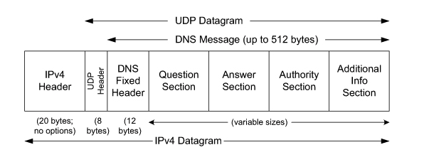

# 0x362 Application

- [1. DNS](#1-dns)
    - [1.1. Organizations](#11-organizations)
    - [1.2. Records](#12-records)
    - [1.3. Resolution](#13-resolution)
    - [1.4. Linux Implementation](#14-linux-implementation)
    - [1.5. Windows Implementation](#15-windows-implementation)
    - [1.6. Security](#16-security)
- [2. HTTP](#2-http)
    - [2.1. Message](#21-message)
- [3. SMTP](#3-smtp)
- [4. Reference](#4-reference)

## 1. DNS

Originally HOSTS.TXT manages all hosts for ARPANET ( HOSTS.TXT is a single txt file ) . Problems with it were latency, linear search complexity etc.

Currently DNS is implemented with a distributed database (e.g.: BIND , Windows DNS). 13 root servers in the world. Each name is a node in an inverted tree, the path to the node is separated by dot. Non ASCII characters are translated into punycode. Dig command can be used to retrieve DNS records. Google public DNS: 8.8.8.8, 8.8.8.4

### 1.1. Organizations

*   ICANN: root domain management
*   Verisign: com, net, 2 root server including <g class="gr_ gr_5 gr-alert gr_gramm gr_inline_cards gr_run_anim Grammar multiReplace" id="5" data-gr-id="5">the a</g> root server
*   IANA: part of ICANN, assign IP  

### 1.2. Records

*   **A**: 32 bit for IPv4 (domain -> ip)
*   **AAAA**: 128 bit for IPv6 (domain -> ip)
*   **CNAME**: map alias domain name to its canonical domain name
*   **TTL**: TTL for DNS cache in each name server. Typically 1 day or 2 days.
*   **NS**: name server for the target domain. used together with A record
*   **PTR**: map IP to domain (for reverse lookup)
*   **MX**: domain to SMTP server
*   **TXT**: meta data about server

### 1.3. Resolution

### 1.4. Linux Implementation

*   hostname will be first looked up with `/etc/hosts`, if not found using the default name server configuration is stored at `/etc/resolv.conf`
*   client: libresolv library (part of libc) provides the standard client implementation
*   server: standard of server implementation is BIND 9

### 1.5. Windows Implementation

*   hosts file is stored under the registry key of `%SystemRoot%\System32\drivers\etc\hosts`

### 1.6. Security

*   DNS Cache Poisoning: [exploits tutorial](https://www.cs.cornell.edu/~shmat/shmat_securecomm10.pdf) (e.g: birthday attack on transaction id)

## 2. HTTP
HTTP/1.0 -> HTTP/1.1 -> HTTP/2.0

### 2.1. Message

## 3. SMTP
SMTP servers commonly use port 25

## 4. Reference

[1] Fall, Kevin R., and W. Richard Stevens. TCP/IP illustrated, volume 1: The protocols. addison-Wesley, 2011.