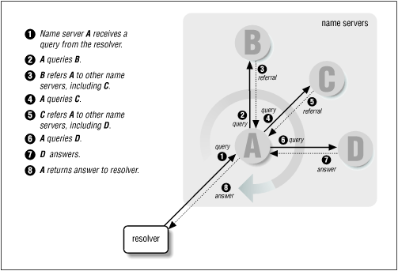

# 0x362 Application

- [1. Foundation](#1-foundation)
- [2. DNS](#2-dns)
    - [2.1. Organizations](#21-organizations)
    - [2.2. Records](#22-records)
    - [2.3. Resolution](#23-resolution)
    - [2.4. Linux Implementation](#24-linux-implementation)
    - [2.5. Windows Implementation](#25-windows-implementation)
    - [2.6. Security](#26-security)
- [3. HTTP](#3-http)
    - [3.1. Message](#31-message)
        - [3.1.1. Request Message](#311-request-message)
        - [3.1.2. Response Message](#312-response-message)
    - [3.2. Cookie](#32-cookie)
- [4. SMTP](#4-smtp)
- [5. Reference](#5-reference)

## 1. Foundation

The application developer will use one of the two predominant architectural paradigms:

- client-server achitecture: there is an always-on host, called the server, which services request from other hosts, called clients (e.g: Web, FTP, Telnet, email)
- P2P architecture: application communicate between pairs of connected hosts (e.g: BitTorrent, eMule, Skype. PPLive)

The compelling feature of P2P is their self-scalability (e.g: do not require significant server infrastructure or bandwidth), but faces three major challenges:

- ISP asymmetrical bandwidth
- security
- users' incentives

The API provided by the Network layer to the Application layer is the socket, the application developer has little control of the transport-layer side of the socket.

## 2. DNS

Originally HOSTS.TXT manages all hosts for ARPANET ( HOSTS.TXT is a single txt file ) . Problems with it were latency, linear search complexity etc.

Currently DNS is implemented with a distributed database (e.g.: BIND , Windows DNS). 13 root servers in the world. Each name is a node in an inverted tree, the path to the node is separated by dot. Non ASCII characters are translated into punycode. Dig command can be used to retrieve DNS records. Google public DNS: 8.8.8.8, 8.8.8.4

### 2.1. Organizations

*   ICANN: root domain management
*   Verisign: com, net, 2 root server including <g class="gr_ gr_5 gr-alert gr_gramm gr_inline_cards gr_run_anim Grammar multiReplace" id="5" data-gr-id="5">the a</g> root server
*   IANA: part of ICANN, assign IP  


### 2.2. Records

*   **A**: 32 bit for IPv4 (domain -> ip)
*   **AAAA**: 128 bit for IPv6 (domain -> ip)
*   **CNAME**: map alias domain name to its canonical domain name
*   **TTL**: TTL for DNS cache in each name server. Typically 1 day or 2 days.
*   **NS**: name server for the target domain. used together with A record
*   **PTR**: map IP to domain (for reverse lookup)
*   **MX**: domain to SMTP server
*   **TXT**: meta data about server

### 2.3. Resolution




### 2.4. Linux Implementation

*   hostname will be first looked up with `/etc/hosts`, if not found using the default name server configuration is stored at `/etc/resolv.conf`
*   client: libresolv library (part of libc) provides the standard client implementation
*   server: standard of server implementation is BIND 9

### 2.5. Windows Implementation

*   hosts file is stored under the registry key of `%SystemRoot%\System32\drivers\etc\hosts`

### 2.6. Security

*   DNS Cache Poisoning: [exploits tutorial](https://www.cs.cornell.edu/~shmat/shmat_securecomm10.pdf) (e.g: birthday attack on transaction id)

## 3. HTTP

Major versioning are:

- HTTP/1.0 (RFC1945)
- HTTP/1.1 (RFC2616)
- HTTP/2.0 (RFC7540)
- HTTP/3.0 ?!

HTTP is a **stateless** protocol, which means the server side does not remember any state info of the client.

HTTP can use either non-persistent connections or persistent connections (default)

- **non-persistent connections**: each request/response should be sent over a separate TCP connection (connection get closed everytime)
- **persistent connections**: request/response use the same TCP connection (server keeps the connection alive)

The benefit of the persistent connection is that it requires only 1 RTT (round-trip-time) after the first connection, while the non-persistent connection requires 2 RTT every time (because of handshake)


### 3.1. Message


#### 3.1.1. Request Message

Note that HTTP/2 has different format, it uses frames instead of the message here.

In HTTP < 2, A request message example is as follows:

```text
GET /somedir/page.html HTTP/1.1
Host: www.someschool.edu
Connection: close
User-agent: Mozilla/5.0
Accept-language: fr
```

where the first line is the request line, containing

- method field
- URL field
- version

The subsequent lines are header lines, some examples are

- Accept-Language: language preference
- Connection: close to tell the server not to be persistent
- User-agent: distinguish browser
- Content-type: media type in the body (e.g: application/json)

After the header lines, there is the entity-body

#### 3.1.2. Response Message

```text
HTTP/1.1 200 OK
Connection: close
Date: Tue, 18 Aug 2015 15:44:04 GMT
Server: Apache/2.2.3 (CentOS)
Last-Modified: Tue, 18 Aug 2015 15:11:03 GMT
Content-Length: 6821
Content-Type: text/html

(data data data data data ...)
```

It has status line, header lines and entity body.

The status line contains

- protocol version
- status code (e.g: 200)
- status message (e.g.: OK)

The header lines might be

- Connection: close to tell the client that server is going to close the connection
- Date: when the response is made at server
- Server: server-side info (like the User-Agent)
- Content-Type

### 3.2. Cookie

HTTP itself is a stateless protocol, cookie is used by server to identify users, it is defined at RFC6265

The cookie has 4 parts: cookie header line in the request message, cookie header line in the response message, cookie file on the client, backend db managing cookie on the server


## 4. SMTP
SMTP servers commonly use port 25


## 5. Reference

[1] Fall, Kevin R., and W. Richard Stevens. TCP/IP illustrated, volume 1: The protocols. addison-Wesley, 2011.