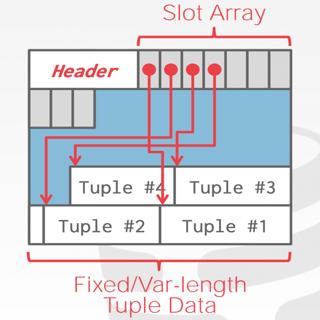
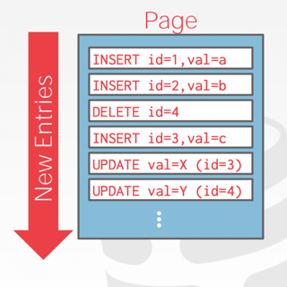
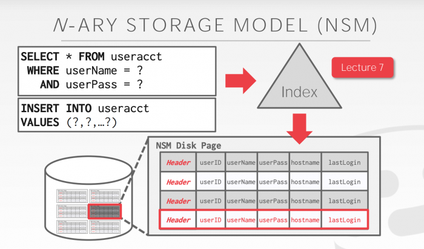
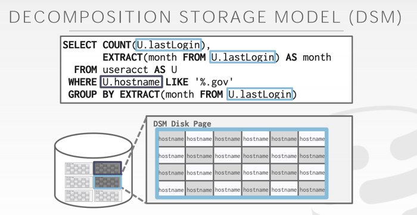
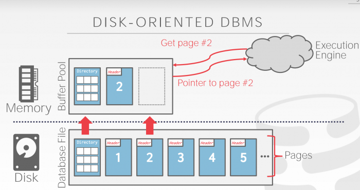

# 0x372 Database

- [1. History](#1-history)
- [2. Data Model](#2-data-model)
    - [2.1. Relational Model](#21-relational-model)
        - [2.1.1. Key Concepts](#211-key-concepts)
    - [2.2. Querying Relational Database](#22-querying-relational-database)
    - [2.3. Hierarchical Model](#23-hierarchical-model)
        - [2.3.1. XML](#231-xml)
            - [2.3.1.1. DTD/XSD](#2311-dtdxsd)
        - [2.3.2. JSON](#232-json)
- [3. Query Languages](#3-query-languages)
    - [3.1. Relational Algebra](#31-relational-algebra)
    - [3.2. SQL](#32-sql)
- [4. Storage Management](#4-storage-management)
    - [4.1. Heap file](#41-heap-file)
    - [4.2. Page Layout](#42-page-layout)
    - [4.3. Tuple Storage](#43-tuple-storage)
        - [4.3.1. N-ary Storage Model (Row model)](#431-n-ary-storage-model-row-model)
        - [4.3.2. Decomposition Storage Model (Column Model)](#432-decomposition-storage-model-column-model)
- [5. Memory Management](#5-memory-management)
    - [5.1. Optimization](#51-optimization)
        - [5.1.1. Buffer Replacement Policies](#511-buffer-replacement-policies)
- [6. Reference](#6-reference)

## 1. History
- 1960: Charles Bachman designed the Integrated Database System, the first DBMS. (Turing 1973)
- 1970: Codd from IBM research lab published the paper of the relational model. (Turing 1981)
- 1973 Ingres project (led by Stonebraker) demostrate that it was possible to build practical and efficient implementation relation model. (Turing 2014)
- 1974: SQL designed by Donald Chamberlin and Raymond Boyce from IBM (SQL become ANSI standard in 1986)
- 1979: Oracle database
- 1995: MySQL (MySQL AB -> Sun Microsystems -> 2010 Oracle), it was forked into MariaDB by its cofounder.
- 1996: PostgreSQL (originally called POSTGRES from the Ingres database)

## 2. Data Model
### 2.1. Relational Model

#### 2.1.1. Key Concepts
A relational database contains a set of named **relations** (or **tables**)
Each relation has a set of named **attributes** (or **columns**)
Each **tuple** (or **row**) has a value for each attribute, tuples in the relation is not ordered.
Each attribute has a **type** (or **domain**)

The **schema** is the formal description of relations in database, it is something like typing in programming languages.
**Instance** is the actual contents at given point in time
There is a special value **NULL** for unknown and undefined, which is important in relational database.
**Key** is an attribute whose value is unique in each tuple or set of attributes whose combined values ar unique. Keys are often denoted by underlining the set of key attributes. Relational database tends to build special index for keys to achieve efficiency.

There are two types of languages in relational model
- DDL (data definition language): create, drop
- DML (data manipulation language): select, insert

### 2.2. Querying Relational Database
The steps in creating and using a relational database
- Design schema; create using DDL
- Bulk load initial data
- Repeat; execute queries and modificiations

Queries return relations (or table)

### 2.3. Hierarchical Model
#### 2.3.1. XML
XML (Extensible Markup Language) is a standard for data representation and exchange.
XML has more flexibility when compared with the relational model.

The basic constructs of XML
- tagged elements, which can be nested
- attributes
- text (can be thought as the content for the leaf node)

##### 2.3.1.1. DTD/XSD

A *well-formed XML* adheres to basic structural requirements
- single root
- matched tags, no open tags
- unique attributes within elements

A *valid XML* adheres to the basic structral requirements and also *content-specific specification*
Examples to describe the specification are
- Document Type Descriptor (DTD)
- XML Schema (XSD)

The specification can be provided to the XML parser to decide whether the XML is valid or not.
For example, *xmllint* can be used to verify.

**Document Type Descriptor (DTD)**
DTD is a grammar-like language for specifying elements, attributes, nesting, ordering, occurrences
It also has special attribute types such as ID and IDREF(S), which works like the pointers

**XML Schema (XSD)**
In addition to the DTD feature, XSD also sepcifies data types, keys, pointers.
It is also written in XML.

#### 2.3.2. JSON
JSON is a stanrdard to serialize data objects into human readable format, it is useful for data interchange, and representing & storing semistructured data.

## 3. Query Languages
### 3.1. Relational Algebra
Relational algebra defines the interface how to retrieve and manipulate tuples in a relation. Input is relation, output is relation, it is proposed by Codds when working in IBM.

==Query (or expression) on set of relations produce relation as a result.==

Note that semantics of relational algebra removes duplicates from relation when querying (because rows are set).

**operator (selector)** selector is to pick certain rows based on condition.
$$\sigma_{cond}(expr)$$

**operator (project)** project is to pick certain columns.
$$\Pi_{attrs}(expr)$$

**operator (cross product)** combine two relations.
$$A \times B$$

Suppose $A$ has $s$ tuples and $B$ has $t$ tuples, then cross product has $st$ tuples. relation name is attached to each attribute to disambiguate.

$$|A \times B| = |A||B|$$

**operator (natural join)**  Enforce equality on all attributes with same name, and eliminate one copy of duplicate attributes.

$$A \bowtie B$$

Natural join does not add any expression power to algebra, it can be expressed using the join
$$ A \bowtie B = \Pi_{schema(E_1) \cup schema(E_2)} (\sigma_{E_1.A_1 = E_2.A_1, E_1.A_2 = E_2.A_2} (A \times B))$$

**operator (theta join)** Apply the condition to join, this is the basic operation used in DBMS
$$A \bowtie_{\theta} B = \sigma_{\theta} (A \times B)$$

The following are set operators
**operator (union)** combines rows vertically, the schema should match
$$A \cup B$$

**operator (difference)** 
$$ A - B$$

**operator (intersection)** intersection can be expressed with union and difference
$$ A \cap B$$

**operator (rename)** rename the schema for an relation
$$\rho_{R(A_1, A_2, ..., A_n)(E)}$$

Rename operator is to unify schemas for set operators because schema must match.

### 3.2. SQL
SQL is the declarative language partially implementing the relational algebra, derived from SEQUAL from IBM.
Row in SQL is an unordered multiset.

**statement (select)** 
$$\text{Select }A_1, A_2, ..., A_n\text{ From }R_1, R_2, ..., R_m\text{ where condition}$$

This is equivalent to the following sigma algebra
$$\Pi_{A_1, A_2, ..., A_n}(\sigma_{condition}(R_1 \times R_2 \times ... \times R_m))$$

duplicates: select will return duplicate because SQL is a multiset model, to reduce the duplicates, add *distinct* after select

order: select will return results without any order, to force order, add *order by attr* at the end.

## 4. Storage Management
One solution to manage storage is using file mapping (mmap), it works well for reading, but not good when there are multiple writers. Instead, database tends to manage storage by themselves using database pages (different page size for different db)

### 4.1. Heap file
A heap file is an unordered collection of pages. There are two styles of heap file.

- Linked List: there is a header managing pointers to data pages and free pages
- Page Directory: track the location and free slots for each page

### 4.2. Page Layout
Each page contains a header (page size, checksum, version...). There are two types of layouts: Tuple oriented layout or log oriented layout.

- Tuple Oriented (Slotted Tuples) For OLTP

Log oriented
append the new log to pages (hbase, cassandra, leveldb ...)

For OLAP

Optimization:

- build index
- compaction
  
### 4.3. Tuple Storage
#### 4.3.1. N-ary Storage Model (Row model)

#### 4.3.2. Decomposition Storage Model (Column Model)

BigQuery is an example of this type. (For example, BigQuery processed data looks like to be proportional to the number of columns: select one column usually cost much less data compared with select all columns)



Large value:

- make them into overflow page and store pointer
- make them into external file and store path
  

## 5. Memory Management

Buffer Pool is a large memory range as an array of fixed size pages. An array entry (slot) is called a frame. DBMS may have multiple buffer pools.

Page table keep tracks of pages that are currently in buffer pool, also maintains meta-data per page such as dirty flag, pin, reference counter for concurrency issue.

### 5.1. Optimization
- scan sharing: decide which page to evict based on access pattern of multiple queries
- pre-fetching: prefetch page based on query
- buffer pool bypass: bypass memory pool to reduce overhead
- OS page cache: O_DIRECT to bypass OS cache (one exception is postgre)
  
#### 5.1.1. Buffer Replacement Policies
The followings are the most common policies. Enterprise db usually have much better policies than open source db

- LRU (Least Recently Used): maintain a timestamp, evict pages by timestamp order. The disadvantage of LRU is the sequential flooding for sequential scan, the most recent page is the most useless.
clock: approximation of LRU, set to 1 when a page accessed, evict page whose when it is 0. Same problem as LRU
- LRU-K: take into account history of the last K references as timestamps and compute the interval between subsequent accesses, the interval helps to predict when the page will get accessed next time. Typical K is 1.
- Localization: restrict memory to its private buffer rather than polluting all memory.
- Priority Hints: provide hints whether a page is important or not.
Dirty pages need to be taken account (e.g: background writing)

## 6. Reference
[1] [Stanford Database Youtube Lectures](https://www.youtube.com/channel/UC5ZAemhQUQuNqW3c9Jkw8ug)

[2] [CMU Database Lectures](https://15445.courses.cs.cmu.edu/fall2020/)

[3] Kleppmann, Martin. Designing data-intensive applications: The big ideas behind reliable, scalable, and maintainable systems. " O'Reilly Media, Inc.", 2017.