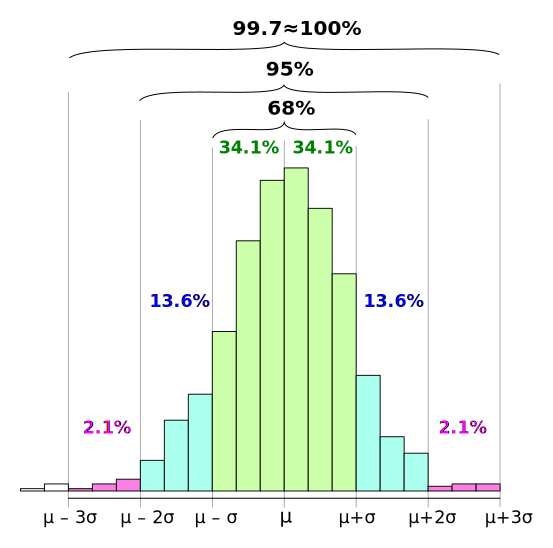

# 0x400 Parametric Distribution

- [1. Discrete Distributions](#1-discrete-distributions)
    - [1.1. Bernoulli](#11-bernoulli)
    - [1.2. Binomial](#12-binomial)
    - [1.3. Multinomial](#13-multinomial)
    - [1.4. Geometric](#14-geometric)
    - [1.5. Pascal](#15-pascal)
    - [1.6. Poisson](#16-poisson)
- [2. Continuous Distributions](#2-continuous-distributions)
    - [2.1. Uniform](#21-uniform)
    - [2.2. Exponential](#22-exponential)
    - [2.3. Beta](#23-beta)
    - [2.4. Dirichlet](#24-dirichlet)
    - [2.5. Gamma](#25-gamma)
    - [2.6. Chi-Square](#26-chi-square)
    - [2.7. T distribution](#27-t-distribution)
    - [2.8. F distribution](#28-f-distribution)
    - [2.9. Gaussian Distribution](#29-gaussian-distribution)
        - [2.9.1. Relation with other distributions](#291-relation-with-other-distributions)
        - [2.9.2. Marginal and Conditional Probabilities](#292-marginal-and-conditional-probabilities)
    - [2.10. Linear Gaussian System](#210-linear-gaussian-system)
- [3. Family Distributions](#3-family-distributions)
    - [3.1. Exponential Family](#31-exponential-family)
    - [3.2. Sub-Gaussian Family](#32-sub-gaussian-family)
- [4. Reference](#4-reference)

## 1. Discrete Distributions
A random variable $X$ is said to have a discrete distribution if the range of $X$, the sample space, is countable. Otherwise it is a continuous distribution.

### 1.1. Bernoulli
**Distribution (Bernoulli)** A random variable $X$ is said to be a Bernoulli random variable with parameter $p$, shown as $X \sim Bernoulli(p)$.

$$ P_X(x) = 
\begin{cases}
p & \text{for } x = 1 \\
1-p & \text{for } x = 0 \\ 0 & otherwise \end{cases} $$

or simply

$$P_X(x) = p^x (1-p)^{1-x}$$

A Bernoulli random variable is associated with a certain event. If event $A$ occurs, then $X=1$; otherwise $X=0$. For this reason, the Bernoulli random variable is also called the indicator random variable. 

**Lemma** Properties of Bernoulli distribution

$$EX = p$$

$$\mathrm{Var}X = p(1-p)$$

$$M_X(t) = [pe^t + (1-p)]^n$$

**Distribution (multiclass Bernoulli)**
Bernoulli can be generalized to deal with multi-class. Suppose $\mathbf{\mu}=(\mu_1, ..., \mu_K)$ where each $mu_k \geq 0$ and $\sum_k \mu_k = 1$. Then the probability of $\mathbf{x}=(x_1, ..., x_K)$ where $x_k \in \{0, 1\} \land \sum_k x_k=1$

$$P_X(\mathbf{x}) = \prod_{k=1}^K \mu_k^{x_k}$$

### 1.2. Binomial
**Distribution (Binomial)** A random variable $X$ is said to be a binomial random variable with parameters n and p, shown as $X \sim Binomial(n,p)$ iff 

$$ P_X(x) = 
\begin{cases}
\binom{n}{k} p^k(1-p)^{n-k} & \text{for } k = 0,1,2,3... \\
0 & otherwise \end{cases} $$

**Lemma (properties)**

$$EX = np$$
$$Var(X) = np(1-p)$$

**Lemma** If $X_1, X_2, ... X_n$ are independent $Bernoulli(p)$ random variables, then the random variable $X$ defined by $X = X_1 + X_2 + ... + X_n$ has a $Binomial(n,p)$ distribution

$$M_X(t) = [pe^t + (1-p)]^n$$

Note that this is easily recognized by multiplication of Bernoulli's mgf

**Lemma (conjugacy)** The conjugate distribution of binomial is the Beta distribution.

If the prior has the beta distribution 

$$f(x|a, b) \propto x^{a-1} (1-x)^{b-1}$$

The posteior would be

$$f(x|k,l,a,b) \propto x^{k+a-1} (1-x)^{l+b-1}$$

where $l=n-k$. This is the kernel form of the beta distribution $Beta(k+a-1, l+b-1)$ where which can regard the hyperparameters $a,b$ as an *effective number of observations* of $x=1, x=0$

Under this formulation, we can compute the expectation of the posterior using the expectation of the beta distribution.

$$E[X|D] = \frac{k+a}{k+a+l+b}$$

Notice that when $k, l \to \infty$, this is reduced to the MLE of binomial distribution.

### 1.3. Multinomial
**Distribution (multinomial)** Binomial distribution can be generalized into the Multinomial distribution. A random variable $\mathbf{X}$ is said to have a $Multinomial(N, \mathbf{\mu})$ distribution when its pmf is

$$P_{\mathbf{X}}(\mathbf{x}) = \frac{N}{x_1 ! x_2 !, ..., x_K !} \prod_{k=1}^{K} \mu_k^{x_k}$$

Conjugate prior of multinomial distribution is Dirichlet distribution.

### 1.4. Geometric
**Distribution (Geometric)** A random variable $X$ is said to be a geometric random variable with parameter p, shown as $X \sim Geometric(p)$ iff

$$ P_X(X=x|p) = 
\begin{cases}
p(1-p)^{x-1} & \text{for } x = 1,2,3... \\
 0 & otherwise \end{cases} $$

The geometric distribution is the simplest of the waiting time distributions and sometimes used to model lifetime and time until failure, however, it fails to model lifetimes for which the probability of failure is expected to increase with time.

It has a "memoryless" property, that is, it "forgets" what has occured.

$$P(X > s | X > t) = P(X > s - t)$$

!!! example "failure times"

    If the probability is 0.001 for a light bulb will fail on any given day, then the probability that it will last at least 30 days is

    $$P(X > 30) = \sum_{x=31}^{\infty} 0.001(1-0.001)^{x-1} = (0.999)^30 = 0.97$$

### 1.5. Pascal
Pascal distribution is a generalization of the geometric distribution.

**Distribution (Pascal)** A random variable $X$ is said to be a Pascal random variable with parameters $m$ and $p$, shown as $X \sim Pascal(m,p)$ iff

$$ P_X(x) = 
\begin{cases}
\binom{k-1}{m-1} p^m(1-p)^{k-m} & \text{for } k = m,m+1,m+2,m+3... \\
0 & otherwise \end{cases} $$

### 1.6. Poisson
Poisson distribution is usually applied to model occurrences both for some time intervals and spatial intervals, whether the probability of an occurrence is proportional to the length of the intervals. For example, the number of earthquakes during 1 year, and the number of people in an area.

**Distribution (Poisson)** A random variable $X$ is said to be a Poisson random variable with parameter $\lambda$ shown as $X \sim Poisson(\lambda)$

$$ P_X(x) = 
\begin{cases}
\frac{e^{-\lambda}\lambda^k}{k!} & \text{for } k = 0,1,2,3... \\
0 & otherwise \end{cases} $$

Poisson distribution is the limit of binomial distribution when $\lambda = np$ and $n$ is very large and $p$ is very small. This can be proved by mgfs convergence.

$$M_X(t) = e^{\lambda(e^t-1)}$$

Calculation of Poisson distribution can be done easily by the following recursive relation

$$P(X=x) = \frac{\lambda}{x} P(X=x-1)$$

**Corollary (additivity)** If $X \sim Poisson(\theta), Y \sim Poisson(\lambda)$, then 

$$X+Y \sim Poisson(\theta + \lambda)$$

This can be provided by either MGF or bivariate transformation with $(X,Y) \to (X+Y, Y)$

## 2. Continuous Distributions
### 2.1. Uniform
**Distribution (uniform)** The continuous uniform distribution is defined to spread mass over an interval $[a,b]$ where its pdf is

$$f(x|a,b) = \frac{1}{b-a}$$

Properties are

$$EX = \frac{a+b}{2}$$

$$\mathrm{Var} X = \frac{(b-a)^2}{12}$$

### 2.2. Exponential
**Distribution (exponential)** A random variable $X$ has an exponential distribution $Exponential(\lambda)$ when its pdf is

$$f_X(x) = \frac{1}{\lambda} e^{-\frac{x}{\lambda}} $$

Some properties are

$$EX = \lambda$$

$$\mathrm{Var}X = \lambda^2$$

Note that exponential distribution is a special case of gamma distribution by setting $\alpha=1$

Exponential distribution can be used to model lifetimes, analogous to the use of geometric distribution.

**Distribution (Weibull)** Weibull distribution can be obtained from the exponential distribution where $X$ has exponential$(\beta)$, then $Y=X^{1/\gamma}$ is a Weibull$(\gamma, \beta)$ distribution.

### 2.3. Beta
Beta distribution offers a wide variety of shapes for distributions with support on bounded intervals (e.g: [0,1])

**Definition (beta function)** The beta function $B(\alpha, \beta)$ is defined as

$$B(\alpha, \beta) = \int_0^1 x^{\alpha - 1} (1-x)^{\beta - 1}$$

It can be represented with gamma function by

$$B(\alpha, \beta) = \frac{\Gamma(\alpha)\Gamma(\beta)}{\Gamma(\alpha+\beta)}$$

**Distribution (beta)** The beta distribution's pdf is 

$$f(x|\alpha, \beta) = \frac{1}{B(\alpha, \beta)} x^{\alpha - 1} (1-x)^{\beta - 1}$$

Beta distribution is usually used to model proportions, which naturally lie between 0 and 1. It can takes on many shapes, for example, when $\alpha=\beta=1$, it reduced to the uniform distribution.

Because of this property, Beta distribution is the conjugate family of the binomial distribution.

**Properties** Moments of beta distribution is easily computed by the same integrand

$$EX^n = \frac{B(\alpha+n, \beta)}{B(\alpha, \beta)}$$

The mean and variance of beta distribution is

$$EX = \frac{\alpha}{\alpha+\beta}$$

$$\mathrm{Var} X = \frac{\alpha\beta}{(\alpha+\beta)^2 (\alpha+\beta+1)}$$

**Relations with other distributions**

Beta distribution can be otained from Gamma distribution with transformation

$$Y = \frac{X_1}{X_1 + X_2}$$

where $X_1, X_2$ are $Gamma(\alpha, 1), Gamma(\beta, 1)$ distributions.

When $\alpha, \beta=1$, it becomes the uniform distribution.

### 2.4. Dirichlet
**Distribution (dirichlet)** 
Dirichlet distribution is a multiclass generalization of Beta distribution. It is used as the conjugate for multinomial distribution.

$$Dir(\mu | \alpha) = \frac{\Gamma(a_0)}{\Gamma(a_1)...\Gamma(a_K)} \prod_{k=1}^K \mu_k^{\alpha_k - 1}$$

Dirichlet distribution can be obtained by following transformations

$$Y_i = \frac{X_i}{X_1 + X_2 + ... + X_{k+1}}$$
$$Y_{k+1} = X_1 + X_2 + ... + X_{k+1}$$

where $X_1, ..., X_{k+1}$ are gamma distributions.

### 2.5. Gamma
The main reason for the appeal of the Gamma distribution in applications is the variety of shapes of the distribution for difrerent various $\alpha, \beta$.

Note beta distribution also has this variety property, but beta family has support for a bounded interval $(a,b)$, Gamma distribution has an unbounded support $(0, \infty)$.

**Definition (gamma function)** Gamma function is defined as

$$\Gamma(\alpha) = \int_{0}^{\infty} t^{\alpha-1} e^{-t} dt$$

The gamma function has the property of $\Gamma(\alpha+1) = \alpha \Gamma(\alpha)$ and $\Gamma(\frac{1}{2}) = \sqrt{\pi}$, it is sometimese called the factorial function.

Note the support is the positive real numbers $[0, \infty)$

**Distribution (gamma)** gamma $(\alpha, \beta)$ family is 

$$f(x | \alpha, \beta) = \frac{1}{\Gamma(\alpha) \beta^{\alpha}} x^{\alpha-1} e^{-x/\beta}$$

The parameter $\alpha$ is known as the shape parameter, which influences the peakedness of the distribution, the parameter $\beta$ is the scale parameter

This can be obtained by normalize Gamma function and scale random variable  as $X=\beta T$.

**Properties (Gamma distribution)**

$$EX = \alpha\beta$$

$$\mathrm{Var}X = \alpha\beta^2$$

$$M_X(t) = (\frac{1}{1-\beta t})^\alpha$$

**Lemma (additivity)** Let $X_1, ..., X_n$ be independent random variable and $X_i$ has a $Gamma(\alpha_i, \beta)$ distribution, let $Y=\sum_i X_i$, then Y has a distribution of $Gamma(\sum_i \alpha_i, \beta)$

Relation with Other Distributions
- exponential distribution is a special case of Gamma distribution when $\alpha=1, \beta=\lambda$
- chi-square is a special case of Gamma distrition when $\alpha=p/2, \beta=2$

Distribution (Wishart)

### 2.6. Chi-Square
**Distribution ($\chi^2$ distribution)** $\chi^2$ distribution is a special case of gamma distribution. The chi square distribution with p degrees of freedom has pdf of Gamma$(p/2, 2)$

$$f(x|p) = \frac{1}{\Gamma(p/2)2^{p/2}} x^{p/2 - 1} e^{-x/2}$$

Note that when $p=1$, the distribution can be computed by applying $Y=X^2$ to normal distribution. (Cassela Example 2.1.9)

$$f_X(x) = \frac{1}{\sqrt{2\pi x}} e^{-x/2}$$

**properties ($\chi^2$ distribution)**  By applying Gamma distribution, we obtain following results

$$EX = p$$
$$Var(X) = 2p$$
$$EX^k = \frac{2^k\Gamma(\frac{r}{2}+k)}{\Gamma(\frac{r}{2})}$$
$$M_X(t) = (\frac{1}{1-2t})^{r/2}$$

**Lemma** If $Z$ is a n(0,1) random variable $Z^2 \sim \chi_1^2$

**Lemma** If $X_1, ..., X_n$ are independent and $X_i \sim \chi_{p_i}^2$, then $X_1 + ... +X_n \sim \chi^2_{p1+...+pn}$

### 2.7. T distribution
In most practical cases, the variance $\sigma^2$ is unknown.  thus to get any idea of the variability of $\hat{X}$, we need to estimate this variance first.

**Distribution (Student's t, Gosset)** Let $X_1, ..., X_n$ be a random sample from a $n(\mu, \sigma^2)$ distribution. The quantity $(\bar{X}-\mu)/(S/\sqrt{n})$ has Student's t distribution with $n-1$ degrees of freedom. It has pdf

$$f_T(t) = \frac{\Gamma((p+1)/2)}{\Gamma(p/2)} \frac{1}{(p\pi)^{1/2} (1+t^2/p)^{(p+1)/2}}$$

The distribution is a distribution of $U/\sqrt(V/p)$ where $U \sim n(0,1), V \sim \chi^2_p$

$$EX = 0$$

$$Var(X) = \frac{n}{n-2}$$

Student's t has no mgf because it does not have moments of all orders. If there are $p$ degrees of freedom, then there are only $p-1$ moments.

t distribution has an important property robustness, which means it is much less sensitive to the outlines than Gaussian distributions

### 2.8. F distribution
**Distribution (Snedecor's F, Fisher)** Let $X_1, ..., X_n$ be a random sample from a $n(\mu_X, \sigma^2_X)$  population and $Y_1, ..., Y_m$ from $n(\mu_Y, \sigma^2_Y)$ population. The random variable 

$$F = (S_X^2/\sigma^2_X)/(S_Y^2/\sigma^2_Y)$$

 has a Snedecor's F distribution with $n-1, m-1$ degrees of freedom.

$$EX = \frac{m-1}{m-3}$$

**Lemma**

If $X \sim F_{(p,q)}$, then $1/X \sim F_{(q,p)}$

If $X \sim t_q$, then $X^2 \sim F_{(1,q)}$

### 2.9. Gaussian Distribution
The normal distribution plays a central role in a large boy of statistics

**Distribution (normal)** The normal distribution with mean $\mu$ and variance $\sigma^2$ is given by

$$f_X(x | \mu, \sigma^2) = \frac{1}{\sqrt{2 \pi \sigma^2}} \exp\{{-\frac{(x-\mu)^2}{2\sigma^2}}\}$$

The moments generating function of normal distribution can be computed 

$$M_X(t) = \exp\{ \mu t +  \sigma^2 t^2 /2 \}$$

!!! info "68–95–99.7 rule"

    It is worth remembering a couple of numbers related to standard normal distribution

    
    
!!! info "confidence interval"

    The four commonly used confidence intervals for a normal distribution are:

    - 68% of values fall within 1 standard deviation of the mean (-1s <= X <= 1s)
    - 90% of values fall within 1.65 standard deviations of the mean (-1.65s <= X <= 1.65s)
    - 95% of values fall within 1.96 standard deviations of the mean (-1.96s <= X <= 1.96s)
    - 99% of values fall within 2.58 standard deviations of the mean (-2.58s <= X <= 2.58s)

**Corollary (additivity)** Let $X_1, ..., X_n$ be independent random variables with $N(\mu_i, \sigma^2_i)$ distributions, let $Y=\sum_{i=1}^{n} a_i X_i$, then $Y$ has the distribution

$$Y \sim N(\sum_i a_i \mu_i, \sum a_i^2 \sigma^2_i) $$

**Distribution (multivariable normal)** The multivariable verison of normal distribution is

$$f_X(x | \mathbf{\mu}, \mathbf{\Sigma}) = \frac{1}{(2\pi)^{D/2} |\Sigma|^{1/2}} \exp{ \{ -\frac{1}{2} (x - \mathbf \mu)^T \mathbf{\Sigma}^{-1}(x - \mathbf \mu) \} }$$ 

To verify $\mathbf{\mu}, \mathbf{\Sigma}$ are actually mean and variance, we can decompose $\Sigma$ with eigendecomposition $\Sigma=Q \Lambda Q^T$

The distribution can be also represented using the canonical parameters $\Lambda, \xi$ instead of $\mu, \Sigma$ where

$$\Lambda = \Sigma^{-1}$$

$$\xi = \Sigma^{-1} \mu$$

Using the canonical parameters, we can write MVN in information form (canonical form) as follows

$$f_X(x | \xi, \Lambda) = (2\pi)^{-D/2}|\Lambda|^{1/2} \exp\{ -\frac{1}{2} (x^T \Lambda x + \xi^T \Lambda^{-1} \xi - 2x^T \xi) \}$$

The moments generating function of multivariate distribution is 
$$M_{\mathbf{X}}(\mathbf{t}) = \exp \{ \mathbf{t}^T \mathbf{\mu} + (1/2) \mathbf{t}^T \Sigma \mathbf{t} \}$$

**Corollary (linear transformation)** Suppose $X$ has a $N_n(\mu, \Sigma)$ distribution, let $Y=AX+b$ where $A$ is a $m \times n$ matrix, then Y has a distribution

$$Y \sim N_m(A\mu + b, A\Sigma A^T)$$

Although multivariable normal distribution is widely used as a density model, there are two limitations to it

- There are $D(D+3)/2$ pindependent parameters in total
- it is intrinsically unimodal and unable to provide good approximation to multimodal distributions.

However, these two limitations can be overcome by
- using diagonal normal distribution to reduce paramters from $O(D^2)$ to $O(D)$
- use mixture distribution instead

**Lemma (Stein)** Let $X \sim N(\theta, \sigma^2)$, and let $g$ be a differentiable function satisfying $E|g'(X)| < \infty$. Then

$$E[ g(X) (X-\theta) ] = \sigma^2 Eg'(X)$$

This is a useful equality to derive, for example, higher order moments for normal distribution

#### 2.9.1. Relation with other distributions
suppose $X, Y$ are independent normal random distribution $N(0,1)$, then $X/Y$ is a Cauchy random variable

#### 2.9.2. Marginal and Conditional Probabilities
Given a joint Gaussian distribution $N(x|\mu, \Sigma)$ with the precision matrix $\Lambda = \Sigma^{-1}$

and $x = (x_a, x_b)$

$$\mu = (\mu_a, \mu_b)$$

$$\Sigma = \begin{pmatrix} \Sigma_{aa} & \Sigma_{ab} \\ \Sigma_{ba} & \Sigma_{bb} \\ \end{pmatrix} \Lambda = \begin{pmatrix} \Lambda_{aa} & \Lambda_{ab} \\ \Lambda_{ba} & \Lambda_{bb} \\ \end{pmatrix}$$

The conditional distribution is given by

$$p(x_a | x_b) = N(x|\mu_{a|b}, \Sigma_{a|b})$$

where

$$\mu_{a|b} = \mu_a - \Lambda_{aa}^{-1}\Lambda_{ab}(x_b - \mu_b)$$

$$\Sigma_{a|b} = \Lambda_{aa}^{-1} = \Sigma_{aa} - \Sigma_{ab}\Sigma_{bb}^{-1}\Sigma_{ba}$$

Notice $\mu_{a|b}$ is a linear function with respect to $x_b$ and $\Sigma_{a|b}$ has the form of the Schur's complement $A-BD^{-1}C$

The marginal distribution is

$$p(x_a) = \int p(x_a, x_b) dx_b$$

It is also a Gaussian

$$p(x_a) = N(x | \mu_a, \Sigma_{aa})$$

### 2.10. Linear Gaussian System
Suppose we have two random variables, $x, y$ whose distributions are given as

$$p(x) = N(x | \mu_x, \Sigma_x)$$

$$p(y|x) = N(y | Ax+b, \Sigma_y)$$

This is an example of a linear Gaussian system, the marginal distribution of $y$ is given by

$$p(y) = N(y|A\mu_x + b, \Sigma_y + A\Sigma_x A^T)$$

the posterior is given by

$$p(x|y) = N(x| \mu_{x|y}, \Sigma_{x|y})$$

where
$$\Sigma_{x|y}^{-1}=\Sigma_x^{-1} + A^T \Sigma_y^{-1}A$$

$$\mu_{x|y} = \Sigma_{x|y} [ A^T \Sigma_y^{-1} (y-b) + \Sigma_x^{-1}\mu_x]$$

## 3. Family Distributions
### 3.1. Exponential Family
Many common probability distribution are examples of a broad class called exponential family whose form is

$$p(x|\eta) = h(x)g(\eta) \exp(\eta^T u(x))$$

$u(x)$ is the sufficient statistics here

This expression has many nice mathematical properties: for example, its covariance can be computed easily with following formula. High order moments also have similar properties, which can be computed easily by replacing integration by differentiation.

$$E[u(x)] = - \nabla \log(g(\eta))$$

MLE of exponential family has the similar form 

$$ -\nabla \log g(\eta_{ML}) = \frac{1}{N} \sum u(x_n)$$

### 3.2. Sub-Gaussian Family

## 4. Reference
- [1] Casella, George, and Roger L. Berger. Statistical inference. Vol. 2. Pacific Grove, CA: Duxbury, 2002.
- [2] Bishop, Christopher M. Pattern recognition and machine learning. springer, 2006.

