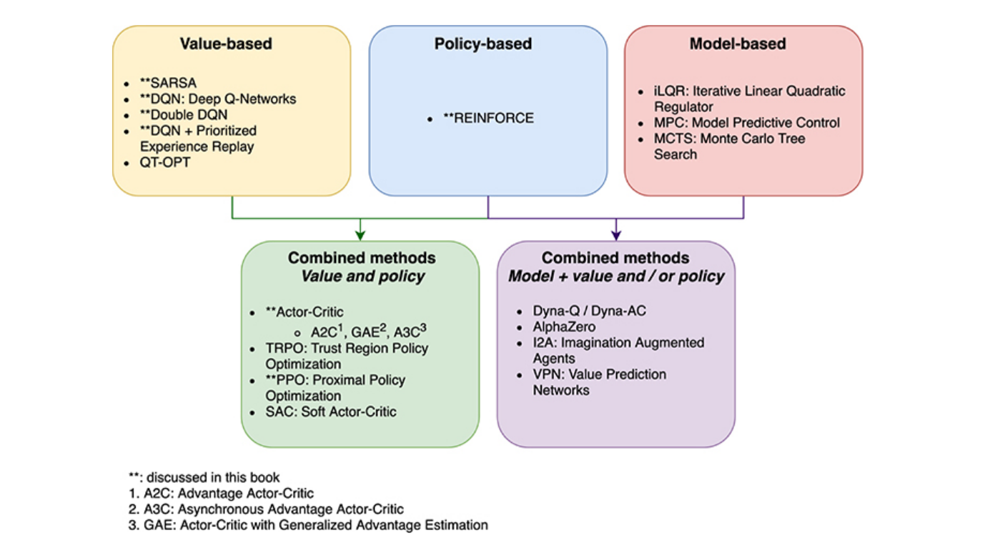

# 0x414 Reinforcement Learning

- [1. Foundation](#1-foundation)
    - [1.1. Bandit](#11-bandit)
- [2. MDP](#2-mdp)
    - [2.1. Markov Process](#21-markov-process)
    - [2.2. Markov Reward Process](#22-markov-reward-process)
    - [2.3. Markov Decision Process](#23-markov-decision-process)
    - [2.4. POMDP](#24-pomdp)
- [Policy-based and Value-based Model](#policy-based-and-value-based-model)
    - [REINFORCE](#reinforce)
- [3. Dynamic Programming](#3-dynamic-programming)
    - [3.1. Policy Evaluation](#31-policy-evaluation)
    - [3.2. Policy Iteration](#32-policy-iteration)
    - [3.3. Value Iteration](#33-value-iteration)
- [4. Model Free Prediction](#4-model-free-prediction)
    - [4.1. Monte Carlor Learning](#41-monte-carlor-learning)
    - [4.2. Temporal Difference Learning](#42-temporal-difference-learning)
- [5. Model Free Control](#5-model-free-control)
    - [5.1. Model Free Policy Iteration](#51-model-free-policy-iteration)
    - [5.2. Lambda-Greedy Exploration](#52-lambda-greedy-exploration)
- [6. Reference](#6-reference)

## 1. Foundation

A lot of machine learning problems are one-shot, in reinforcement learning, we care about **sequential decisions**: each decision we make have consequences in the future.

RL problems can be expressed as a system consisting an agent and an environment. The system repeats the following circles,


- An environment produces information which describes the **state** $s_t$ of the system
- An agent interacts with the environment by observing the state and using this information to select an **action** $a_t$.
- The environment accepts the action and transitions into the next state, then return the next state and a **reward** $r_t$ to the agent



Reinforcement learning can be divided into three categories:

**Family (policy based algorithms)** It learns a good policy $\pi$, which should generate actions that produce good reward (e.g: REINFORCE)
  
Advantage:

- very general approach, can be applied to problem with any types of actions (e.g: continuous, discrete)
- directly optimize the objective function
- local convergence

Disadvantage:

- high variance
- sample inefficiency


**Family (value based algorithms)** This family learns the value function $V$ or $Q$, and use these or generate a policy (e.g: SARSA, DQN)

Advantage:

- sample efficiency
- low variance

Disadvantage:

- usually limited to discrete actions
- convergence is not guaranteed


**Family (model based algorithms)** It learns the model of the environment $P(s_{t+1}| s_t, a_t)$. Purely model based approaches are commonly applied to games with a target state: winning or lossing in a game.  (e.g: MCTS (monte carlo tree search))

Advantage:

- sample efficiency

Disadvantage:

- models are hard to come by
  

There are other concepts to distinguish the RL models:

**Concept (Model-based vs model-free)** Whether an algorithm uses a model of an environment’s transition dynamics

**Concept (On-policy vs off-policy)** Whether an algorithm learns with data gathered using just the current policy


### 1.1. Bandit

**Task (Contextual Bandit)** contextual bandit means that multiple bandits are available and different bandit will be used when different context presented.

e.g. web ads. agent selects 1 ads from the ad set (select an arm), the world (user) gives the reward (whether to select that or not)

## 2. MDP

We assume the the transition to the next state $s_{t+1}$ only depends on the previous state $s_{t}$ and action $a_t$, which is known as the markov property

$$s_{t+1} \sim P(s | s_{t}, a_t)$$


### 2.1. Markov Process

Markov Process can be defined as (S, P)

- S: state space
- P: transition prob

### 2.2. Markov Reward Process
Markov Reward Process $(S, P, R)$


**Definition (Bellman function)**

- Each state can be assigned value function.
- the value function can be estimated using Bellman function

$$v(s_t) = R(S_t) + \gamma * E(v_{t+1})$$


- Explicit solution of this Bellman function requires O(n) for inverse matrix operation
- Other methods can be Montecarlo ...


### 2.3. Markov Decision Process

Markov Decision Process is defined as a 4-tuple $(S, A, P, R)$

- $S$: state space (depend on previous state and action)
- $A$: action space
- $P=P(s_{t+1} | s_t, a_t)$: transition prob distribution, reward prob distribution
- $R=R(s_{t+1}, s_t, a_t)$: reward depending on current, previous state and action

**Definition (policy)** A policy $\pi$ is how an agent produces the action in the environment to maximize the objective, it is a distribution over actions given state $\pi(a|x)$


The interaction between environment and agent can be expressed in Python as

```python
# Given an env (environment) and an agent

for episode in range(MAX_EPISODE):
    state = env.reset()
    agent.reset()

    for t in range(T):
        action = agent.act(state)
        state, reward = env.step(action)
        agent.update(action, state, reward)

        if env.done():
            break

```


**Definition (reward function)** The reward function is defined with respect to an episode $\tau = (s_0, a_0, r_0), ..., (s_T, a_T, r_T)$ the discount ratio $\gamma$

$$R(\tau) = r_0 + \gamma r_1 + \gamma^2 r_2 + ... = \sum_{t=1}^T \gamma^t r_t$$

The objective $J(\pi)$ is the expectations of the returns over many trajectories

$$J(\pi) = \mathbf{E}_{\tau \sim \pi}[R(\tau)]$$

A return $R_t$ of a trajectory is defined as the discounted sum of award from timestamp $t$ to the end of the trajectory

$$R_t(\tau) =  \sum_{t'=t}^T \gamma^{t'-t} r'_t$$


**Definition (State Value Function, V)** The state value function $V$ evaluates a state under a certain policy, it evaluates how good or bad a state is

$$V_{\pi}(s) = \mathbf{E}_{\tau \sim \pi}(R(\tau) | S_t = s)$$


**Definition (Action Value Function, Q)**  The action value function evaluates a (state, action) pair under a certain policy.

$$Q_{\pi}(s, a) = \mathbf{E}_{\tau \sim \pi}(R(\tau) | S_t = s, A_t = a)$$


**Definition (Bellman Equation for MDP)**

state value function can be derived from action value function

$$v_{\pi}(s) = \sum_{a}{\pi(a|s)q_{\pi}(s,a)}$$


action value function can be derived from next state value function

$$q_{\pi}(s,a) = R_{s}^{a} + \sum_{s'}{P_{s,s'}^{a}v_{\pi}(s')}$$


**Definition (Optimal Value Function)**

the optimal state value function is the maximum value function over all policies

$$v_{*}(s) = max_{\pi} v_{\pi}(s)$$

MDP is solved if we know the optimal action value function 

$$q_{*}(s,a) = max_{\pi}(q_{\pi}(s,a))$$

**Definition (Optimal Policy)**

a policy is better than another when its value function on all states should be better than the value function for the other

**Theorem**

- There exists an optimal policy that is better than or equal to all other policies
- Optimal policy achieve optimal value and optimal action
- if we knew q-star, we can know the optimal policy

**Definition (Bellman Optimality Equation)**

optimal value function are recursively related by the Bellman optimality equations

$$v_{*}(s) = max_{a} q_{*}(s,a)$$

optimal action function acn be defined in the same manner

$$q_{*}(s,a)=R^a_{s} + \gamma\sum_{s'}{P^a_{s,s'}v_{*}(s')}$$


Unfolding the action value function

$$q_{*}(s,a) = R(s,a) + \gamma\sum_{s'}{P^a_{s,s'}max_{a'}(q_{*}(s',a'))}$$

Solution of Bellman Optimality Equation
- nonlinear, no closed form solution in general
- Iterative solution methods

Value Iteration
Policy Iteration
Q-learning
Sarsa

### 2.4. POMDP

Note the states mentioned so far might mean two different types of states:

- observable state: the state observed by the agent
- internal state: the state inside the environment

These two states are not necessarily same, in this case, the environemnt is described as the **partially observable MDP (POMDP)**

## Policy-based and Value-based Model

### REINFORCE

The key idea is: during learning, actions that result in good outcomes should become more probable. these actions are positively *reinforced*. Actions are changed by following the **policy gradient**.

The policy gradient algorithm solves the following problem

$$\max_{\theta} J(\pi_{\theta}) = \mathbf{E}_{\tau \sim \pi_{\theta}}[R(\tau)]$$

The policy parameter $\theta$ is updated by gradient ascent

$$\theta = \theta + \alpha \nabla_{\theta} J(\pi_{\theta})$$

where the policy gradient $\nabla J$ is defined as

$$\nabla_\theta J(\pi_\theta) = \mathbf{E}_{\tau \sim \pi_\theta}[\sum_{t=0}^T R_t(\tau) \nabla_\theta \log \pi_\theta(a_t | s_t) ]$$

Intuitively, if the return $R_t(\tau) > 0$, then the probability of the action $\pi_\theta(a_t | s_t)$ is increased, otherwise it is decreased

In practice, we approximate this policy gradient with **Monte Carlo Sampling** 

$$\nabla_\theta J(\pi_\theta) \approx \sum_{t=0}^T R_t(\tau) \nabla_\theta \log \pi_\theta(a_t | s_t)$$

The REINFORCE algorithm is as follows:

```text

1: Initialize learning rate α

2: Initialize weights θ of a policy network πθ

3: for episode = 0, . . . , MAX_EPISODE do

4:       Sample a trajectory τ = s0, a0, r0, . . . , sT, aT, rT

5:       Set ∇θJ(πθ) = 0

6:       for t = 0, . . . , T do

7:            Rt(τ)=Σ^T_{t'=t} γ^{t'−t}*r′t
8:            ∇θ J(πθ) = ∇θJ(πθ) + Rt(τ) ∇θ log πθ(at | st)

9:       end for

10:       θ = θ + α∇θ J(πθ)

11: end for
```


To reduce the variance of the REINFORCE, one approach is to normalize the reward as 

$$\nabla_\theta J(\pi_\theta) \approx \sum_{t=0}^T (R_t(\tau) - b(s_t)) \nabla_\theta \log \pi_\theta(a_t | s_t)$$

where $b(s_t)$ might be the value function $V$, this is related to the Actor-Critic algorithm. Another option is to use the mean over the trajectory

$$b = \frac{1}{T} \sum_t R_t(\tau)$$


## 3. Dynamic Programming

Optimal substructure

- optimal solution can be decomposed into subproblems

Overlapping subproblems

- Subproblems recur many times
- Solutions can be cached and reused

Dynamic programming assumes full knowledge of MDP

for Prediction:

- Input MDP, and policy and output value function v_pi

for Control:
- output: optimal value function v_star and optimal policy


### 3.1. Policy Evaluation
Problem: evaluate a given policy $\pi$
Solution: iterative application of Bellman expectation backup

v1->v2->...->v_pi

### 3.2. Policy Iteration
Given a policy $\pi$, Evaluate the policy to get $v_{\pi}(s)$ Improve the policy by acting greedily with respect to $v_{\pi}$

This policy iteration always converges to $\pi_{*}$

- Greedy policy iteration improve both value function and state function everytime
- if improvement stops, the Bellman optimality equation  has been satisfied.
- We do not need to wait until the value function converge. If we update policy every time updating the value function then it is the value iteration

### 3.3. Value Iteration
If we know the solution to subproblems v_{*}(s')

solution could be found by one-step lookahead

$$v_{*}(s) = max_{a} R^a_{s} + \sum_{s'}{P^a_{s,s'}v_{*}(s')}$$

- This function is applied iteratively
- v1->v2->...->v_star
- difference between policy iteration and value iteration is that value iteration does not requrie explicit policy

## 4. Model Free Prediction
estimate the value function of an unknown MDP, TD exploits Markov property and MC does not exploit Markov property.

### 4.1. Monte Carlor Learning

- montecarlor learns directly from episodes of experience
- montecarlor is model-free, do not need knowledge of MDP transitions / rewards
- montecarlor learns from complete episodes, and value equals the mean
- caveat: all episodes mush finish
- efficient in non-Markov environment

**Formulation**
*Goal: learn <math>v_{\pi}</math> from experience of episodes under policy pi
Solution:
*use empirical return as expected return
*each reward should be remembered each time and averaged to re-estimate the state value later
*It will converge by law of large numbers

Incremental update

### 4.2. Temporal Difference Learning

- TD learns from incomplete episodes
- TD works in non-terminating environment
- some bias, low variance (because only one random action in case of TD(0))
- TD use cached value instead of the complete actual return
- For instance, TD(0) Update value $V(S_t)$ toward estimated return $R_{t+1} + \gamma V(S_{t+1})$

$$V(S_t) = V(S_t) + \alpha(R_{t+1}+\gamma V(S_{t+1})-V(S_t))$$

- TD learning can be generalize to look n steps into the future
- we can average multiple n steps

**Definition (TD(lambda))** TD(lambda) combines all n-steps return with decaying weight.

$$G_t^{\lambda} = (1-\lambda)\sum {\lambda^{n-1} G^n_t}$$


## 5. Model Free Control

### 5.1. Model Free Policy Iteration

Greedy policy improvement over V(s) requires model of MDP

$$\pi'(s) = max_{a} R^a_{s} + P^a_{s,s'}V(s')$$

Greedy policy improvement over Q(s,a) is model-free

$$\pi'(s) = argmax_a Q(s,a)$$

iteration action value function instead of the state value function because MDP is unknown (transition, reward is unknown)

### 5.2. Lambda-Greedy Exploration
**Theorem** For any lambda greedy policy pi, the lambda greedy policy pi-prime with respect to q is an improvement

$$v_{\pi'}(s) > v_{\pi}(s)$$

## 6. Reference

[1] David Silver's reinforcement learning lecture

[2] CMU 10703 Deep Reinforcement Learning and Control

[3] Foundations of Deep Reinforcement Learning: Theory and Practice in Python