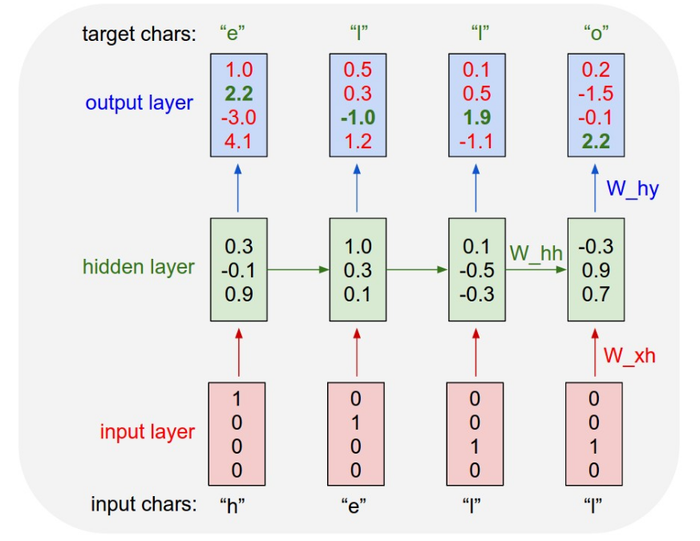
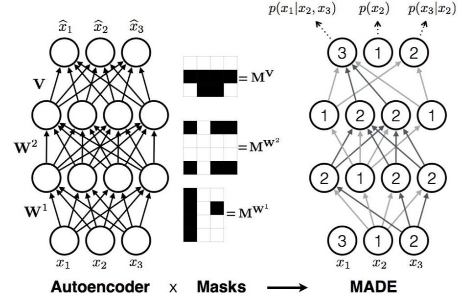
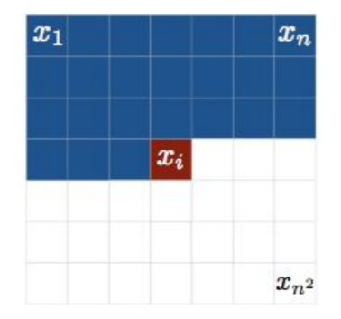

# 0x423 Unsupervised Model

- [Generative Model](#generative-model)
    - [Autoregressive Model](#autoregressive-model)
        - [RNN](#rnn)
        - [Masking-based Models](#masking-based-models)
    - [VAE](#vae)
    - [GAN](#gan)
    - [Flow](#flow)
- [Reference](#reference)

## Generative Model
### Autoregressive Model

Neural AR models factorize the generation problem with a sequence of conditional probabilities, then use network to model them.

The cons of autoregressive model is its slow generation.

#### RNN
RNN can be used as an autoregressive model.

**Model (char-rnn)** The character-level language model is model the character sequence $\mathbf{x}$ with RNN as follows

$$\log p(\mathbf{x}) = \sum_{i=1}^d \log p(x_i | \mathbf{x}_{1:i-1})$$

[Karpathy's blog](http://karpathy.github.io/2015/05/21/rnn-effectiveness/) shows that this model can be used to generate many different sequences such as Shakespeare, Wikipedia, XML, latex and source code.

This model can also generate non-text objects such as images by representing pixel as character.

#### Masking-based Models
**Model (Masking-based autoregressive model, MADE)** An MLP based autoencoder can be turned into an autoregressive model by removing (masking) some connections.

**Model (wavenet)** Wavenet is a 1d convolution AR model

**Model (PixelCNN)** Pixel CNN is the 2d convolution AR model. Unlike normal CNN which will use all neighborhood pixels to convolve, PixelCNN masks out those pixels it has not seen (e.g. with the raster scan ordering)

### VAE

### GAN

### Flow

## Reference
[1] Berkeley CS249
[2] http://karpathy.github.io/2015/05/21/rnn-effectiveness/
[3] [Hung-yi Lee Youtube Flow-based Generative Model](https://www.youtube.com/watch?v=uXY18nzdSsM)