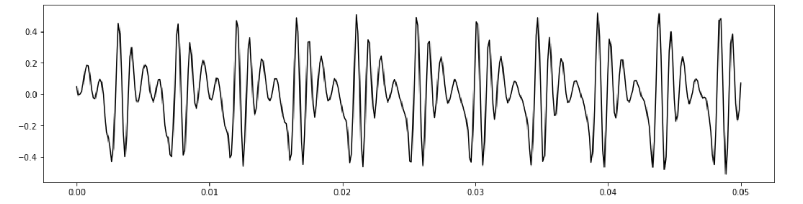
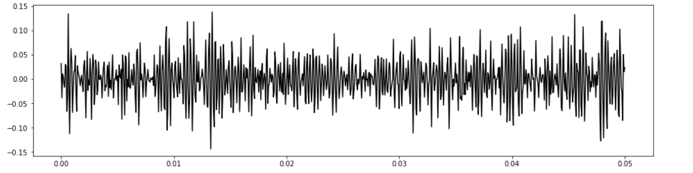
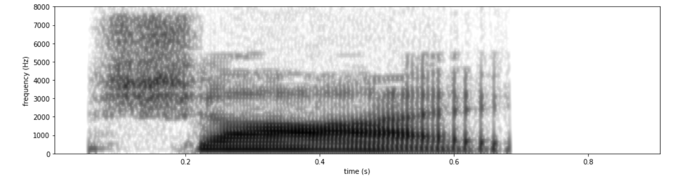
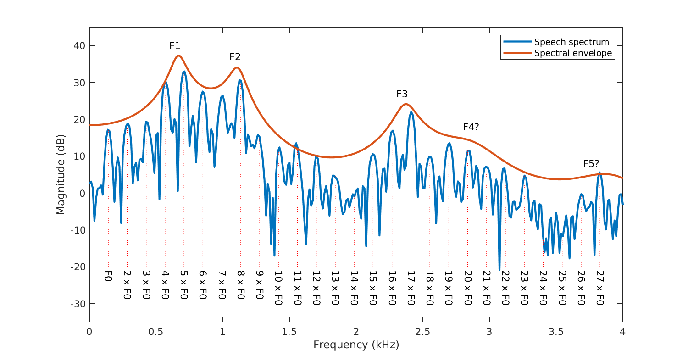

# 0x450 Phonetics

- [1. Foundation](#1-foundation)
- [2. Articulatory Phonetics](#2-articulatory-phonetics)
    - [2.1. Articulation](#21-articulation)
        - [2.1.1. Airstream Process](#211-airstream-process)
        - [2.1.2. Phonation Process](#212-phonation-process)
        - [2.1.3. Oro-nasal Process](#213-oro-nasal-process)
    - [2.2. Consonants](#22-consonants)
        - [2.2.1. place of articulation](#221-place-of-articulation)
        - [Manners of Articulation](#manners-of-articulation)
    - [2.3. Vowels](#23-vowels)
- [3. Acoustic Phonetics](#3-acoustic-phonetics)
    - [Formants](#formants)
- [4. Reference](#4-reference)

## 1. Foundation
- phoneme: abstract sound unit distinguishing one word from another in a particular language (e.g.: /t/)
- phone: actual sound produced in speech (independent of languages) (e.g: [t])
- allophone: a set of phones to represent a phoneme in a particular language (phoneme/allophone is something like class/instance)
Substituting one phoneme for another will result in a word with a different meaning, but substituting allophones only results in a different pronunciation of the same word.

## 2. Articulatory Phonetics

### 2.1. Articulation
Airflow: 

- Powering up lungs
- Buzzing with the vocal folds in the larynx
- Shaping the airflow

#### 2.1.1. Airstream Process
*Airstream Process* is about how to push air out or suck it in

direction:

- **egressive**: inside to outside
- **ingressive**: outside to inside

place:

- **pulmonic**: lung
- **glottalic**: glottal
- **velaric**: velar

#### 2.1.2. Phonation Process
Phonation Process is related to the vocal folds.

There are two possibilities depending whether vocal fold are vibrating or not
- **voiced**: sounds produced when vocal folds are vibrating (e.g: [v])
- **voiceless**: sounds produced when vocal folds are apart (e.g: [f])
  
The rate of vibration frequency of vocal fold is described as the **fundamental frequency**, influenced by the length, size and tension of vocal folds. According to Wikipedia, this frequency averages about 125 Hz in an adult male, 210 Hz in adult females, and over 300 Hz in children.

!!! example "fundemantal frequency example"

    The following is a female pronounciation of father, it is clear that the fundamental frequency

    

#### 2.1.3. Oro-nasal Process
Whether the aistream going through mouth (e.g: [v], [z]) or nose (e.g: [m], [n])

Our PhD student Ivan Stelmakh has contributed to a new introductory
course on Practical Crowdsourcing for Efficient ML
https://toloka.ai/academy/coursera <https://toloka.ai/academy/coursera>.
The course is available on Coursera and has a nice feature — it offers a
hands-on experience with real data collection on a crowdsourcing
platform! The course may be useful for those who plan to use
crowdsourcing for their research. Give your feedback to Ivan if you take
the course :)

- movable articulators: Tongue, Jaw, Lips, velum (soft palate)
- static articulators: Teeth, Alveolar ridge, Hard palate
- 
### 2.2. Consonants
A consonant is a sound made by partially or totally blocking the vocal tract during speech production. 

Consonants are classified based on where they are made in the articulatory system (place of articulation), how they are produced (manner of articulation), whether they are voiced or not.

Stop consonants
aspiration: a period after the release of the lip closure (e.g: "pie", "tie", "kie"). In xsampa, it is marked as _h suffix

#### 2.2.1. place of articulation
the location inside the mouth at which the constriction of air take place

- coronal: speech sounds made using tip or blade

- dorsal: speech sounds make using the rear of the tongue

- bilabial: sounds made with a constriction at the lips (e.g: pat, bat)

- labiodental: top teeth touch bottom lip (e.g: fat, vat)

- dental: a closure produced at the teeth with contact of the tongue tip and/or blade (e.g: this, thick)

- alveolar: ridge on hard palate (e.g: t, d, s, z)

- retroflex: tongue tip to the rear of the alveolar ridge, common in India, Pakistan English, rare in American British English

- palato-alveolar (post alveolar):  place tongue blade behind alveolar ridge (e.g: ship)

- palatal: tongue on the hard plate (e.g: yes, yellow)

- velar: tongue on the soft palate

#### Manners of Articulation

**Definition (stop)** Complete closure of the articulators involved so that the airstream cannot escape through the mouth.

**Definition (fricative)** Close approximation of two articulators so that the airstream is partially obstructed (narrowed) and turbulent airflow is produced.

Examples are fie, vie (labiodental), thigh, thy (dental), sigh, zoo (alveolar) and shy (palato-alveolar).

!!! example "fricative waveform and spectrogram"

    The following is the waveform (0.1 ~ 0.2 sec) and spectrogram of shy

    

    

### 2.3. Vowels
- [i] has low F1 and high F2
- [a] has high F1 and low F2
- [u] has low F1 and low F2
  

## 3. Acoustic Phonetics

**Definition (F0, Fundamental Frequency)** F0 refers to the approximate frequency of the periodic structure of voiced speech signal. The oscillation originates from the vocal folds. Typically fundamental frequencies lie roughly in the range 80 to 450 Hz.

F0 is typically not stationary, but changes constantly within a sentence. In fact, the F0 can be used for expressive purposes to signify, for example, emphasis and questions

**Concept (F0 vs Pitch)**
The fundamental frequency is closely related to pitch, which is defined as our perception of fundamental frequency. That is, the F0 describes the actual physical phenomenon, whereas pitch describes how our ears and brains interpret the signal, in terms of periodicity. 

Modern pitch perception models assume that pitch is derived either from the periodicity of neural patterns in the time domain or else from the harmonic pattern of partials resolved by the cochlea in the frequency domain

For example, a voice signal could have an F0 of 100 Hz. If we then apply a high-pass filter to remove all signal components below 450 Hz, then that would remove the actual fundamental frequency. The lowest remaining periodic component would be 500 Hz, which correspond to the fifth harmonic of the original F0. However, a human listener would then typically still perceive a pitch of 100 Hz, even if it does not exist anymore

### Formants
Formants are usually harmonics of F0

Formants Rules

- F1 rule(high/low): F1 is inversely related to tongue height, or equivalently related to distance between tongue and palate. For example, the average adults males /i/  (top high vowel) ~300 Hz, /a/ (back low vowel) ~ 754 Hz.
- F2 rule(front/back): more front the tongue is placed, the higher the F2 frequency value.
- F3 rule(retroflexion): everytime an r-colored sound is made, F3 decreases in value
- F1-F3 lowering rule: Lip protrusion will make vocal tract a bit longer (17+2.5cm for male or 14+2.5 cm for female), which makes the resonant peaks go slightly lower. (probably because of the larger $L$ in the following string vibrating formula)

$$f = \frac{nv}{2L}$$

## 4. Reference
[1] Ladefoged, Peter, and Keith Johnson. A course in phonetics. Nelson Education, 2014.

[2] Katz, William F. Phonetics for dummies. John Wiley & Sons, 2013.

[3] Introduction to Speech Processing https://wiki.aalto.fi/