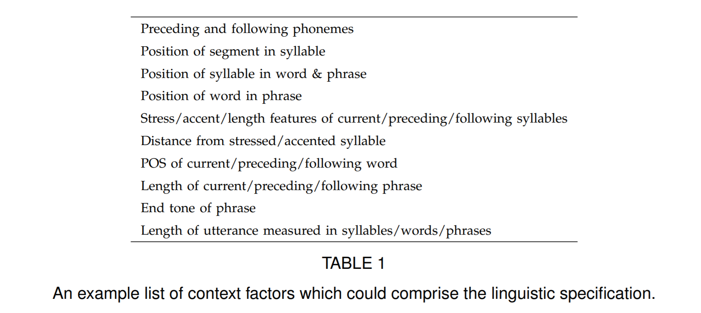
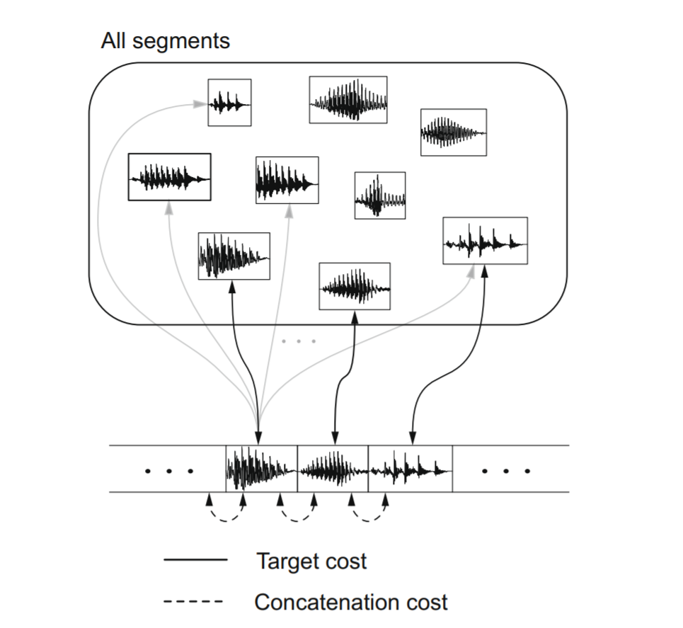
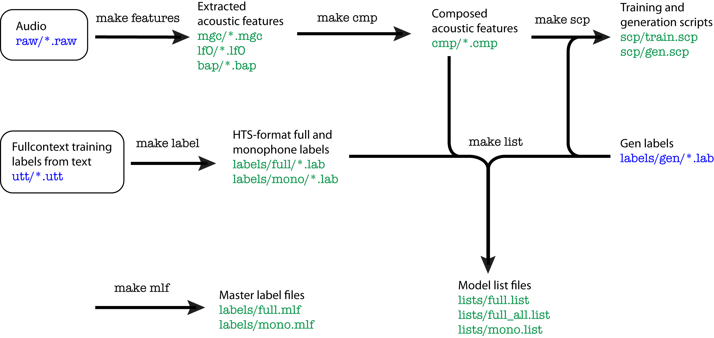
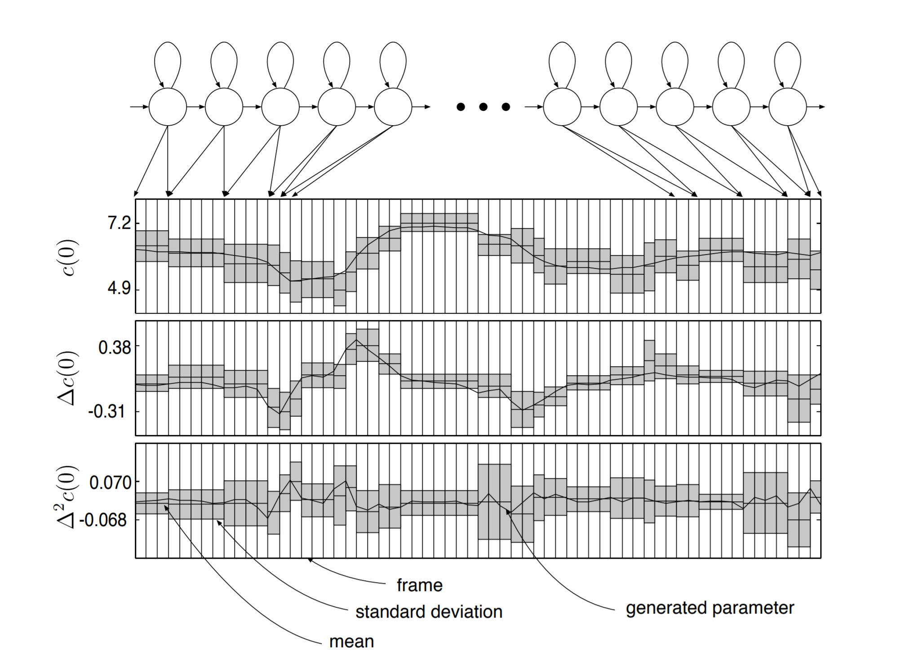

# 0x452 Speech Synthesis

- [1. Preprocessing](#1-preprocessing)
    - [1.1. Linguistic Features](#11-linguistic-features)
    - [1.2. Acoustic Features](#12-acoustic-features)
- [2. Concatenative TTS](#2-concatenative-tts)
- [3. Parametric TTS](#3-parametric-tts)
    - [3.1. Clustering](#31-clustering)
    - [3.2. Modeling](#32-modeling)
        - [3.2.1. Duration Model](#321-duration-model)
        - [3.2.2. Observation Model](#322-observation-model)
        - [DNN Model](#dnn-model)
- [4. Neural TTS](#4-neural-tts)
    - [4.1. Wavenet](#41-wavenet)
    - [4.2. Tacotron](#42-tacotron)
- [5. Reference](#5-reference)

## 1. Preprocessing

### 1.1. Linguistic Features

In neural TTS, the linguistic feature is just grapheme, subword or words, but in traditional TTS, we are using more detailed linguistic features.

The input $w$ is usually transformed into linguistic features or **linguistic specification**. This could be as simple as a phoneme sequence, but for better results it will need to include supra-segmental information such as the prosody pattern of the speech to be produced. In other words, the linguistic specification comprises whatever factors might affect the acoustic realisation of the speech sounds making up the utterance.

For example, in HTS, the lab file might contain [those features](http://www.cs.columbia.edu/~ecooper/tts/lab_format.pdf)

### 1.2. Acoustic Features

Depending on the model, we might use different features. In the traditional models, one example feature set is

- 40 and 60 parameters per frame to represent the spectral envelope
- value of F0
- 5 parameters to describe the spectral envelope of the aperiodic excitation

## 2. Concatenative TTS

The basic unit-selection premise is that we can synthesize new natural-sounding utterances by selecting appropriate sub-word units from a database of natural speech. The subword units might be frame, HMM state, half-phone, diphone, etc.

There are two costs to consider when concatenating units.

**Target cost** is about how well a candidate unit from the database matches the required units.

$$C_{target}(t_i, u_i) = \sum_j w_j C^{target}_j(t_i, u_i)$$

where $u_i$ is a candidate unit and $t_i$ is a required unit and $j$ sums over the features (e.g: phonetic, prosodic contexts.)

The other cost is **Concatenative cost**, which defines how well two selected units combines

$$C_{concat}(u_{i-1}, u_i) = \sum_k w_k C^{concat}_k(u_{i-1}, u_i)$$

where $k$ sums over the features (e.g: spectral and acoustic features)

The goal is to find a string of units $u=\{ u_1, ..., u_n \}$ from the database that minimizes the overall costs

$$\hat{u} = \text{argmin}_u \sum_i C_{target}(t_i, u_i) + C_{concat}(u_{i-1}, u_i)$$

## 3. Parametric TTS
Statistical parametric speech synthesis might be most simply described as generating the
average of some sets of similarly sounding speech segments.

In a typical parametric system, the steps are training phase and synthesis phase

In the training phase, we first extract parametric representations of speech (e.g: spectral, excitation) and model them using a generative model (e.g.: HMM), estimated with MLE

$$\hat{\lambda} = \text{argmax}(P(O | W, \lambda))$$

where $\lambda$ is the parameter, $O$ is the training set and $W$ is the word sequence of $O$

In the synthesis phase, we want to generate a speech, we use the estimated parameter $\hat{\lambda}$ and target words $w$.

$$\hat{o} = \text{argmax}(P(o | w, \hat{\lambda}))$$

The flow of HTS is as follows:

### 3.1. Clustering
Typically, we want to create a model to map the a set of linguistic features to the acoustic feature. However, there are many unseen contexts (linguistic feature) in the corpus. We need to make generalization from the limited number of observed samples to unlimited number of unseen contexts.

For example, we can use the clustering approach to tie parameters to achieve generalization

In [CLUSTERGEN](https://www.cs.cmu.edu/~awb/papers/is2006/IS061394.PDF), CART trees are built in the normal way with wagon to find questions that split the data to minimize impurity. The impurity is calculated as

$$N\sum_i \sigma_i$$

Where N is the number of samples in the cluster and σi is the standard deviation for MFCC feature i over all samples in the cluster. The factor N helps keep clusters large near the top of the tree thus
giving more generalization over the unseen data.

### 3.2. Modeling

#### 3.2.1. Duration Model
**Model (duration)** the durations (i.e. the number of frames of parameters to be generated by each state of the model) are determined in
advance – they are simply the means of the explicit state duration distributions.

#### 3.2.2. Observation Model
The naive approach to generate the most likely observation from each state is to take the mean of Gaussian, which would generate piecewise constant trajectories, which is not natural, so we have the MLPG algorithm

**Model (maximum likelihood parameter generation, MLPG)** Model the delta and delta-delta as well, illustrated in the following

#### DNN Model
Instead of the Gaussian model, we can use a DNN for observation instead

This [tutorial](https://r9y9.github.io/nnmnkwii/stable/nnmnkwii_gallery/notebooks/tts/01-DNN-based%20statistical%20speech%20synthesis%20(en).html) is very helpful

## 4. Neural TTS

### 4.1. Wavenet

### 4.2. Tacotron

## 5. Reference

[1] [festvox book](http://festvox.org/bsv/book1.html)

[2] Zen, Heiga, Keiichi Tokuda, and Alan W. Black. "Statistical parametric speech synthesis." speech communication 51.11 (2009): 1039-1064.

[3] Taylor, Paul. Text-to-speech synthesis. Cambridge university press, 2009.

[4] King, Simon. "A beginners’ guide to statistical parametric speech synthesis." The Centre for Speech Technology Research, University of Edinburgh, UK (2010).